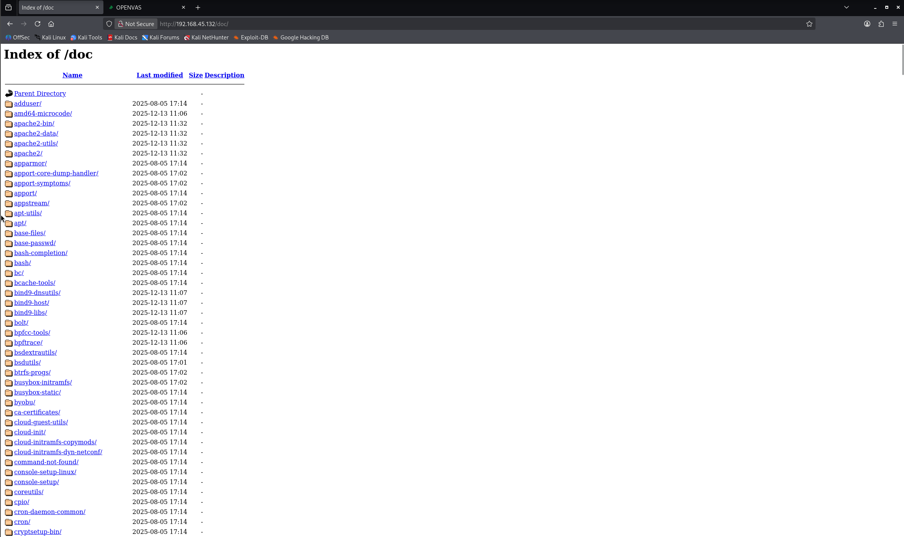
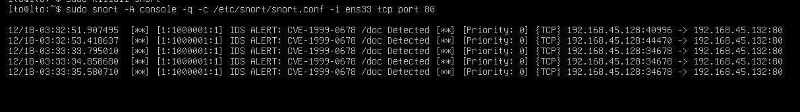
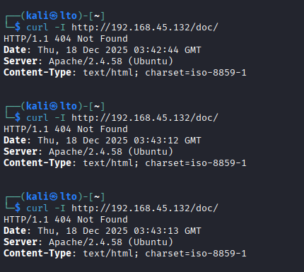

# CVE-1999-0678: Detection & Remediation Project

**Author:** Pham Huu Minh  
**Date:** December 2025  

## Project Overview
This project demonstrates the complete lifecycle of a vulnerability assessment, specifically targeting the legacy **Directory Traversal vulnerability (CVE-1999-0678)** on an Apache Web Server. The goal was to simulate an attack, detect it using an IDS, and permanently fix the security hole.

### Tech Stack
* **Attacker:** Kali Linux (Curl, Firefox, GVM)
* **Victim:** Ubuntu Server (Apache2, Snort IDS)
* **Tools:** Greenbone Vulnerability Manager, Snort, Iptables

---

## Phase 1: Discovery & Exploitation
I configured a local testing lab with a vulnerable Ubuntu target (`192.168.45.132`).
1.  **Vulnerability Scan:** Used GVM to identify an HTTP service on Port 80.
2.  **Manual Verification:** Confirmed the vulnerability by accessing the exposed `/doc/` directory via browser and terminal.

*Figure 1: Successful unauthorized access to system documentation.*

---

## Phase 2: Intrusion Detection (IDS)
I deployed **Snort** on the victim server to detect this specific attack pattern in real-time.
* **Custom Rule:** `alert tcp any any -> any 80 (content:"/doc/"; msg:"CVE-1999-0678 Detected";)`
* **Result:** Snort successfully alerted when the attacker accessed the directory.

*Figure 2: Snort IDS detecting the directory traversal attempt.*

---

## Phase 3: Mitigation & Remediation
To secure the system, I implemented both temporary and permanent fixes.

1.  **Temporary Mitigation (Firewall):** blocked the attacker's IP using `iptables` to immediately stop the active intrusion.
2.  **Permanent Remediation (Root Cause):** Modified the Apache configuration (`/etc/apache2/sites-available/000-default.conf`) to remove the insecure `Alias /doc` directive.

**Verification:**
After patching, I attempted the attack again. The server returned a **404 Not Found** error, confirming the system is secure.

*Figure 3: Curl command returning 404, proving the vulnerability is fixed.*

---

## Conclusion
This project highlights the importance of **Defense in Depth**. While Firewalls provide immediate containment, true security requires root-cause remediation (configuration patching) and continuous monitoring via IDS.
