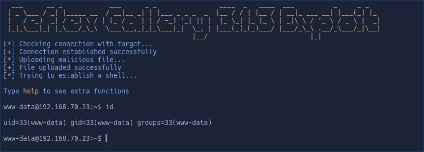

# CVE-2015-4133

CVE 2015-4133 - Reflex Gallery 3.1.3 Arbitrary File Upload to RCE

# Description

Reflex Gallery is a Wordpress plugins which has a vulnerability on its 3.1.3 version which can be exploited easily by attackers to upload arbitrary files, for example PHP code to achieve Remote Command Execution

```
# Exploit Title: Wordpress Plugin Reflex Gallery - Arbitrary File Upload
# Google Dork: inurl:wp-content/plugins/reflex-gallery/
# Date: 08.03.2015
# Discovered by: CrashBandicot @DosPerl
# CVE: CVE-2015-4133
# Vendor Homepage: https://wordpress.org/plugins/reflex-gallery/
# Software Link: https://downloads.wordpress.org/plugin/reflex-gallery.zip
# Version: 3.1.3
# Tested on: Linux
```

# Usage

The usage of the exploit is really easy. You just have to specify the WordPress base URL to the `-u` parameter and it will do all the dirty work for you. It will upload a PHP file and spawn a interactive fake-shell to execute commands remotely

```sh
python3 CVE-2015-4133.py -u http://target.com/wordpress/
```

If you receive errors try to change the number **2022** from script to any other existent year in the /wp-content/uploads/ folder

# Demo



# References

```
https://www.exploit-db.com/exploits/36374
https://www.rapid7.com/db/modules/exploit/unix/webapp/wp_reflexgallery_file_upload/
https://www.acunetix.com/vulnerabilities/web/wordpress-plugin-reflex-gallery-arbitrary-file-upload-3-1-3/
https://patchstack.com/database/wordpress/plugin/reflex-gallery/vulnerability/wordpress-reflex-gallery-plugin-3-1-3-unrestricted-file-upload
https://wpscan.com/vulnerability/c2496b8b-72e4-4e63-9d78-33ada3f1c674/
```

# License

This project is under MIT license

Copyright © 2025, *D3Ext*

