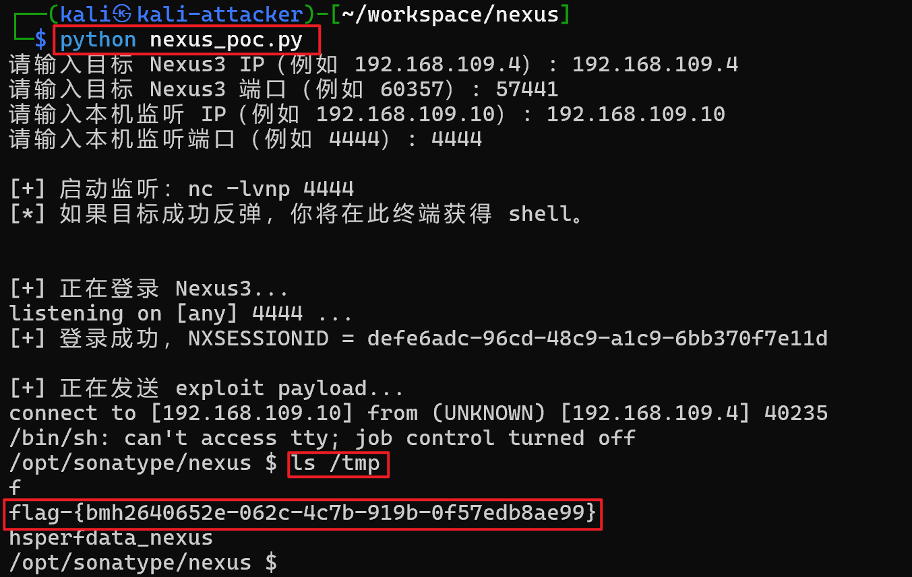

### 本脚本针对Nexus Repository Manager3 EL注入（[CVE-2018-16621](https://www.cve.org/CVERecord?id=CVE-2018-16621)）漏洞，一键执行漏洞利用反弹shell

#### 运行示例：

在攻击机本地运行脚本，根据提示输入靶机ip、端口、本机监听ip、端口，之后即可一键执行漏洞利用代码，GET反弹Shell。