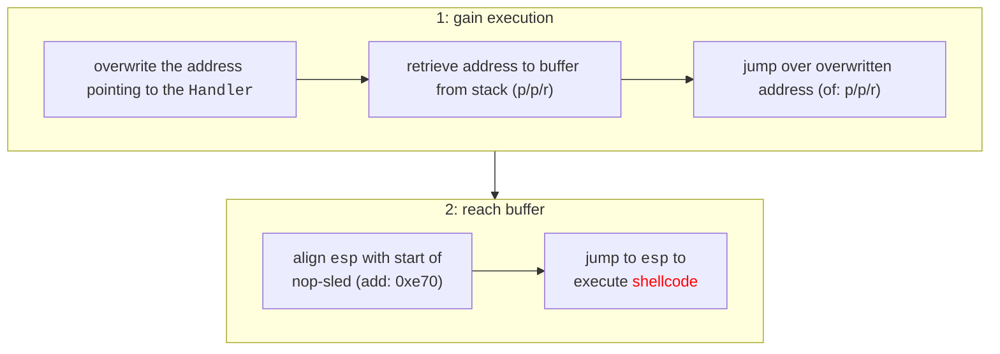

# [CVE-2018-6537](https://nvd.nist.gov/vuln/detail/CVE-2018-6537)

The exploit targets **Sync Breeze** running on **Windows 10 (x86, build: 16299)**, affecting **version 10.4.18**, where an unauthenticated attacker can perform a **SEH overflow** via a TCP-connection, resulting in **remote code execution**. This exploit assumes all security mitigations are disabled (e.g. ASLR, CFG, DEP).

### Process

1. **Overwrite the address pointing to the `Handler`**
    <br> The new address `1015a2f0` is used to overwrite the old address that referenced the `_except_handler` function. This new address points to the following assembly instructions:
    
    ```asm
    pop eax ; esp += 0x04
    pop ebx ; esp += 0x04
    ret     ; esp now points to the buffer
    ```

2. **Jump over the overwritten address**
    <br> After execution proceeds in the buffer, it is necessary to `jmp` over the previously overwritten address (`1015a2f0`) as this will now be interpreted as an instruction, this is done with: `jmp 0xffffff93`.

3. **Align the stack with the buffer**
    <br> To prepare for a consistently stable execution of the provided shellcode, we align stack pointer with the buffer such that the `esp` points to the start of the dynamically sized `nop-sled`.  

4. **Execute the shellcode**
    <br> When the `esp` pointer points to the start of the `nop-sled`, we simply perform the `jmp esp` instruction to execute the shellcode. **The shellcode can hold at most 400 bytes,** you may increase this range by remapping the `nop-sled` and/or padding.

    During the creation/generation of the shellcode, it is important to avoid the following <span style="color: red">**bad characters**</span>: `\x00\x02\x0A\x0D`.

### Chart



### Preview


### Usage

```bash
python3 exploit.py --host <host> --port <port> --file <file>  
```

| Flag | About |
| -- | -- 
| host | the interface _Sync Breeze_ is listening on 
| port | the port _Sync Breeze_ is listening on  
| file | the raw output of `msfvenom`