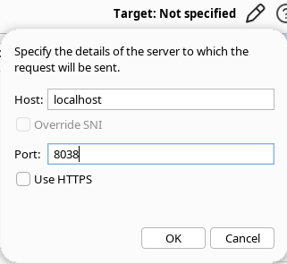
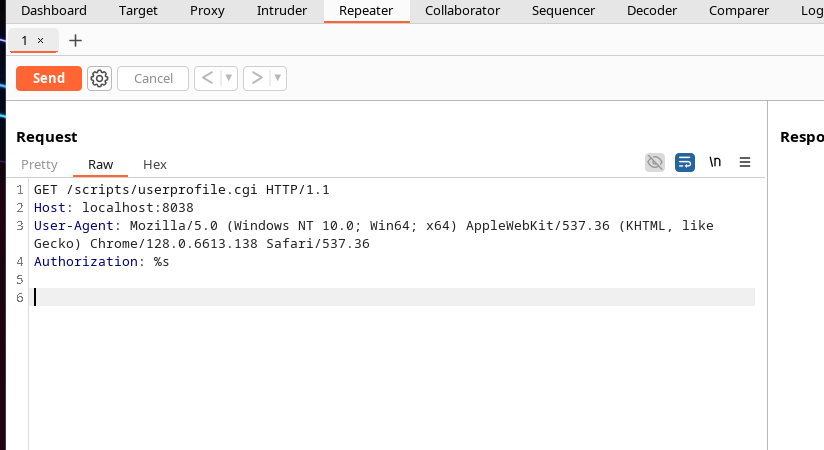
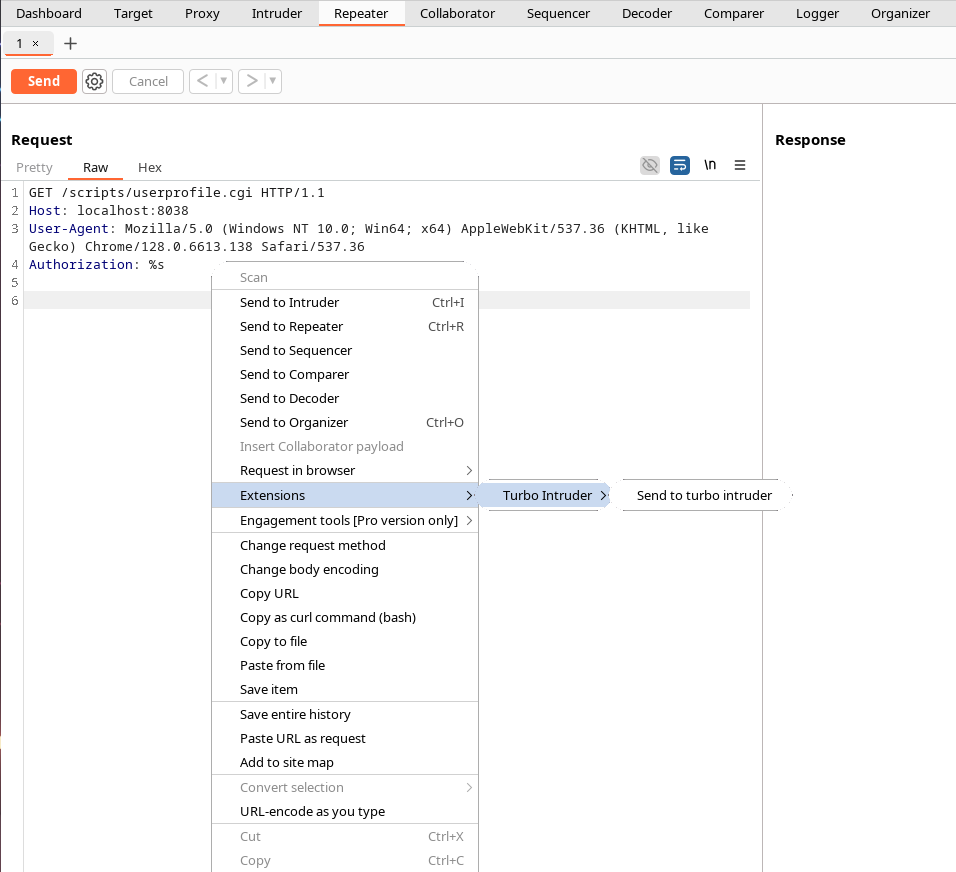
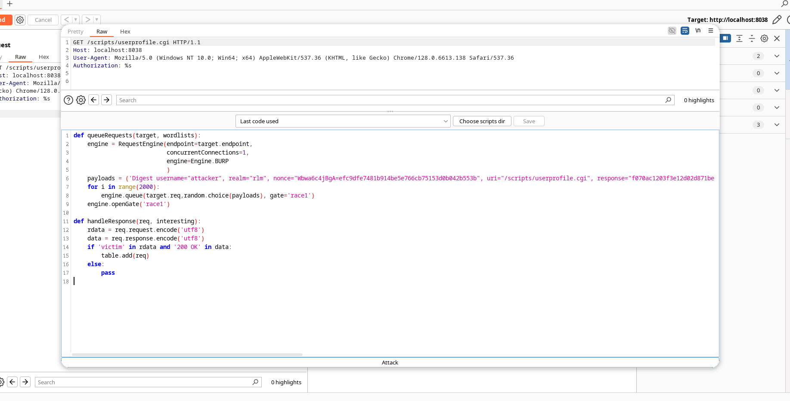
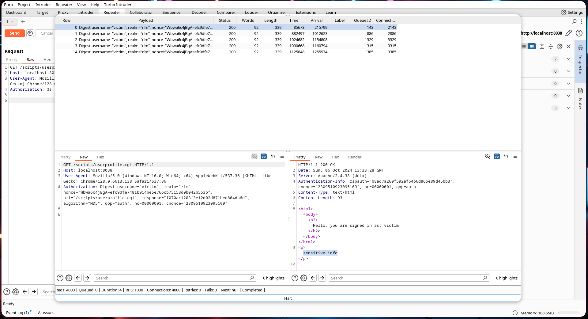

This repository contains a proof of concept exploit for CVE-2019-0217, along with a Dockerfile to set up a web server vulnerable to the CVE.

  

### CVE Description

> In Apache HTTP Server 2.4 release 2.4.38 and prior, a race condition in mod_auth_digest when running in a threaded server could allow a user with valid credentials to authenticate using another username, bypassing configured access control restrictions.

### Background
#### HTTP Digest Authentication
When a client tries to access a resource behind HTTP Digest Auth, the server responds with a 401 status code, along with a `WWW-Authenticate` Header, roughly of the below format:
```
Digest realm="rlm", nonce="TToc8M0jBgA=7afa4f292c97632a6c17eec458d3db31021b111f", algorithm=MD5, qop="auth"
```
The client calculates the HA1, which is the md5 digest of A1 (i.e. username:realm:password), and then adds to it the nonce and other metadata like cnonce to get A2, whose md5 digest in turn gives HA2, which the client sends as the response, along with the username, cnonce, and other metadata, in the `Authentication` header:
```
'Digest username="attacker", realm="rlm", nonce="TToc8M0jBgA=7afa4f292c97632a6c17eec458d3db31021b111f", uri="/scripts/userprofile.cgi", response="bcb433e4071fa228fe0c9452a7495efd", algorithm="MD5", qop="auth", nc=00000001, cnonce="2309510923095109"
                 ^^^^^^^^^^
```
As is described below, the highlighted portion of the above header can be manipulated to create the requisite race condition for the exploit to work.
#### Vulnerability Analysis
The vulnerability was fixed by [this commit](https://github.com/apache/httpd/commit/89e83282abc5a900a1ce63673d88e24e865989a2).
Looking at the `mod_auth_digest` module's code (specifically `get_hash` function in `mod_auth_digest.c`), it is evident that the server first first parses the `Authentication` header to determine what lies within the quotes after `username=`, which it treats as the user associated with the request (`r->user`). It then checks to see whether this "user" has access to the requested resource or not. If it does, the `get_hash` function retrieves the corresponding HA1 from the authentication file.
Prior to the vulnerability-fix commit, the HA1 thus retrieved was stored in `conf = (digest_config_rec *) ap_get_module_config(r->per_dir_config,&auth_digest_module)` variable which apparently isn't thread safe.

Which gives us the exploit:

### The Exploit

#### Background
Based on the vulnerability analysis section above, it should be possible to create a race condition by simultaneously sending requests with valid Authentication header along with requests with a forged Authentication header (which is same as the valid header but with the `username=` value set to the target user (who the attacker wants to authenticate as)).


Terminology used in this exploit:
    - Attacker: the user running this exploit. They have a valid username and password for their own account.
    - Victim: the user whom the attacker wants to pose as. The victim's username is known, but the password is (obviously) not.

I could get this method to run by spamming a bunch of python threads some of which sent requests of the first type and others of the second type, but it was unreliable and required a large number of requests to be true.
This led me to using burp's turbo intruder (free), which reliably sends the requests in parallel. Unfortunately, turbo intruder's cli support is broken, so some parts of the exploit need to be performed using GUI.
#### Setting up a vulnerable environment
To use the sample vulnerable server I have included in this repository, run:
```
$ cd sample_vulnerable_server
$ docker build -t poc_httpd .
$ docker run -p 8038:80 poc_httpd
```
#### The Actual Exploit
Run [generate_turbo_intruder_script.py](exploit/generate_turbo_intruder_script.py), after configuring the variables at the top:
```py
# Configuration
URL = 'http://localhost:8038/scripts/userprofile.cgi' # location to the resource protected by digest auth
ATTACKER_USERNAME = 'attacker'
ATTACKER_PASSWORD = 'known'
VICTIM_USERNAME = 'victim'
NUMBER_OF_REQUESTS = 2000 # number of concurrent requests sent to catch a glimpse of the race condition
```
This script then generates two files, `generated/turbo_intruder_script.py` and `generated/request.txt` in the current directory.

Now open BurpSuite Community Edition, and install the "Turbo Intruder" extensions by heading to Extensions -> BApp Store, if you haven't already.

Open the burp repeater. Set the target's host and port:


Paste the contents of `generated/request.txt` into the Request section:


Right click anywhere in the Request section, and select 'Extensions->Turbo Intruder->Send to Turbo Intruder'.


Paste the contents of `generated/turbo_intruder_script.py` into the script section:


Finally, click on the Attack button at the bottom of Turbo Intruder window. It should show any successful results in the resulting screen:

