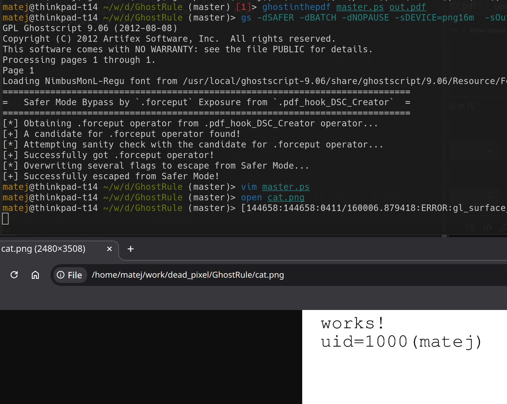

# CVE-2019-14811 GhostScript PDF preview Exploit PoC

This exploit targets CVE-2019-14811 in GS environments where PostScript output is not reflected, but is executed such as PDF previews via png images.

Exploit renders commands directly in (pngXXm) preview, it is based on https://github.com/hhc0null/GhostRule/blob/master/ghostrule1.ps.

The `dSafer` flag gets overridden to allow execution of arbitrary commands using `.forceput` via `.pdf_hook_DSC_Creator`. See screenshot below.

