# Green Hills INTEGRITY RTOS F-16 Exploit - CVE-2019-7711

**Full Format String Exploitation Chain**  
**Realistic Ground Maintenance Attack on F-16 Avionics**

---

## 📋 Description

This repository contains a **Proof of Concept (PoC)** for **CVE-2019-7711** — a Format String vulnerability in the Interpeak IPCOMShell TELNET server (part of Green Hills INTEGRITY RTOS 5.0.4).

The exploit demonstrates a **realistic full attack chain** targeting the **F-16 Fighting Falcon** (Block 60 and similar) Color Display Processor (CDP) and mission systems during **ground maintenance**.

---

## 🔄 Attack Diagram

```mermaid
flowchart TD
    A[Start: TELNET Connection\nGround Maintenance Interface] --> B[Login: admin / password]
    
    B --> C[Phase 1: Memory Leak]
    C --> D[Send prompt command\nwith %p %x %s payloads]
    D --> E[Leak: Stack Addresses, Pointers\n& Task Handlers]
    E --> F[Defeat ASLR / Randomization]
    
    F --> G[Phase 2: Arbitrary Memory Write]
    G --> H[Send %n Primitive]
    H --> I[Overwrite Function Pointer\nor Scheduler Callback]
    
    I --> J[Phase 3: Trigger]
    J --> K[Send exit / reboot command]
    K --> L[Control Flow Hijack]
    L --> M[Potential Code Execution in RTOS Partition]
    
    style A fill:#1a1a1a,stroke:#00ff00
    style M fill:#8B0000,stroke:#ffcc00,color:#fff
```



---

## ⚠️ Important Disclaimer

- This exploit is for **educational and research purposes only**.
- Real F-16 aircraft use strict partitioning (ARINC 653). Networking services are typically disabled in flight.
- Do **NOT** use this on any operational aircraft or unauthorized systems.
- Unauthorized access to military avionics is illegal.

---

## ✨ Features

- Realistic F-16 ground maintenance scenario
- Strong memory leak phase
- Arbitrary memory write using `%n` primitive
- Control flow hijack trigger
- Clean and educational code structure

---

## 🛠️ Usage

```bash
python3 exploit.py <target_ip> [--lhost <your_ip>] [--lport <your_port>]
```

**Example:**
```bash
python3 exploit.py 192.168.1.100
```

---

## 📌 How to Use (Step by Step)

1. Run the exploit against a vulnerable TELNET maintenance interface
2. Analyze the **Memory Leak** output (Phase 1)
3. Adjust the `%n` offset in Phase 2 based on the leak
4. Execute the full chain

---

## ⚙️ Requirements

- Python 3.x
- Target running INTEGRITY RTOS 5.0.4 with IPCOMShell enabled (lab environment only)

---

## 👤 Author

- **Name**: Mohammed Idrees Banyamer
- **Country**: Jordan 🇯🇴
- **Instagram**: [@banyamer_security](https://www.instagram.com/banyamer_security)
- **GitHub**: [mbanyamer](https://github.com/mbanyamer)

---

## 🔗 References

- [CVE-2019-7711 - NVD](https://nvd.nist.gov/vuln/detail/CVE-2019-7711)
- [Original GHS-Bugs Research](https://github.com/AlixAbbasi/GHS-Bugs)

---

**⭐ Star this repository if you find it useful for aviation cybersecurity research!**

**⚠️ Legal Note**: This information is based on publicly known vulnerabilities from 2019. Used for educational purposes only.


