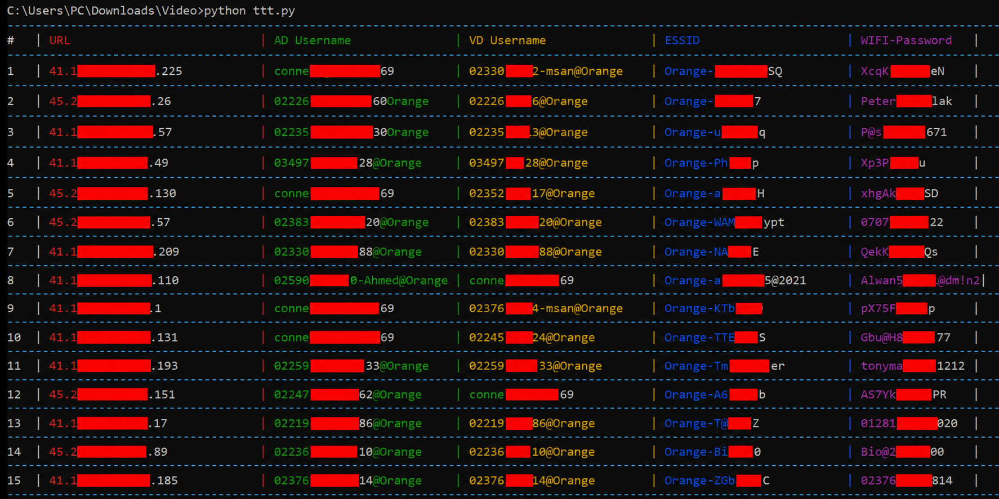

# CVE-2021-21735: ZTE ZXHN H168N Information Leak to Full Admin Compromise

Technical case study and GitHub Pages-ready write-up for **CVE-2021-21735** in the **ZTE ZXHN H168N V3.5**.

This repository focuses on the firmware routing flaw behind the exposed wizard endpoints, the disclosure timeline, the scoring split between the vendor advisory and NVD, and the practical path from information leak to full administrative compromise.



## What This Repo Contains

- `index.html`: the main article page, designed for GitHub Pages
- `zte_zxhn_h168n_bulk_poc.py`: bulk proof-of-concept script for the exposed wizard endpoints
- `requirements.txt`: minimal Python dependencies for the PoC
- `hero.png`: hero visual used in the article header
- `Codecleaned.png`: cleaned firmware screenshot used in the root cause analysis
- `Redacted.png`: redacted proof image used in the evidence section

## Core Angle

This write-up treats CVE-2021-21735 as more than a generic information disclosure:

- exposed wizard handlers returned PPPoE and WLAN data
- firmware allowlisting appears to admit sensitive setup routes through a `QuickSetupEnable` branch
- deployment-side credential practices could turn the leak into full admin compromise

## PoC

The repository includes a bulk PoC that demonstrates the exposed wizard-page behavior described in the write-up across a host list:

```powershell
python -m pip install -r requirements.txt
python .\zte_zxhn_h168n_bulk_poc.py --input .\urls.txt
```

The script fetches:

- PPPoE `ADUsername`
- PPPoE `VDUsername`
- WLAN `ESSID`
- WLAN `KeyPassphrase` via the unauthenticated `GetPassword` action

Expected input:

- `urls.txt`: newline-delimited list of target hosts or IPs

## Publishing Note

The repository is prepared for GitHub Pages, but Pages is not being enabled yet because a published GitHub Pages site becomes publicly accessible even when the repository itself remains private.
