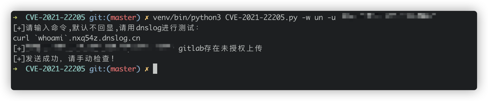
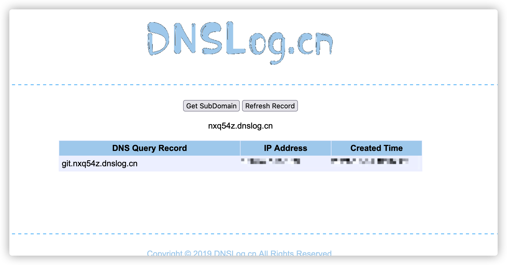

## 0x01 前言

**声明:本项目仅供学习和交流使用，请勿用于非法未授权测试！**

**更新记录**

10.30

- 增加了`burp`代理池

- 重写了命令行参数
- 增加了`gitlab`未授权批量以及单个检测功能

## 0x02 使用说明

安装

```bash
pip3 install - r requirements.txt
```

使用方法

```bash
usage: CVE-2021-22205.py [-h] [-w WAY] [-u URL] [-f FILE]

CVE-2021-22205

optional arguments:
  -h, --help            show this help message and exit
  -w WAY, --way WAY     Exploit way Forexample unauthorized or register new projects
  -u URL, --url URL     url like http://127.0.0.1:8080
  -f FILE, --file FILE  url file path
```

单个`url`进行未授权上传检测
```python
python3 CVE-2021-22205.py -w un -u http://127.0.0.1
```

进行批量未授权上传检测

```python
python3 CVE-2021-22205.py -w un -f ./url.txt
```

举个小列子

此漏洞默认不回显，输入命令，例如以`dnslog`带数据进行判断



重回`dnslog`进行检测，有回显即成功



## REF

https://hackerone.com/reports/1154542

https://security.humanativaspa.it/gitlab-ce-cve-2021-22205-in-the-wild/

https://github.com/RedTeamWing/CVE-2021-22205

https://github.com/mr-r3bot/Gitlab-CVE-2021-22205/