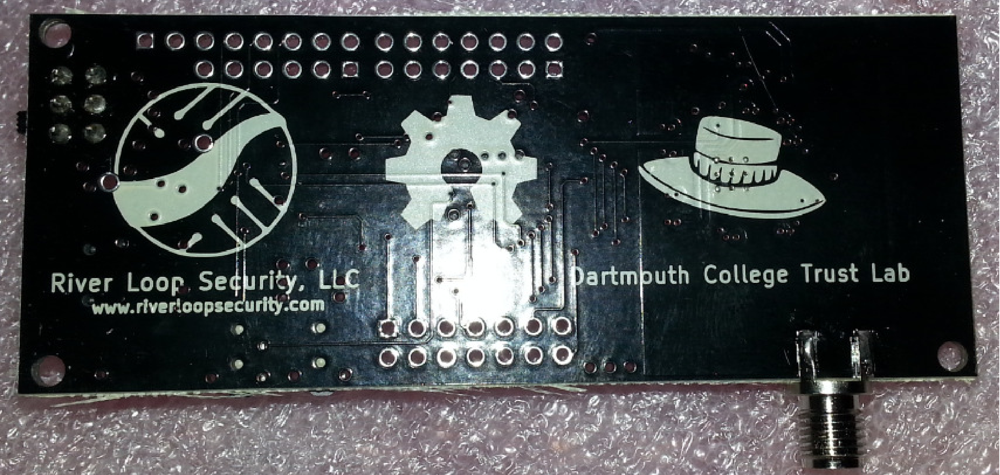
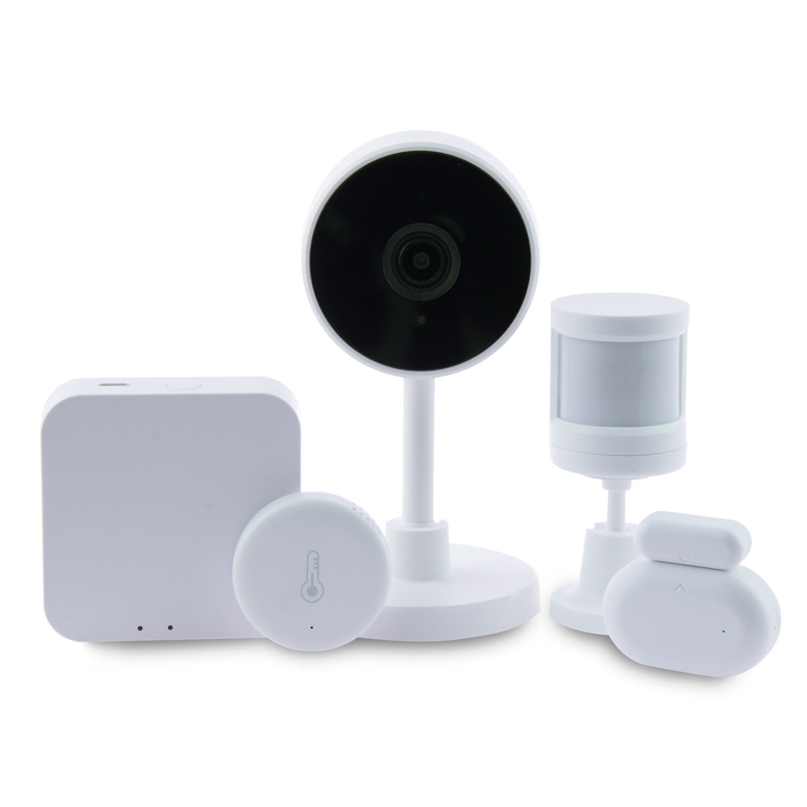
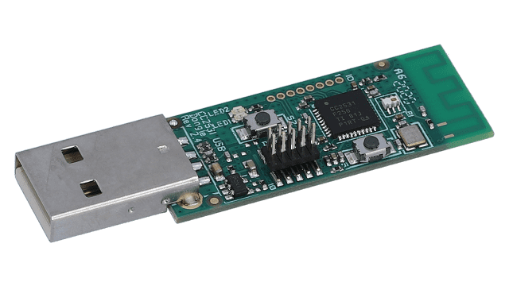
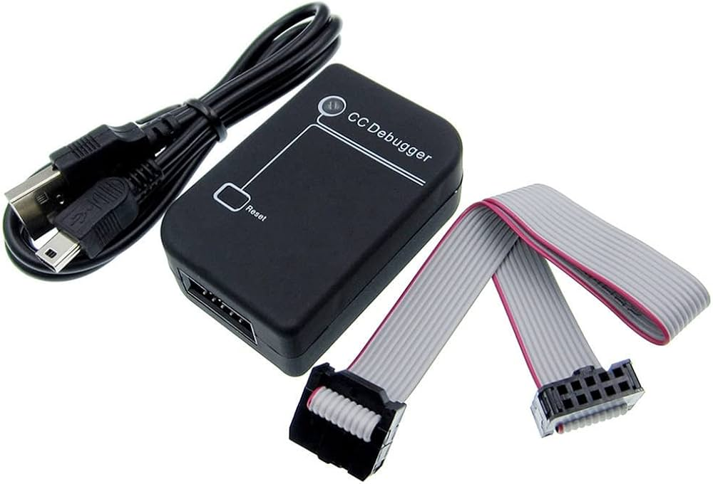
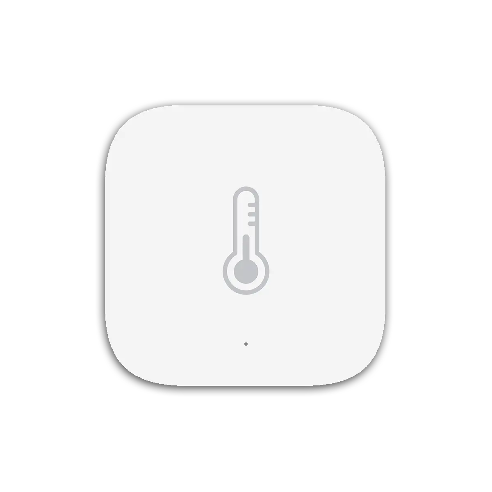
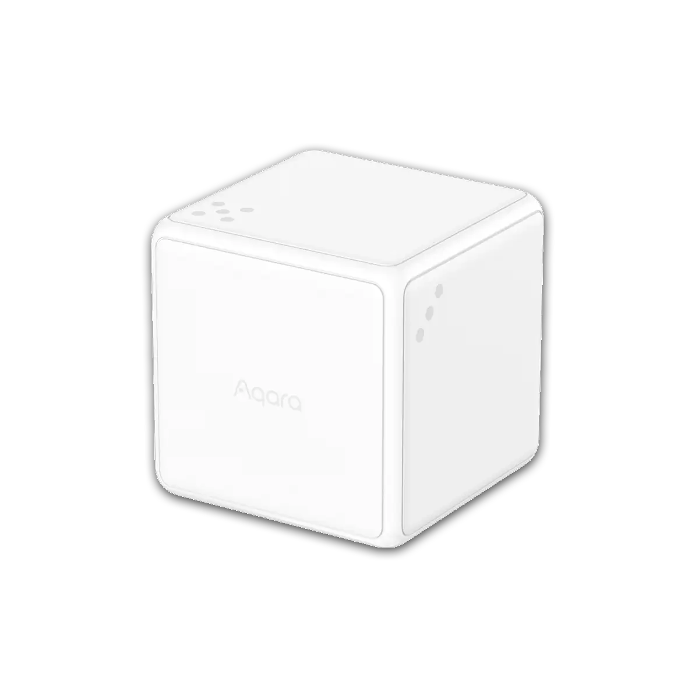
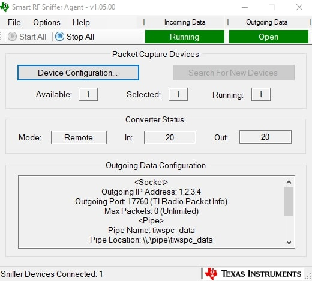
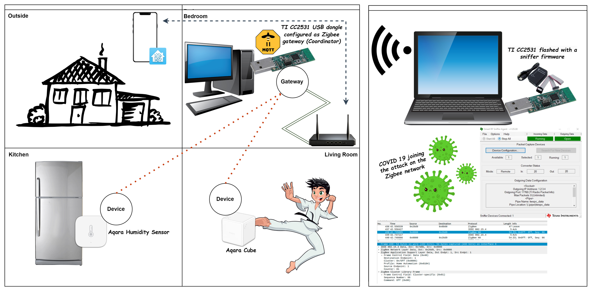
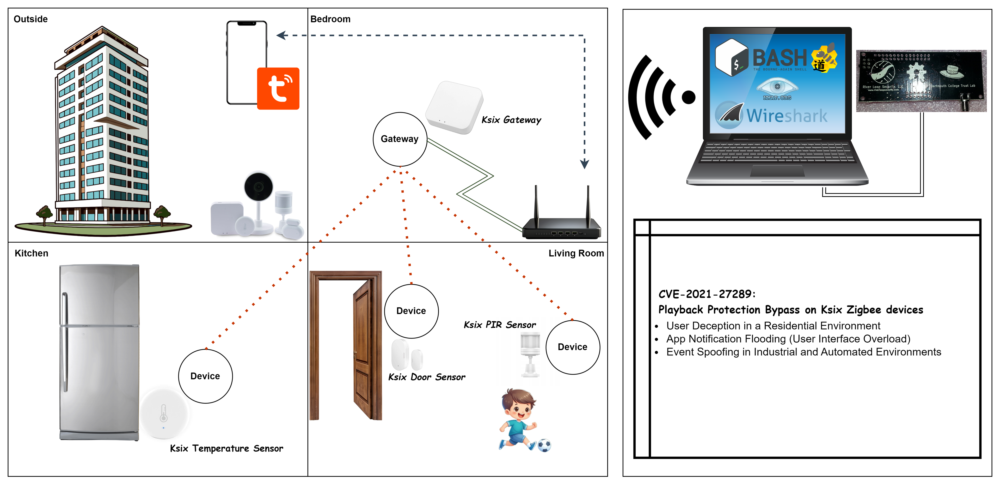

# ***🍯Lab Setup for Zigbee Security Research*** 

This document outlines the hardware and software components used in my Zigbee security research lab.


---
---
---


## ***📑 Table of Contents***

* [Hardware Components](#hardware-components)
    * [APImote](#hardware-components-apimote)
    * [Ksix Zigbee Devices](#hardware-components-ksix-zigbee-devices)
    * [(Optional) TI CC2531 and CC-Debugger](#hardware-components-ticc2531)
    * [(Optional) Aqara Zigbee Devices](#hardware-components-aqara-zigbee-devices)

* [Software Components](#software-components)
    * [KillerBee Framework](#software-components-killerbee-framework)
    * [Wireshark](#software-components-wireshark)
    * [Nmap](#software-components-nmap)
    * [Tuya Smart](#software-components-tuya-smart)
    * [(Optional) Zigbee2MQTT](#software-components-zigbee2mqtt)
    * [(Optional) SmartRF Packet Sniffer 2](#software-components-smartrf)
    * [(Optional) Home Assistant](#software-components-home-assistant)

* [Lab Setup Diagram](#lab-setup-diagram)
    * [Phase 1 - Early Research with a Private Company (Mar 2020 - Jun 2020)](#lab-setup-diagram-phase1)
    * [Phase 2 - Independent Thesis Project (Oct 2020 - Jan 2021)](#lab-setup-diagram-phase2)


---
---
---


<div id='hardware-components'/>

## ***🧰 Hardware Components***

<div id='hardware-components-apimote'/>

### ***📡 APImote***
​
<p align="center">
  <span style="vertical-align: middle;">
    
  </span>
  <span style="vertical-align: middle;">
    
  </span>
</p>

#### ***📖 Description***
APImote is an open-source hardware platform designed for low-level experimentation with IEEE 802.15.4/Zigbee protocols. It facilitates tasks such as packet sniffing and injection, making it invaluable for security research.​

#### ***🛒 Where to Buy***
The APImote is available through various online retailers, including:​
- [Attify Store](https://www.attify-store.com/products/apimote)

#### ***🔗 References***

- [River Loop Security's APImote Project](https://riverloopsecurity.com/projects/apimote/​)

---

<div id='hardware-components-ksix-zigbee-devices'/>

### ***🖧 Ksix Zigbee Devices***

<p align="center">
  <span style="vertical-align: middle;">
    
  </span>
</p>

#### ***📖 Description***

The Ksix Smart Home Kit includes various Zigbee-compatible devices such as motion sensors, door/window sensors, and a central control hub. These devices are used to simulate a typical smart home environment for testing purposes.​

#### ***📦 Availability***

Please note that some Ksix Zigbee devices have been discontinued. However, they may still be found through certain retailers or second-hand marketplaces.​

#### ***🔗 References***

- [Archived Ksix Smart Home Kit page (via Wayback Machine)](https://web.archive.org/web/20201124113630/https://www.Ksix.com/otros-productos-smart/1950-smart-home-kit-ksix-kit-de-domotica-para-el-hogar.html)
- [Amazon product listing (discontinued)](https://www.amazon.es/dp/B07ZHBF1Z4)

---

<div id='hardware-components-ticc2531'/>

### ***🔌 (Optional) TI CC2531 and CC-Debugger***

<p align="center">
  <span style="vertical-align: middle;">
    
  </span>
  <span style="vertical-align: middle;">
    
  </span>
</p>

#### ***📖 Description***

The Texas Instruments CC2531 USB dongle is a widely used and budget-friendly Zigbee sniffer. When flashed with the appropriate firmware, it becomes capable of capturing and analyzing Zigbee traffic using various tools. To flash the CC2531, a CC-Debugger is required. This debugger allows writing the Zigbee sniffer firmware to the dongle through its debug interface.

#### ***🧰 Flashing Process Overview***

- Connect the CC2531 to the CC-Debugger using the supplied debug cable.
- Use the flashing software (e.g., TI's Flash Programmer) to load the sniffer firmware.
- After flashing, the CC2531 can be plugged directly into a USB port and used with compatible Zigbee analysis tools.

#### ***💡 Usage***

The CC2531 USB dongle was tested in conjunction with Zigbee2MQTT and SmartRF Packet Sniffer 2 to inspect live traffic and perform packet analysis.

#### ***🔗 References***

- [CC2531 Product Page](https://www.ti.com/product/CC2531)
- [TI CC-Debugger Product Page](https://www.ti.com/tool/CC-DEBUGGER)
- [Flashing Guide - Zigbee2MQTT](https://www.zigbee2mqtt.io/guide/adapters/flashing/flashing_the_cc2531.html)
- [SmartRF Flash Programmer](https://www.ti.com/tool/FLASH-PROGRAMMER)

---

<div id='hardware-components-aqara-zigbee-devices'/>

### ***💧 (Optional) Aqara Zigbee Devices***

<p align="center">
  <span style="vertical-align: middle;">
    
  </span>
  <span style="vertical-align: middle;">
    
  </span>
</p>

#### ***📖 Description***

- Aqara Temperature and Humidity Sensor - Measures ambient temperature, humidity, and atmospheric pressure.
- Aqara Cube T1 Pro - A motion-based Zigbee controller that recognizes multiple gestures such as rotate, shake, flip, and double-tap.

#### ***🔗 References***

- [Aqara Official Website](https://eu.aqara.com/en-eu)
- [Aqara Water Leak Sensor](https://eu.aqara.com/en-eu/products/aqara-temperature-and-humidity-sensor)
- [Aqara Cube T1 Pro](https://eu.aqara.com/en-eu/products/aqara-cube-t1-pro)


---
---
---


<div id='software-components'/>

## ***💻 Software Components***

<div id='software-components-killerbee-framework'/>

### ***🐝 KillerBee Framework***

<p align="center">
  <span style="vertical-align: middle;">
    
  </span>
</p>

#### ***📖 Description***

KillerBee is a Python-based framework and toolset for testing and auditing Zigbee and IEEE 802.15.4 networks. It provides utilities for packet capture, injection, and analysis, facilitating comprehensive security assessments.​

#### ***⚙️ Installation***

Clone the Repository:
```
git clone https://github.com/riverloopsec/killerbee.git
```
Install Dependencies:
```
cd killerbee
sudo python setup.py install
```

#### ***🔗 References***

- [KillerBee GitHub Repository](https://github.com/riverloopsec/killerbee​)

---

<div id='software-components-wireshark'/>

### ***🦈 Wireshark***

<p align="center">
  <span style="vertical-align: middle;">
    
  </span>
</p>

#### ***📖 Description***

Wireshark is a widely-used network protocol analyzer. In this context, it was used to inspect Zigbee packet captures (.pcap files), visualize traffic structure, and analyze specific fields like the frame counter and sequence number.

#### ***⚙️ Installation***

Wireshark is available for Linux, Windows, and macOS. Download and install it from the official [website](https://www.wireshark.org/download.html).


#### ***🔗 References***

- [Wireshark Official Site](https://www.wireshark.org/)
- [Display Filter Reference: ZigBee Network Layer](https://www.wireshark.org/docs/dfref/z/zbee.nwk.html)
- [Wireshark IEEE_802.15.4](https://wiki.wireshark.org/IEEE_802.15.4)

---

<div id='software-components-nmap'/>

### ***📡 Nmap***

<p align="center">
  <span style="vertical-align: middle;">
    
  </span>
</p>

#### ***📖 Description***

Although not specific to Zigbee, Nmap was used in the lab to analyze the state of the host system running the Zigbee controller, verify local services, and inspect network behavior during replay attacks.

#### ***⚙️ Installation***

Nmap is pre-installed on most pentesting distributions like Kali Linux. To install it manually:

```
sudo apt install nmap
```

#### ***🔗 References***

- [Nmap Official Site](https://nmap.org/)
- [Nmap Cheat Sheet](https://www.stationx.net/nmap-cheat-sheet/)

---

<div id='software-components-tuya-smart'/>

### ***📡 Tuya Smart***

<p align="center">
  <span style="vertical-align: middle;">
    
  </span>
</p>

#### ***📖 Description***

Tuya Smart is a widely used mobile application that enables users to control a variety of IoT devices, including Zigbee-compatible sensors. It allows for remote configuration, automation, and monitoring of smart home environments. This app was used during the research to pair the Zigbee devices, observe their behavior, and receive real-time alerts, which proved useful when testing spoofed or replayed packets.

Key features:
- Device pairing and automation rules.
- Real-time alerts on state changes (e.g., door opened, motion detected).
- App interface used to confirm whether spoofed Zigbee messages were accepted by the devices.
- Compatible with many off-the-shelf smart home kits (including the Ksix Zigbee kit used in this project).

#### ***🔗 References***

- [Tuya Smart on Google Play](https://play.google.com/store/apps/details?id=com.tuya.smart)
- [Tuya Smart Official Site](https://www.tuya.com)

---

<div id='software-components-zigbee2mqtt'/>

### ***📶 (Optional) Zigbee2MQTT***

<p align="center">
  <span style="vertical-align: middle;">
    
  </span>
</p>

#### ***📖 Description***

Zigbee2MQTT allows Zigbee devices to communicate through MQTT, commonly used in smart home setups. It supports packet monitoring when combined with flashed CC2531 dongles.

#### ***🔗 References***

- [Official Zigbee2MQTT Guide](https://www.zigbee2mqtt.io)
- [Zigbee2MQTT: Sniff Zigbee traffic](https://www.zigbee2mqtt.io/advanced/zigbee/04_sniff_zigbee_traffic.html)

---

<div id='software-components-smartrf'/>

### ***📡 (Optional) SmartRF Packet Sniffer 2***

<p align="center">
  <span style="vertical-align: middle;">
    
  </span>
</p>

#### ***📖 Description***

SmartRF Packet Sniffer 2 by Texas Instruments provides a GUI to capture, filter, and analyze IEEE 802.15.4 traffic. It's especially useful for low-level debugging.

#### ***🔗 References***

- [TI Tool Page](https://www.ti.com/tool/download/PACKET-SNIFFER-2)

---

<div id='software-components-home-assistant'/>

### ***🏡 (Optional) Home Assistant***


<p align="center">
  <span style="vertical-align: middle;">
    
  </span>
</p>

#### ***📖 Description***

Home Assistant is an open-source home automation platform that can integrate with a wide range of smart home devices, including Zigbee networks through add-ons like Zigbee2MQTT or ZHA (Zigbee Home Automation).

#### ***🔗 References***

- [Official Home Assistant Website](https://www.home-assistant.io)
- [Zigbee2MQTT Integration Guide](https://www.zigbee2mqtt.io/guide/usage/integrations/home_assistant.html)
- [Zigbee Home Automation Website](https://www.home-assistant.io/integrations/zha/)


---
---
---

<div id='lab-setup-diagram'/>

## ***🗺️ Lab Setup Diagram***

This section presents two diagrams representing the evolution of the lab environment across the two stages of my final degree project. The first phase was carried out as part of a collaboration with a private cybersecurity company, while the second phase reflects a shift to independent research, which ultimately led to the discovery of the vulnerability CVE-2021-27289.

<div id='lab-setup-diagram-phase1'/>

### ***📁 Phase 1 - Early Research with a Private Company (Mar 2020 - Jun 2020)***

<p align="center">
  <span style="vertical-align: middle;">
    
  </span>
</p>

The first version of the lab was developed during a university collaboration with a private company (Tarlogic Research), where I focused on the detection, monitoring, and interference of Zigbee-based IoT devices. During this stage, I used TI CC2531 dongles, Zigbee2MQTT, and SmartRF Packet Sniffer 2 to capture and analyze Zigbee traffic in a typical smart home scenario.

⚠️ Note: These tools are marked as optional in the main hardware and software sections because they were only used during this initial research phase focused on preliminary analysis.

---

<div id='lab-setup-diagram-phase2'/>

### ***🎓 Phase 2 - Independent Thesis Project (Oct 2020 - Jan 2021)***

<p align="center">
  <span style="vertical-align: middle;">
    
  </span>
</p>

After completing the initial research objectives set by the company, I decided not to move forward with the development-focused direction they had in mind. Instead, I chose to continue working independently, expanding the scope of the project to include more low-level analysis of Zigbee and Thread protocols and exploring different IoT device implementations.

This second phase became my final degree thesis, and it's during this deeper technical exploration that I discovered the vulnerability now known as CVE-2021-27289.
