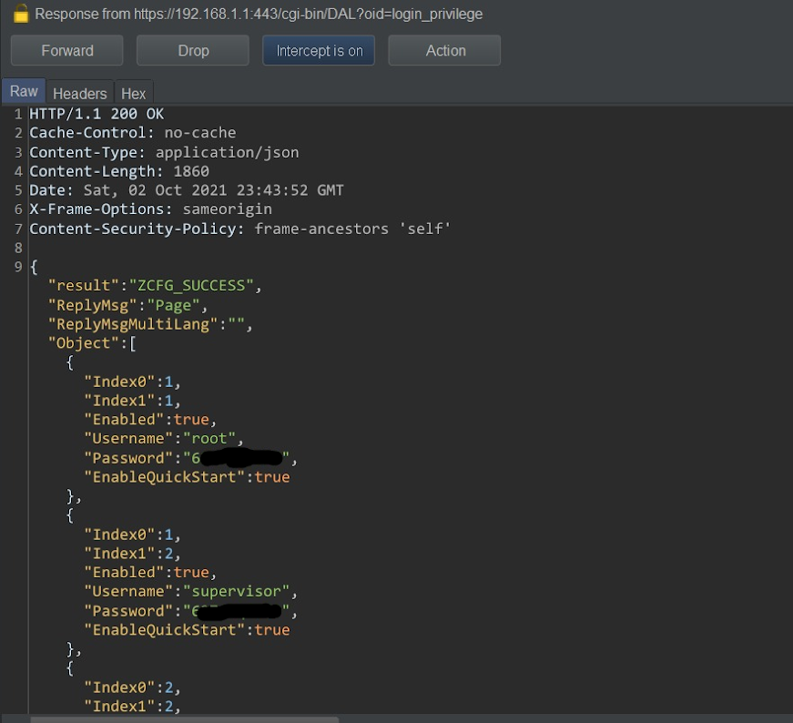
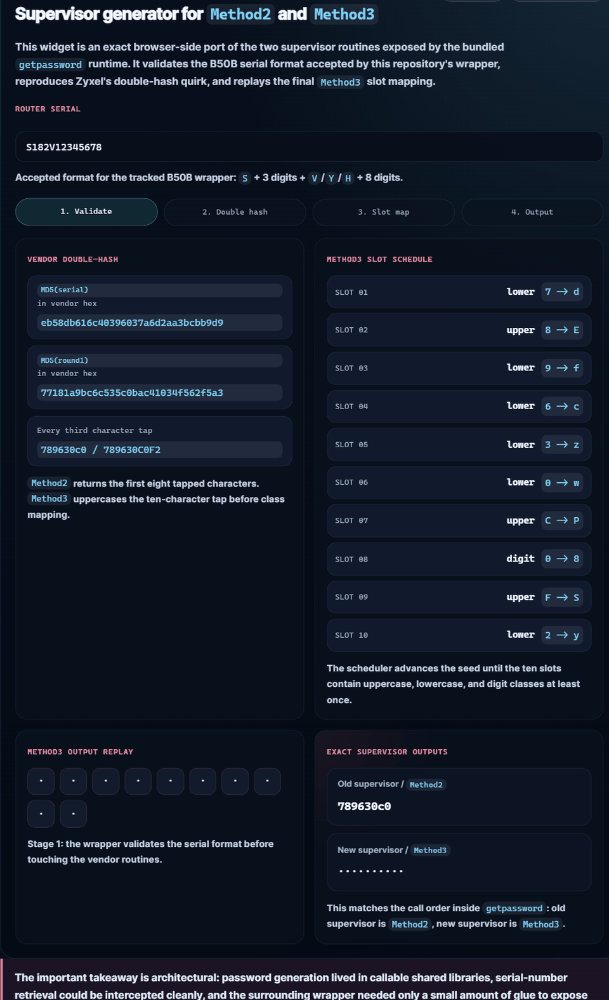

# CVE-2021-35036: Zyxel Super-Admin Password Leak Analysis

This repository contains the public write-up and lab files for CVE-2021-35036. The issue was reported against Zyxel VMG3625-T50B firmware and centered on DAL getter paths that returned higher-privilege local-account and remote-management credentials to a low-privilege authenticated session.



[](https://minanagehsalalma.github.io/zyxel-cve-2021-35036-super-admin-password-leak/#exact-supervisor-generator)

The analysis traces the issue from the original VMG3625-T50B report into the broader Zyxel management stack: authenticated low-privilege users could reach DAL handlers that returned raw secrets for administrator-tier local accounts plus management services such as TR-069 and FTPS.

Boginw's public [`zyxel-vmg8825-keygen`](https://github.com/boginw/zyxel-vmg8825-keygen) project is useful context for the article's Genpass section. It shows that password material on affected Zyxel platforms was embedded in reusable vendor logic that could derive supervisor and admin credentials from device identity inputs. That context helps explain why the DAL disclosure was operationally serious: once shared backend objects were exposed too broadly, other components in the firmware stack were already capable of loading, transforming, and regenerating sensitive credential material.

The repository also includes the adapted VMG8825-B50B bundle used during analysis in [`zyxel-vmg8825-b50b-keygen-lab/`](zyxel-vmg8825-b50b-keygen-lab/README.md). The tracked `adapted-runtime/opt/genpass/genpass` wrapper was extracted from the emulated B50B filesystem and accepts serial formats with `V`, `Y`, or `H` in position five before dispatching to the vendor password-generation binary.

## Exact supervisor generator

Open the live generator here:

[Launch the exact Method2 / Method3 generator](https://minanagehsalalma.github.io/zyxel-cve-2021-35036-super-admin-password-leak/#exact-supervisor-generator)

The preview above is clickable and opens the exact browser-side supervisor generator for the bundled `Method2` and `Method3` paths. GitHub strips JavaScript from repository READMEs, so the interactive version has to open from the linked page rather than execute inline inside `README.md`.

Example usage for the adapted lab bundle:

```powershell
.\zyxel-vmg8825-b50b-keygen-lab\run-qemu.bat
```

Then, inside the emulated shell:

```sh
genpass S182V12345678
```

Expected output includes supervisor, admin, and Wi-Fi password families derived from the supplied serial. The large `rootfs.ext2` disk image remains untracked because it is too large for a normal GitHub push, while the repository carries the adapted runtime files and launch scripts that distinguish this B50B-specific version from the original upstream project.

The keygen material is included because it is concrete firmware evidence: credential handling was implemented in reusable vendor libraries and wrappers, not only in one web panel.

Publishable site files:

- `index.html`: main article
- `assets/site.css`: page styling
- `assets/properhero.jpg`: article hero and social preview image
- `assets/readme-genpass-demo.gif`: animated README preview of the exact supervisor generator
- `assets/favicon.svg`: favicon source
- `disclosure-proof-images/page-04-img-01.png`: embedded disclosure proof image used in the article
- `zyxel-vmg8825-b50b-keygen-lab/`: adapted VMG8825-B50B keygen bundle, including the extracted `genpass` runtime used in the analysis

Local research artifacts, firmware trees, emulator assets, PDFs, screenshots, and other research files are excluded from the repo by `.gitignore` so the Pages branch stays clean.

External references highlighted in the article include:

- Zyxel's public advisory for CVE-2021-35036
- NVD's CVE record
- Boginw's public `zyxel-vmg8825-keygen` project for the VMG8825 password-generation context
