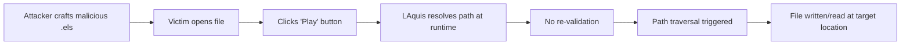

# LAquis SCADA Arbitrary File Write
## 👨‍💻 Author

### Mohammed Idrees Banyamer

🐦 Instagram: @banyamer_security


**Proof-of-Concept exploit for CVE-2021-41579** - Arbitrary file write via malicious `.els` project file in **LCDS LAquis SCADA ≤ 4.3.1.1085**.

---


## 🚨 Vulnerability Description

**CVE-2021-41579** is a client-side vulnerability in **LCDS LAquis SCADA** versions ≤ 4.3.1.1085.

An attacker can craft a malicious `.els` project file containing path traversal sequences (`..\..\..\`). When a victim opens the file and clicks **"Play"** (runtime/simulation mode), LAquis bypasses all security/consent prompts and resolves the traversed paths without sanitization.

This allows:

- **Arbitrary file write** to locations writable by the current user
- **Arbitrary file read** of system/project files
- **Remote Code Execution** (via Startup folder persistence or malicious DLLs)

---

## 🎯 Affected Versions

| Status | Version |
|--------|---------|
| ❌ **Vulnerable** | LAquis SCADA ≤ 4.3.1.1085 |
| ✅ **Patched** | LAquis SCADA ≥ 4.3.2.1086 |

**Tested on:** Windows 10 x64, Windows 11 x64

---

## 💥 Impact

| Vector | Description |
|--------|-------------|
| **CVSS v3** | 7.8 (High) - AV:L/AC:L/PR:N/UI:R/S:U/C:H/I:H/A:H |
| **File Write** | Drop files to Startup → RCE on next boot |
| **File Read** | Dump credentials, project source code, system files |
| **Privilege** | Runs with victim's privileges (often Admin in SCADA environments) |

---

## 🔬 Technical Details

### Root Cause

1. **Client-side validation only** - Paths are checked when opening the file, but **not revalidated** during runtime
2. **Play mode bypass** - Clicking "Play" assumes the project is already trusted
3. **No path normalization** - `..\..\` sequences are passed directly to filesystem APIs
4. **Widespread path fields** - Images, scripts, logs, exports all use writable path strings

### Vulnerability Flow


### 🛠️ Usage
``` bash
git clone https://github.com/mbanyamer/CVE-2021-41579.git
cd CVE-2021-41579
pip install -r requirements.txt  # if applicable
```
