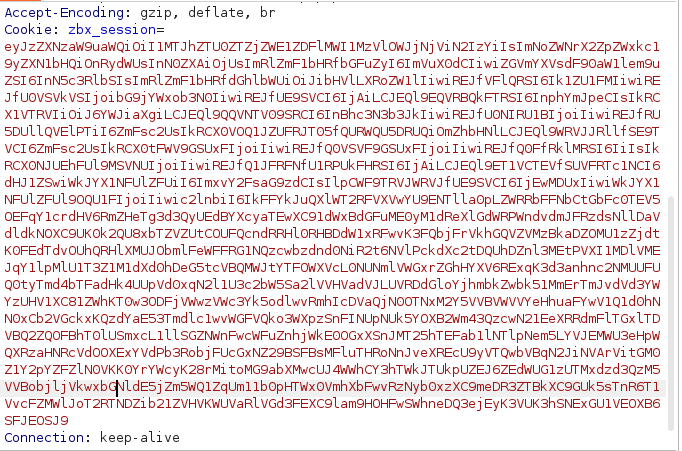
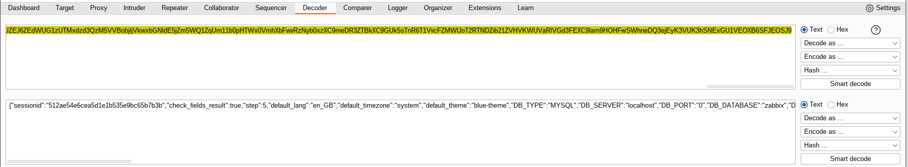
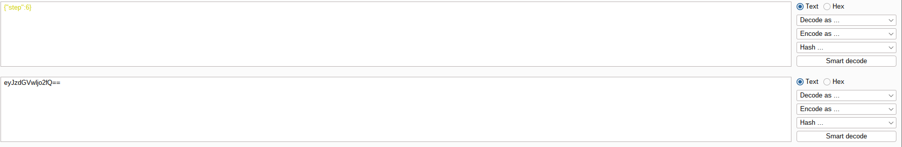
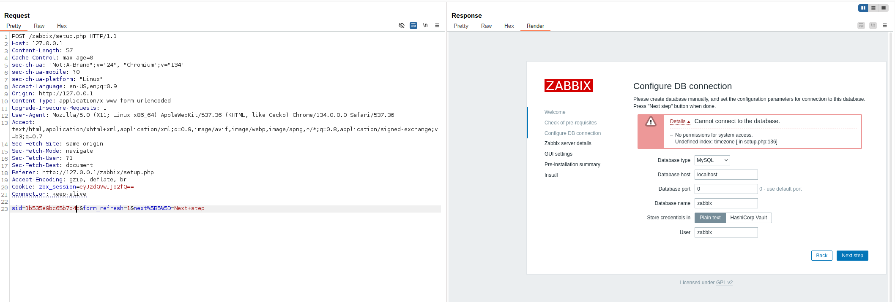
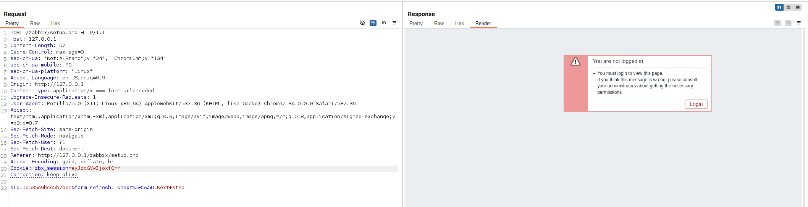
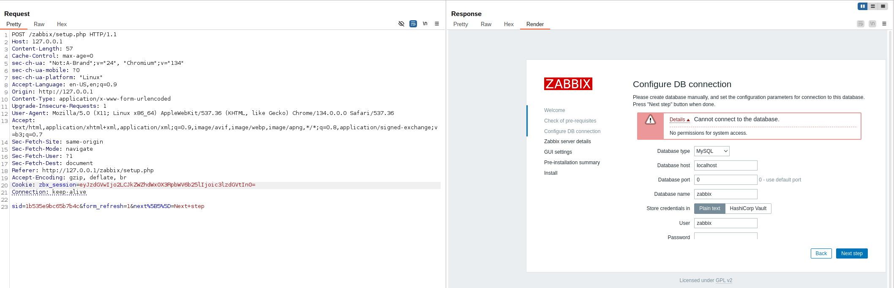
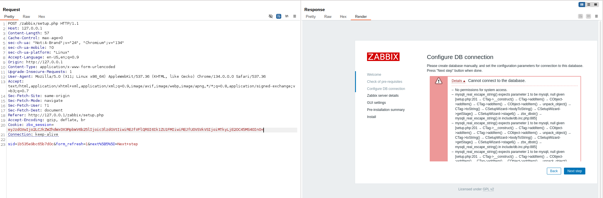
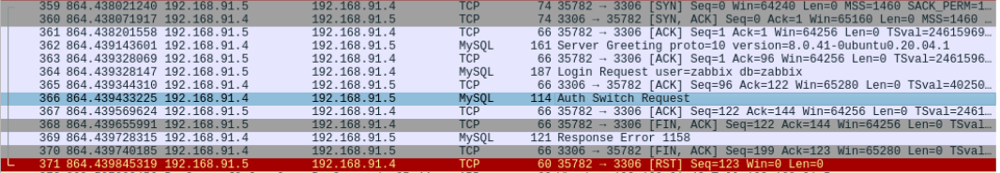
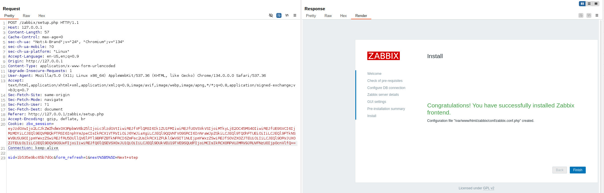

# CVE-2022-23134

This CVE, an auth bypass caused by lack of checking signatures, is contained in Zabbix PHP frontend versions 5.4.0 to 5.4.8RC1, as well as alpha versions 6.0.0-0 to 6.0.0-7 and beta version 6.0.0 according to NIST.

According to SonarSource, the original finders of this vulnerability, the issue stems from "setup.php" not checking the signature on the last "step" of the install process. This particular step is the one that gets all the data from the client needed to create the "zabbix.conf.php" file, which we can allegedly override and point to our own malicious database (most importantly, with a user account that we control). Once you're inside Zabbix, the world is your oyster - paired with a web vulnerability, you could run code! But either way, having full access to Zabbix can be powerful. (https://www.sonarsource.com/blog/zabbix-case-study-of-unsafe-session-storage/)

A coworker sent this link to me as an intriguing vulnerability that seemed quite "basic" to not have a POC for, so I dived into crafting my first web exploit!

## Starting Out

To start... you have to install Zabbix, which can be found as both source and Docker containers. I chose installing 5.4.2 from scratch as my target, because it wasn't the oldest or the newest - seemed like a good starting point, although the install process was time-consuming, building from source. I highly suggest you use a Docker container if you're testing this, but make sure it has the "zabbix_web_frontend" installed. 

The next thing was to make an "attacker" database. You can see from [the article written by SonarSource](https://www.sonarsource.com/blog/zabbix-case-study-of-unsafe-session-storage/) that it requires a remote database to "call back" to, to get the login info for your Zabbix user. I suggest doing this by...

 - Grabbing the source for your target's version (because minor releases can mess up things)
 - Following the [database install guide from Zabbix](https://www.zabbix.com/documentation/5.4/en/manual/appendix/install/db_scripts) on your attacker database
    - While making the `zabbix` user, make sure you use your target's IP
 - Make the MySQL server exposed on the correct attacker IP (for MySQL, this is done in `/etc/mysql/mysql.conf.d/mysqld.cnf` as `bind-address` and `mysqlx-bind-address` - service restart is required)

It requires some fields to be set for the Zabbix instance to be "happy" with the remote attacker database. I could go and find these fields and make a slimmed down SQL schema file, but this was meant to be a short project and I had already spent most of the day on it at that point!

## Hunting for the Vulnerability

And now that things are set up, we can search for the vulnerability! I started off using Burp Suite to capture each of the steps of the setup process. Thankfully we're dealing with HTTP here, so there's no SSL funniness to work with.

As I proceeded through the steps and got to the last one, I saw this gigantic blob as the "zbx_session" - looked like base64, so I decoded it... and it has some interesting fields!





Fascinating... this step, step 5, consists of a BUNCH of stuff in the session cookie. It looks like there's some important things in here, like a session ID, followed by a bunch of config information, and then a large `sign` field at the end (cut off). Based off SonarSource's writeup, this field seems to be what's never checked in step 6... so let's slim this message down to just step 6 and see what we get back!

```json
{"step":"6"}
```





Well damn! Looks like we're getting some errors though... a timezone, and more importantly, a permissions issue. The permissions issue scared me, but I was able to confirm that I was on the right track when I tried step 1, and got a "not logged in" error. We're getting farther in step 6 than step 1!

```json
{"step":"1"}
```



So if you look above, at the 2nd picture, you can see a `default_timezone` field... let's add it and see if we can rid ourselves of the timezone error.

```json
{"step":"6","default_timezone":"system"}
```



Nice! Adding the `default_timezone` field rid us of our error. So now, let's try populating that database connection stuff with information related to our attacker's database, taken from the initial message...

*NOTE: If this doesn't match later screenshots, I've slimmed the cookie down a whole lot, but it still has the same effect. See the POC for details!*

```json
{"step":6,"default_timezone":"system","DB_TYPE":"MYSQL","DB_SERVER":"192.168.91.4","DB_PORT":"3306","DB_DATABASE":"zabbix","DB_USER":"zabbix","DB_PASSWORD":"skibidi","DB_SCHEMA":"","DB_ENCRYPTION":false,"DB_ENCRYPTION_ADVANCED":false,"DB_VERIFY_HOST":false,"DB_KEY_FILE":"","DB_CERT_FILE":"","DB_CA_FILE":"","DB_CIPHER_LIST":"","DB_CREDS_STORAGE":"0","DB_DOUBLE_IEEE754":true}
```



Big error, and we're seeing some SQL stuff! So let's start digging into the traffic at the packet layer, because I feel like our request is good as we're hitting some SQL code based off the error.



Hmm... I've never dealt with MySQL in this capacity before (long ago I did some Asterisk administration... but that's about all my experience). But the "Auth Switch Request" from the attacker on 192.168.91.4 seemed to kill the comms. 

Turns out this is a type of negotiation that happens - if we look into the packet sent by the attacker, it asks for "caching_sha2_password" as its auth. But our Zabbix server sends "mysql_native_password" - our attacker then politely asks to change, before getting the cold shoulder from Zabbix, which then causes the attacker to tell the client that *it's* the problem. Sounds like a horrible relationship, but thankfully the solution is easier than marriage counseling. 

On the attacker's database, update the target user with this command to force it to use the `mysql_native_password` authentication method: `ALTER USER '<user>'@'<host>' IDENTIFIED WITH mysql_native_password BY '<password>';` and try again...



And look at that, it's updated and using our server as its database config!

I'd dive into the code, but SonarSource has already done a really good job of showing the vulnerability - I just wanted to share my POC and the way I got there with everyone!

## Future Work

In the future I'd like to find a concrete way to turn this into code execution or pivoting. So far it's just an auth bypass to a priveleged account on a system. I feel like by studying the database schema, I might find an issue somewhere... regardless, here's a POC for this vulnerability!