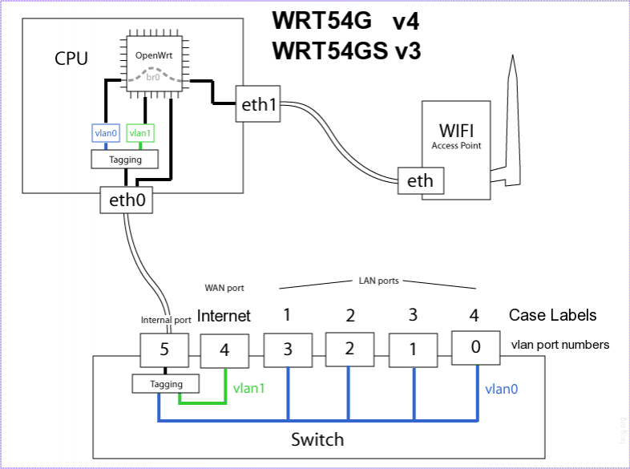
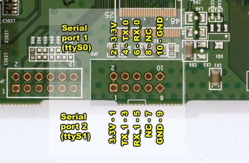
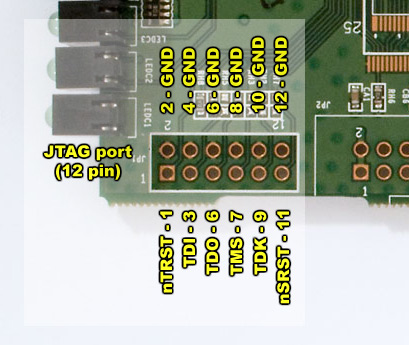
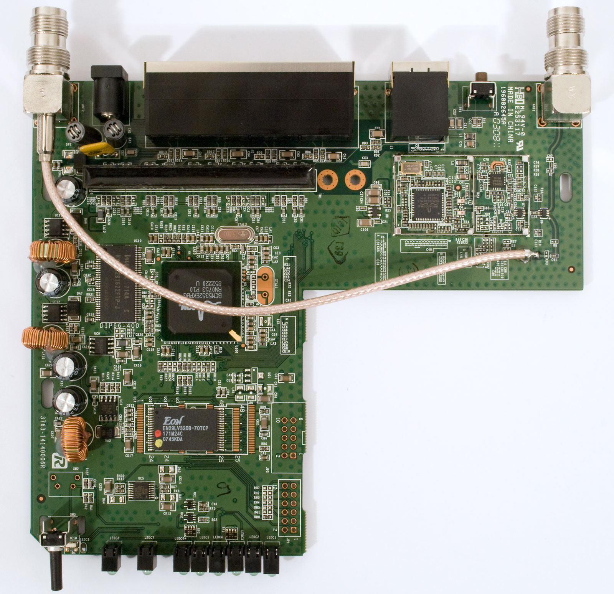
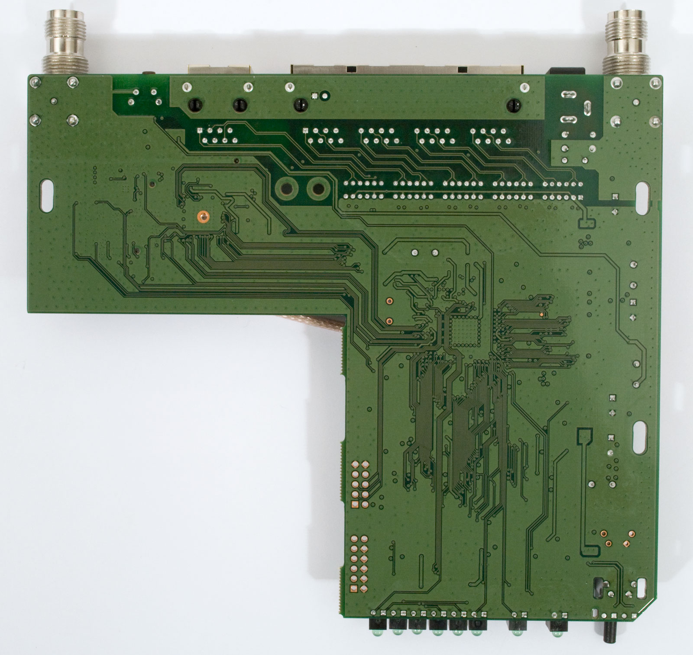
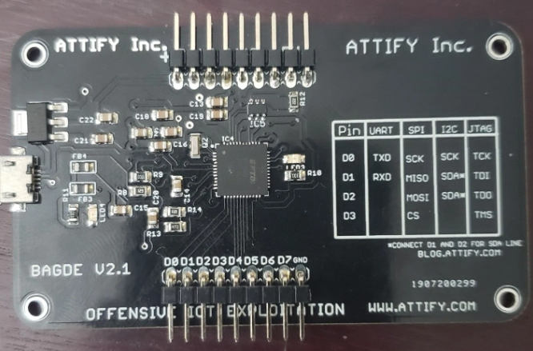
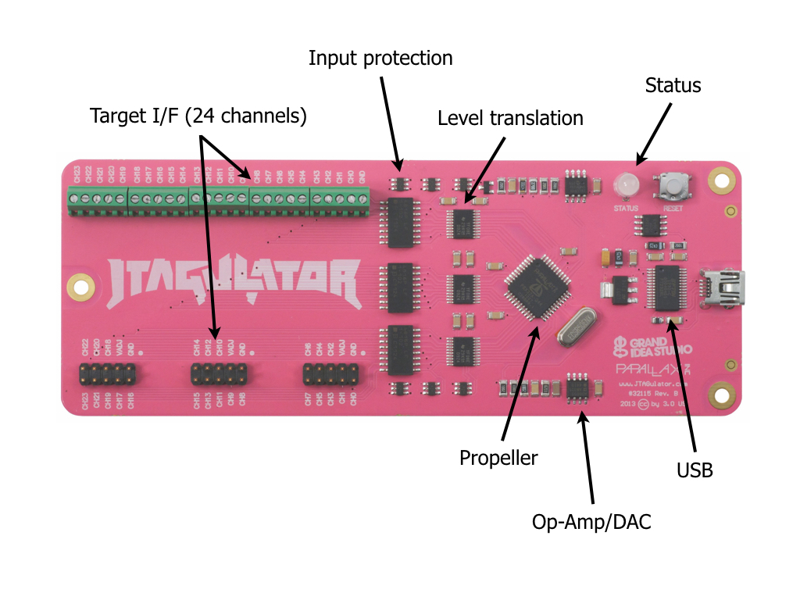

# Hardware Inventory

This section contains all information about the hardware used during the exploitation process.

> **Disclaimer:** This repository is for **educational and research purposes only**. Do **not** reproduce on hardware you do not own or have explicit authorization to test. The author assumes **no liability** for misuse.

---

## Table of Contents

1. [Linksys WRT54GL v1.1 Datasheet](#linksys-wrt54gl-v11-datasheet)

   * [General Specifications](#general-specifications)
   * [Physical Specifications](#physical-specifications)
   * [Features](#features)
   * [Software](#software)
   * [Hardware and Features](#hardware-and-features)
   * [Default Network Configuration](#default-network-configuration)
   * [Internal Architecture](#internal-architecture---wrt54gl)
   * [Buttons](#buttons)
   * [Serial Interface](#serial-interface---information)
   * [JTAG Interface](#jtag-interface---information)
   * [JTAG Pinout](#pinout---jtag-port)
   * [Photo - Back](#photo---back)
   * [Photo - Front](#photo---front)
2. [Attify Badge](#attify-badge---hardware-security-analysis-tool)

   * [Features](#features-1)
   * [Getting Started](#getting-started)
   * [Contributing](#contributing)
   * [License](#license)
3. [JTAGulator Datasheet](#jtagulator-datasheet)

   * [Introduction](#introduction)
   * [Features](#features-2)
   * [OpenOCD Configuration](#openocd-installconfiguration)
   * [Command Set](#command-set)
   * [Additional Information](#additional-information)
   * [Credits](#credits)

---

## Linksys WRT54GL v1.1 Datasheet

### General Specifications

* Model: WRT54GL v1.1
* Wireless Standard: IEEE 802.11b/g
* Data Rate: Up to 54 Mbps
* Number of Wireless Antennas: 2
* Number of Wired Ports: 4
* Supported Operating Systems: Windows, Mac OS X, Linux

### Physical Specifications

* Dimensions: 192 x 120 x 35 mm (7.56 x 4.72 x 1.38 in)
* Weight: 220 g (7.8 oz)

### Features

* Wireless networking
* 4-port switch
* NAT firewall
* Stateful packet inspection (SPI)
* DHCP server
* Dynamic DNS support
* QoS support
* Access control lists (ACLs)

### Software

* Linksys firmware
* DD-WRT firmware
* Tomato firmware

### Hardware and Features

| Feature              | Description                                                                                                                                                                                                                                                       |
| -------------------- | ----------------------------------------------------------------------------------------------------------------------------------------------------------------------------------------------------------------------------------------------------------------- |
| CPU                  | Broadcom BCM5352 chipset - 200 MHz                                                                                                                                                                                                                                |
| CPU Architecture     | Broadcom MIPS                                                                                                                                                                                                                                                     |
| Architecture         | Microprocessor without Interlocked Pipeline Stages                                                                                                                                                                                                                |
| Computing Style      | Reduced instruction set computing                                                                                                                                                                                                                                 |
| Data Byte Ordering   | Little Endian                                                                                                                                                                                                                                                     |
| RAM                  | 16 MB                                                                                                                                                                                                                                                             |
| Flash Memory         | 4 MB                                                                                                                                                                                                                                                              |
| Operating System     | Linux                                                                                                                                                                                                                                                             |
| Frequency Band       | 2.4 GHz                                                                                                                                                                                                                                                           |
| Data Transfer Rate   | 54 Mbps                                                                                                                                                                                                                                                           |
| Interfaces           | WAN: 1 x Ethernet 10Base-T/100Base-TX - RJ-45, LAN/DMZ: 4 x Ethernet 10Base-T/100Base-TX - RJ-45                                                                                                                                                                  |
| Data Link            | Ethernet, IEEE 802.11b, IEEE 802.11g, Fast Ethernet                                                                                                                                                                                                               |
| Remote Management    | HTTP                                                                                                                                                                                                                                                              |
| Features             | Dynamic IP address assignment, Firewall protection, DMZ port, Auto-sensing per device, Auto-negotiation, Auto-uplink (auto MDI/MDI-X), MAC address filtering, Firmware upgradable, Wi-Fi Multimedia (WMM) support, Stateful Packet Inspection (SPI), DHCP support |
| Encryption Algorithm | WPA2, WPA, 128-bit WEP, 64-bit WEP                                                                                                                                                                                                                                |
| Compliant Standards  | IEEE 802.11g, IEEE 802.11b, Wi-Fi CERTIFIED, UPnP, IEEE 802.3u, IEEE 802.3                                                                                                                                                                                        |

### Default Network Configuration

| Name           | Description        | Default configuration |
| -------------- | ------------------ | --------------------- |
| br-lan         | LAN & WiFi         | 192.168.1.1/24        |
| vlan0 (eth0.0) | LAN ports (1 to 4) | None                  |
| vlan1 (eth0.1) | WAN port           | DHCP                  |
| wl0            | WiFi               | Disabled              |

### Internal Architecture - WRT54GL

### Buttons

| Button            | Event |
| ----------------- | ----- |
| Reset             | reset |
| Secure-Easy-Setup | ses   |

### Serial Interface - Information

* The WRT54G/S/L has a 10 pin connection slot on the board called JP1 (JP2 on some v1.1 boards). This slot provides two TTL serial ports at 3.3V.
* These two TTL serial ports on the WRT54GL router can be used as standard Serial Ports similar to the serial ports you may have on your PC. In order to do this though you need a line driver chip that can raise the signal levels to RS-232 levels.
* You can not directly connect a serial port header to the board and expect it to work. That method will only work with devices that can connect to TTL serial ports at 3.3V. Connecting two which have 3.3V directly will work (TX - RX, RX - TX, GND - GND).
* Standard RS-232 devices cannot be directly connected which accounts for nearly all serial PC devices.

### Pinout - Serial Interface

| Pin | Valore        |
| --- | ------------- |
| 1   | 3.3V          |
| 2   | 3.3V          |
| 3   | TX_1          |
| 4   | TX_0          |
| 5   | RX_1          |
| 6   | RX_0          |
| 7   | Non collegato |
| 8   | Non collegato |
| 9   | GND           |
| 10  | GND           |

### JTAG Interface - Information

* The JTAG port is a 12-pin unpopulated header next to the serial port header. A simple unbuffered cable works fine.

### Pinout - JTAG Port

| Pin                | Valore |
| ------------------ | ------ |
| 1                  | nTRST* |
| 3                  | TDI    |
| 5                  | TDO    |
| 7                  | TMS    |
| 9                  | TCK    |
| 11                 | nSRST* |
| 2, 4, 6, 8, 10, 12 | GND    |

### Photo - Front

### Photo - Back

---

## Attify Badge - Hardware Security Analysis Tool

### Features

1. Embedded Device Security Analysis
2. Multiple Interfaces for Exploration
3. JTAG Pinout Identification
4. UART Pinout Detection
5. Open Source Hardware Design
6. User-Friendly USB Connectivity
7. Educational Purpose Emphasis
8. Compact and Portable Design
9. Support for Various Architectures
10. Community and Documentation

### Getting Started

Refer to the [official documentation](https://docs.attify.com/).

### Contributing

Join the [Attify community](https://community.attify.com/) to contribute.

### License

Released under [GNU GPL v3.0](https://opensource.org/licenses/GPL-3.0).

---

## JTAGulator

### Introduction

Open-source hardware tool for identifying on-chip debug interfaces (JTAG, SWD, UART).

### Features

* Multi-interface support (JTAG/IEEE 1149.1, ARM SWD, UART)
* Sigrok and OpenOCD integration
* 24 I/O channels with input protection
* Adjustable I/O voltage
* USB control interface

### OpenOCD Install/Configuration

Refer to: [Installation/Configuration-JTAGulator](https://github.com/grandideastudio/jtagulator/wiki/OpenOCD)

### Command Set

See: [Command_Set_JTAGulator](https://github.com/grandideastudio/jtagulator/wiki/Command-Set)

### Additional Information

More details on [GitHub](https://github.com/grandideastudio/jtagulator).

### Credits

**Created by Grand Idea Studio**
