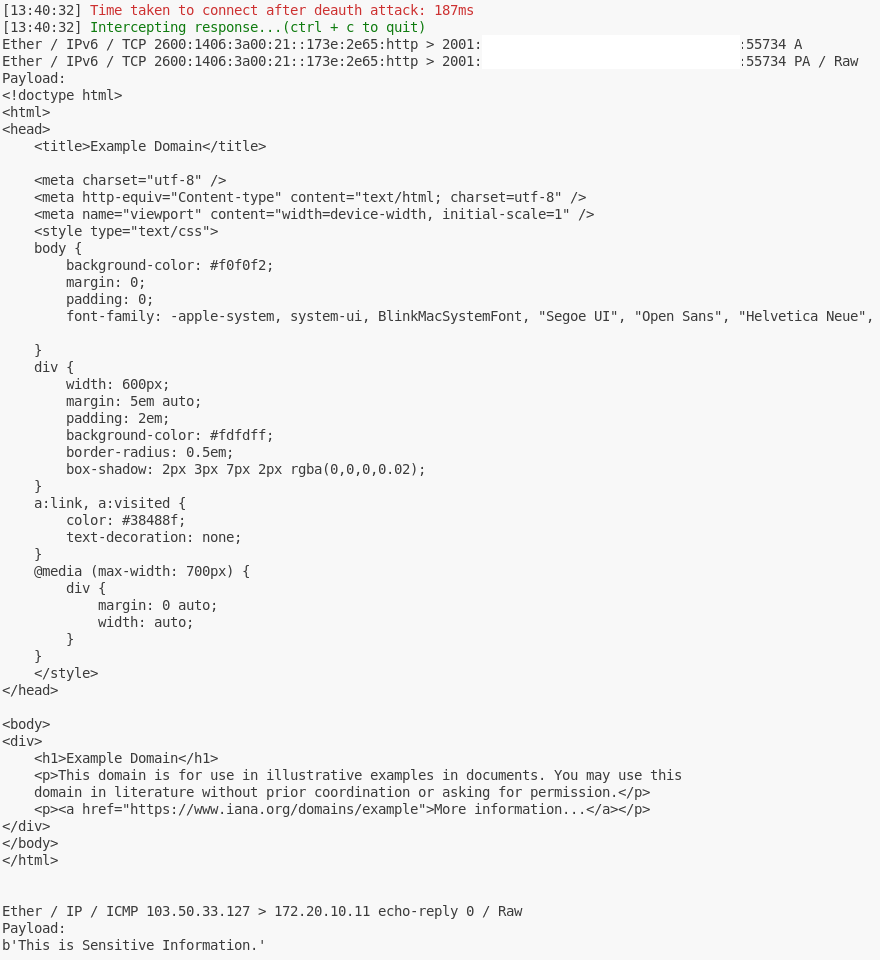

# CVE-2022-47522-PoC
This is a vulnerability that allows **intercepting frames** sent to arbitrary clients on a **Wi-Fi network**.  
For a detailed explanation, see [here](https://github.com/vanhoefm/macstealer).  
> **Note:** MITRE's description is inaccurate; please refer to the link above for the correct details.  
This repository is based on that link.  

## Environment
For a realistic test environment, the victim and the attacker run on separate hosts.

### Network
- This PoC does **not bypass MFP** (Management Frame Protection), so it only works on networks **with MFP disabled**.
- Tested only on the **2.4GHz band**.
    - It is also expected to operate at 5GHz band.
- While not strictly required, testing was performed on a hotspot to introduce network latency.

### Victim
- Tested on **Windows 11** (also works on Kali, Ubuntu, and Ubuntu WSL).
- Requires a wireless network interface.

### Attacker
- Tested on **Kali Linux 2024.4** (expected to work on Ubuntu as well).
- Requires **two wireless network interfaces**:  
  - One must support **monitor mode**.

It may be possible to run both the victim and attacker on a single host, but this would require three wireless network interfaces and potential modifications to the code and execution method.

## Tool Prerequisites
### Victim  
Run the following commands (optionally in a python venv):  
```
pip install scapy==2.6.1 httpx==0.28.1
```
Alternatively, you can use ping, curl, or a web browser instead of victim.py.  

### Attacker  
Run the following commands:  
```
cd macstealer/research
./build.sh

cd ../../attacker
./pysetup.sh
```
## Before Execution
### Victim  
Ensure that victim is connected to the network you want to test.

### Attacker  
#### wpa_supplicant Configuration
Edit `./attacker/attacker.conf` to match the network settings of the victim’s connection.  
If you are unsure, look into how to configure `wpa_supplicant.conf`.
```
# attacker.conf
# Don't change this line, other MacStealer won't work
ctrl_interface=wpaspy_ctrl

network={
	#Fill in properties of your network
	key_mgmt=WPA-PSK
	ssid="Your-SSID"
	psk="Your-password"
}
```
#### NetworkManager Configuration
You need to configure **NetworkManager** to ignore both interfaces:  

1. Add the following lines to `/etc/NetworkManager/NetworkManager.conf`:  
    ```
    [keyfile]
    unmanaged-devices=interface-name:{iface};interface-name:{mon_iface}
    ```

2. Apply the changes by running:  
    ```
    sudo systemctl restart NetworkManager
    ```

To revert, remove the added lines and restart NetworkManager again.

#### Virtual Environment Activation
Activate the **venv as root** before execution:  
```
cd attacker
sudo su
source venv/bin/activate
```

## Execution
### Victim  
Run `victim.py` and follow the prompts to enter the required information (or use the default values).  
Then each time you press **Enter**, an **ICMP Echo Request** and an **HTTP GET Request** will be sent.

### Attacker  
Run the following command:  
```
./attacker.py -i $iface -m $mon_iface -v $victimMAC  
```
`-i` specifies the attacker's **managed interface**,  
`-m` specifies the attacker's **monitor interface**,  
`-v` specifies the **victim's MAC address**.

For example:  
```
./attacker.py -i wlan0 -m wlan1 -v a0:d3:65:2c:ed:71  
```
Once executed, the script will automatically establish a pre-connection and prepare the attack.  
When the attack is ready, you will see the prompt:  

    Press enter to start attack:  

At this point, **press Enter on the victim's side first** to send the request, then immediately **press Enter on the attacker's side** to start the attack.  
For the attack to succeed, both actions must be performed almost simultaneously.  
However, the **victim** must send the request **first**.

> **Note:**  
    - Shorter connection times increase the attack’s success rate.  
    - In my tests, the connection time was around **200ms**, but sometimes the AP unexpectedly refused connections, leading to longer connection times.  
    - If this happens, wait for a timeout or terminate the process with `Ctrl+C` and try again.  
    - The longer the gap between pre-connection and reconnection, the higher the chance of failure.  
    - Press Enter **as quickly as possible** to start the attack.  
    - If the attack does not succeed even though the attacker's connection is stable, try changing the server that the victim is requesting to a more distant location.  
    Since I am in **Korea**, I chose a server in **Argentina**, which is one of the farthest regions.

#### Intercepted HTTP and ICMP Responses
 

Check whether HTTP and ICMP responses are intercepted, and ensure that the HTTP body and ICMP payload are correctly displayed.

### Attack Flow

1. **Prepare**  
   - **Pre-connect** to enable fast reconnection after the Deauth attack.  
   - Collect BSSID and channel information of the AP.  
   - Disconnect from the AP.  
   - Change the **attacker's MAC address** to match the **victim's MAC address**.  
   - Configure the Deauthentication frame.

2. **Deauth Attack**  
   - Send **Deauthentication frames** to both the **AP** and the **victim**.

3. **Intercept**  
   - Connect to the AP using the **victim’s MAC address**.  
   - Display the intercepted frames.
