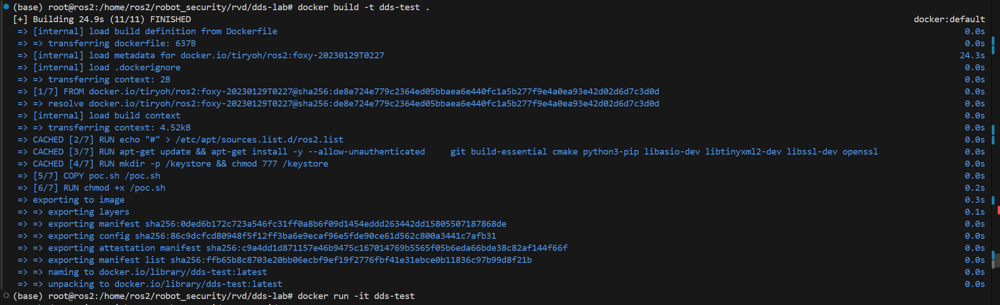
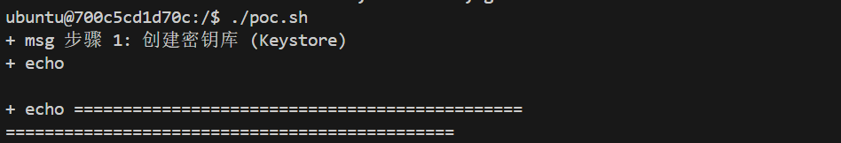
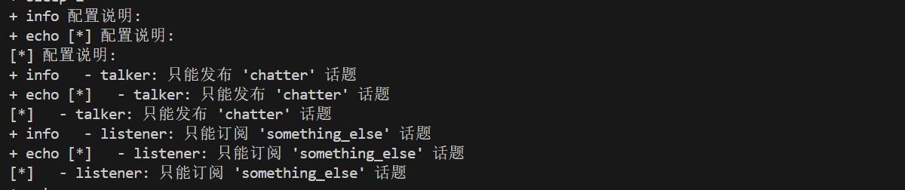
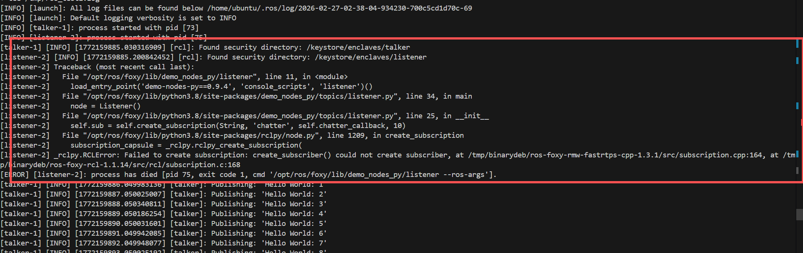
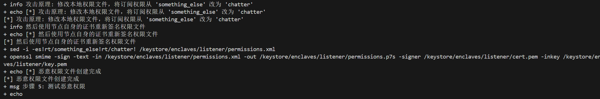
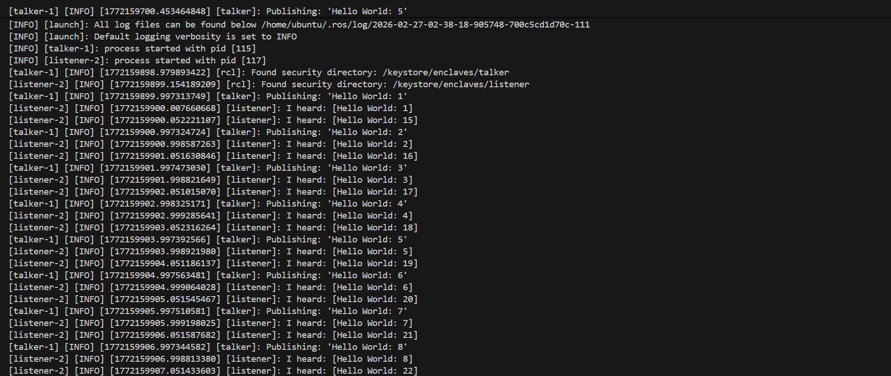

# DDS Security Test

ROS 2 DDS 安全研究测试环境，基于 ROS 2 Foxy。

## 项目简介

本项目演示了 ROS 2 SROS2 安全框架中的一个权限绕过漏洞。通过修改签名的权限文件，攻击者可以让节点订阅本不该订阅的话题。

## 环境要求

- Docker

## 快速开始

### 构建镜像

```bash
docker build -t dds-test .
```

### 运行 PoC

```bash
docker run -it dds-test ./poc.sh
```

### 
## PoC 脚本说明

`poc.sh` 脚本执行以下步骤：

1. **创建密钥库** - 使用 `ros2 security` 工具生成 talker 和 listener 的密钥和证书
2. **创建正确权限** - 配置 talker 可发布 `chatter` 话题，listener 只能订阅 `something_else` 话题
3. **运行正常通信** - 验证节点在正确权限下能正常通信
4. **创建恶意权限** - 演示攻击者如何修改权限文件，让 listener 能够订阅 `chatter` 话题
5. **运行恶意通信** - 验证节点使用恶意权限后可以订阅原本无权访问的话题

### 关键文件


- `Dockerfile` - ROS 2 Foxy 环境配置
- `poc.sh` - PoC 演示脚本


### 复现演示
**构建运行docker漏洞环境**


**运行poc**



**poc运行**
配置文件说明:



**正常情况**

listener监听不到taker发布的信息

**开始攻击**


**效果**

listener能够监听到taker发布的信息
## 参考

- [ROS 2 SROS2 文档](https://docs.ros.org/en/foxy/Tutorials/Security/Understanding-The-Security-Framework.html)
