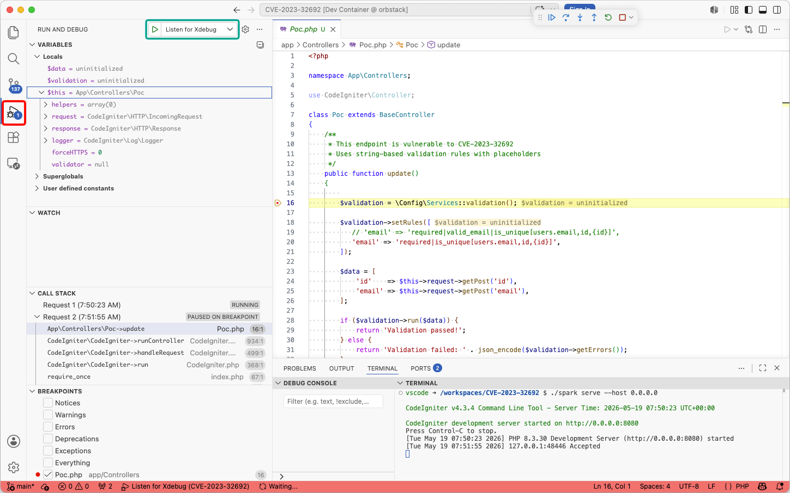

# CVE-2023-32692 — CodeIgniter 4 Validation Rule Injection


**CVE-2023-32692** is a code injection vulnerability in the [CodeIgniter 4](https://codeigniter.com) PHP framework, affecting versions **4.0.0 through 4.3.4**. It was fixed in **4.3.5** (released June 2023). This is a demo environment for anyone that wants to play with it.

Vulnerability details can be found on the [MOGWAI LABS blog](https://mogwailabs.de/en/blog/2026/05/vulnerability-spotlight-cve-2023-32692/).

## PoC Environment

This repository contains a minimal CodeIgniter 4 application that demonstrates the vulnerability. It ships with a [Dev Container](https://containers.dev/) configuration so you can spin it up directly from VS Code (or any compatible editor) with no local PHP installation required.

The underlying Docker container uses PHP 8.3 and installs the XDebug extension to allow debugging. Additional PHP modules, required by the CodeIgniter framework are installed as local "Devcontainer features", basically because I wanted to try out that feature. 

The following VS Code extensions are included (all installed inside the container, not your VS Code instance):

| Extension                             | Purpose                                                    |
|---------------------------------------|------------------------------------------------------------|
| `xdebug.php-debug`                    | PHP XDebug support — step through the vulnerable code path |
| `bmewburn.vscode-intelephense-client` | PHP Intelephense for code navigation                       |
| `humao.rest-client`                   | HTTP client to fire the included request templates         |

---

## Installation

1. Open the repository in VS Code and reopen it in the Dev Container when prompted (requires Docker). This might take a while.
2. Required packages are installed automatically via `composer` when the container builds, no need to do anything here.
3. Copy the environment template:

```bash
cp env .env
```

---

## Starting the Example Application

The Dev Container includes Apache, but the PHP built-in development server is sufficient for this PoC. Open a terminal inside VS Code and run:

```bash
./spark serve --host 0.0.0.0
```

The application will be available at `http://localhost:8080`. You can access it outside of the container, using your regluar web browser.

---

## Debugging with XDebug

The `.vscode/launch.json` configures XDebug to listen on TCP port 9003 (also set in the Dev Container's `Dockerfile`):

```json
{
    "version": "0.2.0",
    "configurations": [
        {
            "name": "Listen for Xdebug",
            "type": "php",
            "request": "launch",
            "port": 9003
        }
    ]
}
```

Start the debug listener **before** starting the PHP development server: click the "Run and Debug" icon in the VS Code sidebar and press the play button next to "Listen for Xdebug".




---

## Vulnerable Code

The vulnerable endpoint is implemented in `app/Controllers/Poc.php`. It exposes two routes:

| Route                  | Description                                              |
|------------------------|----------------------------------------------------------|
| `POST /poc/update`     | Vulnerable endpoint — uses string-based validation rules |
| `POST /poc/updateSafe` | Safe endpoint — uses array-based validation rules        |


Set a breakpoint in `Poc::update()` and trace how the `{id}` placeholder is expanded into the rule string inside the CodeIgniter validation engine. The relevant framework code is in `vendor/codeigniter4/framework/system/Validation/Validation.php`.

---

## HTTP Request Templates

The `http_requests/` folder contains ready-to-use templates for the VS Code REST Client extension:

| File                   | Description                                                                            |
|------------------------|----------------------------------------------------------------------------------------|
| `reqular_request.http` | Baseline legitimate request — no injection, validation passes normally                 |
| `basic_poc.http`       | Injects additional validation rules via the `id` parameter                             |
| `system_call.http`     | Exploits the injection to call `system()` and execute an OS command (`touch /tmp/pwn`) |

Open any `.http` file and click **Send Request** above the request block to execute it.

---

