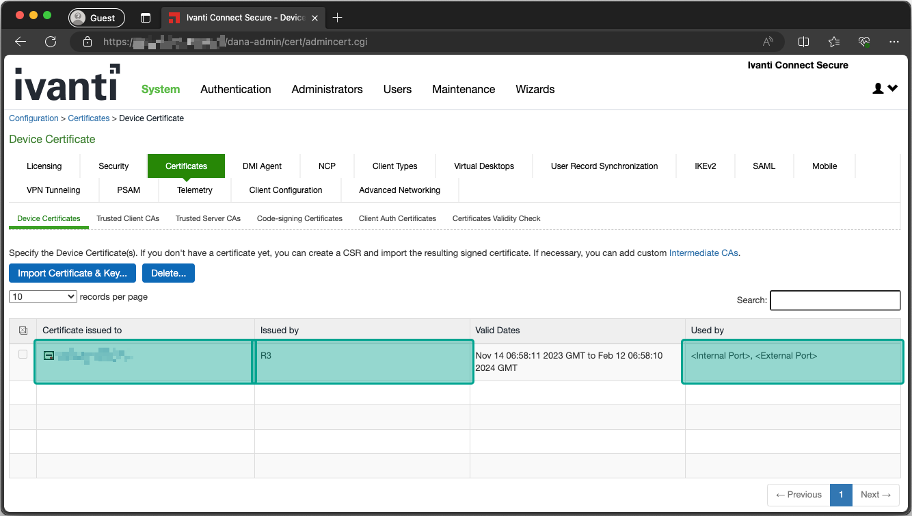
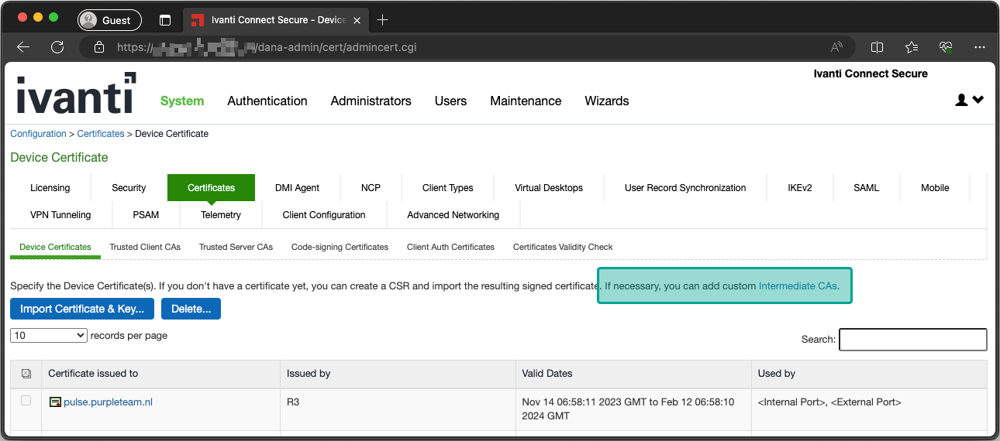
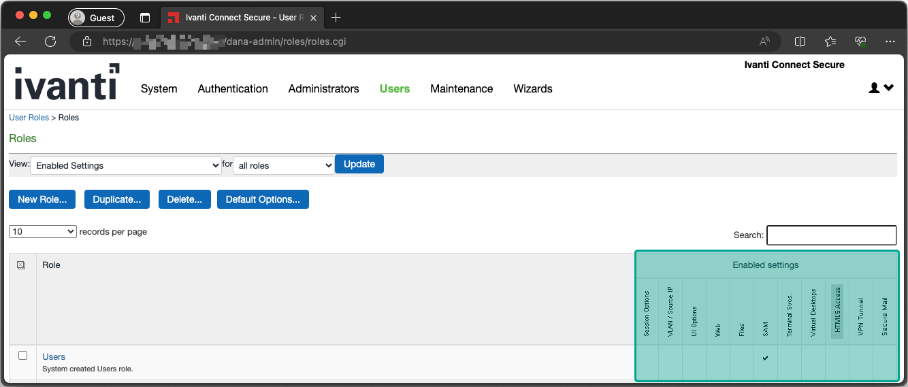
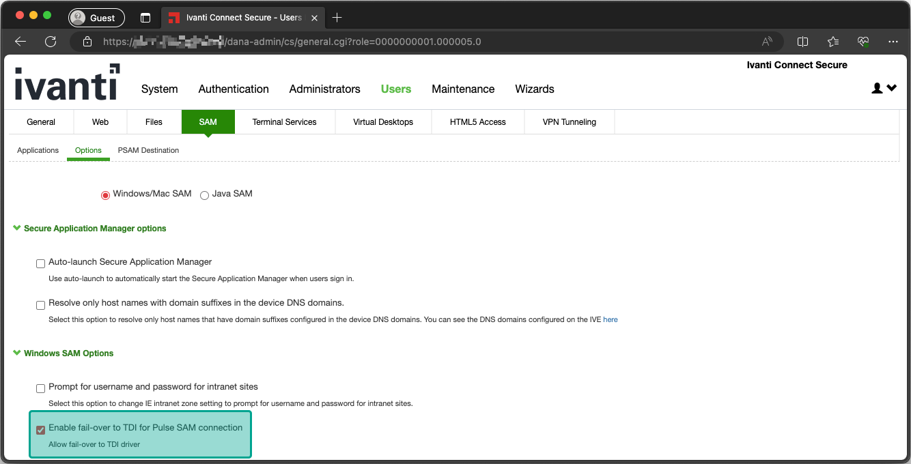
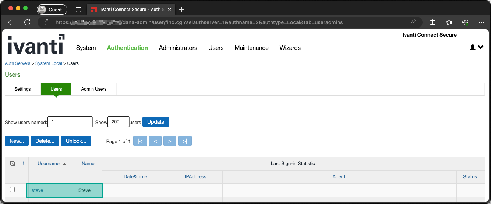

# Setup Rogue Server

The vulnerable driver starts when a (low-privileged) user on the victim machine connects to a (rogue) VPN server that has the TDI fail-over option enabled. Follow this guide to setup such a rogue server, ultimately connecting the victim to it.

### 1. Download evaluation image

First, we need to spin up an Ivanti Secure Access VPN evaluation server. Download a VM image of your choice [here](https://www.ivanti.com/ty/security/trial/connect-secure-virtual-appliance).

### 2. Install evaluation server

Install the downloaded VM image on a VPS or locally. Ensure that you can point a domain name to it (we'll use `vpn.rogue-server.com` in this guide from now on). If you locally install it, you can use port forwarding to point a domain to it.

Boot the VM image and complete the setup you are prompted with. When finished, you can access the admin portal (web).

### 3. Configure a valid certificate

Obtain a valid certificate for your rogue server domain (e.g. `vpn.rogue-server.com`). You can use Let's Encrypt for this. Once you've obtained a `fullchain.pem` and `privkey.pem`, upload them to the admin portal.

System -> Configuration -> Certificates -> Device certificate

1. Delete the self-signed pre-configured one.
2. Upload your valid certificate via "Import Certificate & Key...".
3. Configure your certificate to be used by the internal & external port.

4. Upload the correct intermediate certificate to prevent certificate validation errors client-side. For example, use [this one](https://letsencrypt.org/certificates/) for Let's Encrypt certificates.

### 4. Restrict VPN & configure TDI-failover

1. Navigate to "Users" -> "User Roles" -> "Users".
2. On the "Overview" tab, uncheck all Access Features besides "Secure Application Manager & Windows/Mac version sub-item".

3. On the same page, navigate to the "SAM" -> "Options" tab.
4. Enable "Enable fail-over to TDI for Pulse SAM connection".

### 5. Create a VPN user

1. Navigate to the "Authentication" -> "Auth. Servers" -> "System Local" -> "Users" tab.
2. Create a new user with static username and password of your choice (the victim will use it to connect to your rogue VPN).

### 6. Let victim connect to the rogue server

Connect the victim to your rogue server. Connect to it by supplying the URL (e.g. `vpn.rogue-server.com`, username/password of the user you created, and the realm which that user is in (`Users` is the local user realm by default).

	"%programfiles(x86)%\Common Files\Pulse Secure\Integration\pulselauncher.exe" -url YOUR_DOMAIN -u YOUR_USER -p YOUR_PASS -r Users

For example

	"%programfiles(x86)%\Common Files\Pulse Secure\Integration\pulselauncher.exe" -url vpn.rogue-server.com -u steve -p Welcome01! -r Users

### 7. Stop the VPN client 

Before running the privilege esclation exploit, stop the VPN client. Otherwise memory corruptions will take place.

    "%programfiles(x86)%\Common Files\Pulse Secure\Integration\pulselauncher.exe" -stop