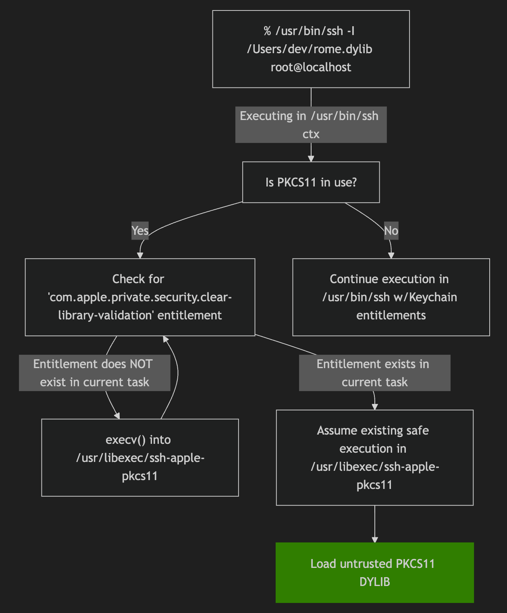
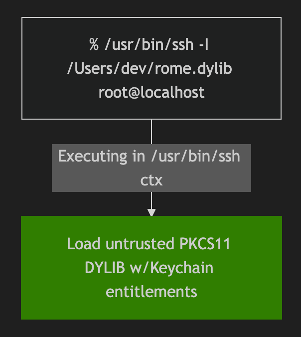
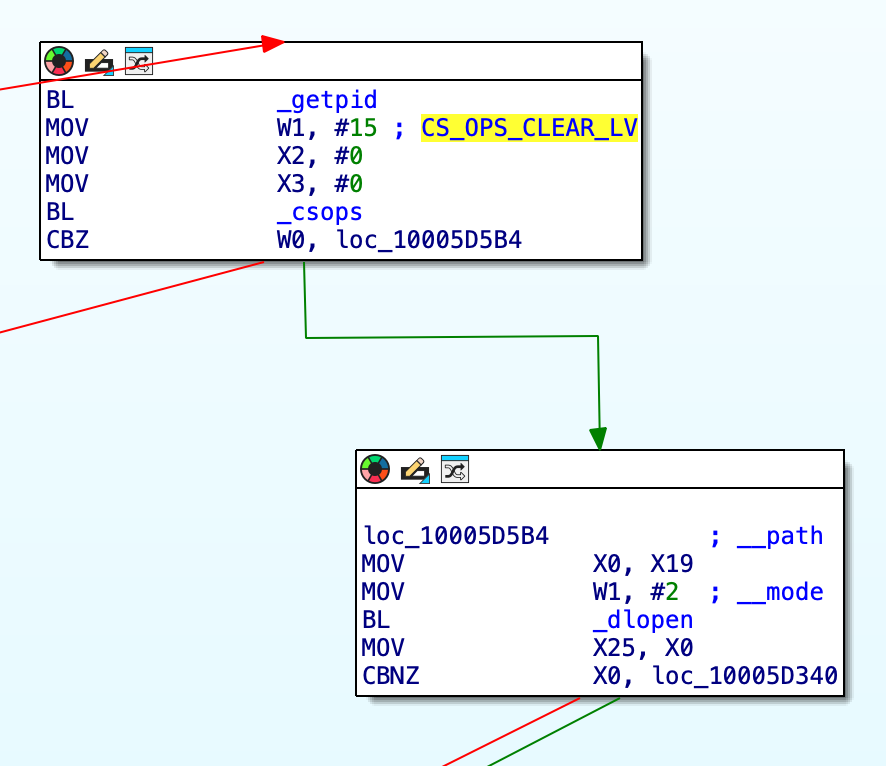
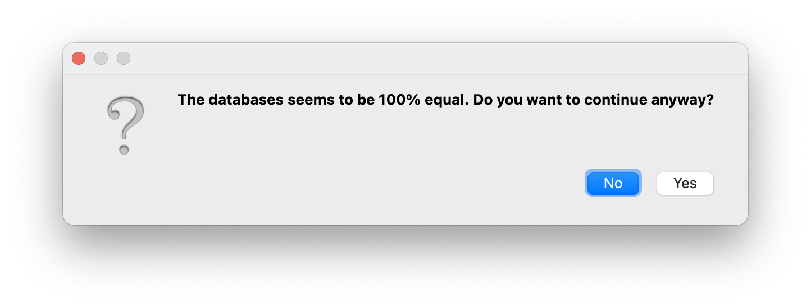
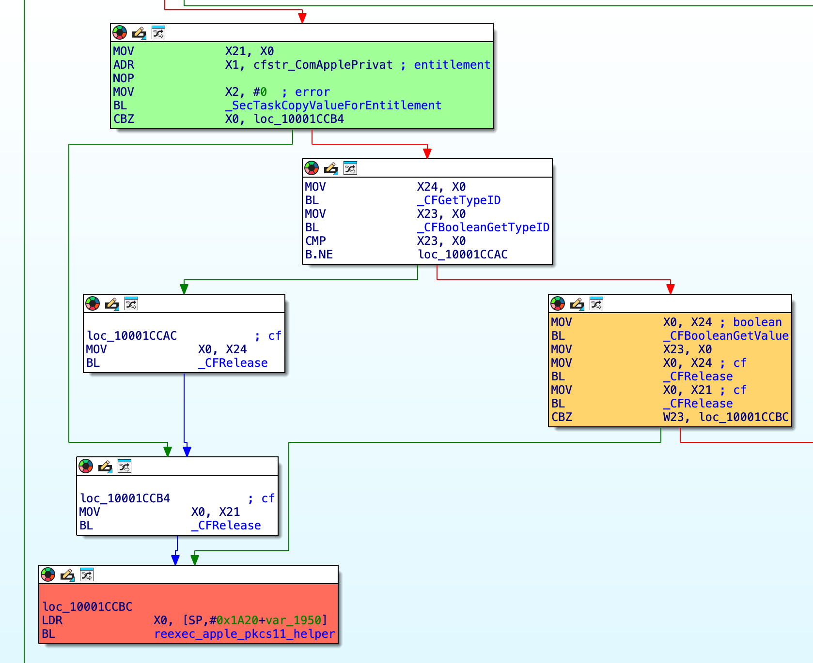
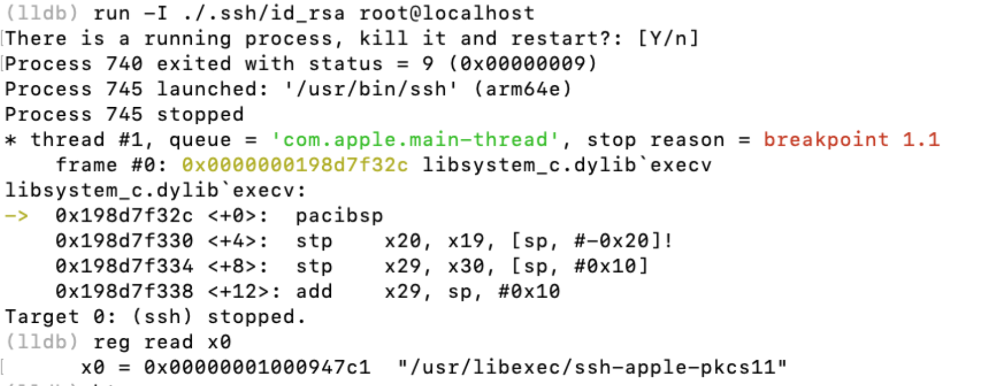

 # CVE-2023-42829; 'An app may be able to access SSH passphrases'

This document presents both an analysis of a logic vulnerability identified in the `ssh` binary on macOS (my first software vulnerability!), and a patch analysis demonstrating how Apple fixed the vulnerability. I reported the issue Apple via the Apple Security Bounty program in late 2022 which was later fixed in macOS Ventura 13.5 and yielded CVE-2023-42829 (🎉). The issue leads to SSH passphrases saved to the macOS user-local 'Login' Keychain (in the `com.apple.ssh.passphrases` access group) being exposed to a local attacker in plain-text.

**Disclaimer:**  
This report is provided for educational purposes only, with responsible disclosure processes having been followed. The analysis is offered as-is, and any further publication or use of this information should adhere to responsible disclosure guidelines.

<div style="display: flex; justify-content: space-around; align-items: center;">
  <div style="text-align: center; margin: 10px;">
    <p><strong>Patched High-Level Flow</strong></p>
    
  </div>
  <div style="text-align: center; margin: 10px;">
    <p><strong>Unpatched High-Level Flow</strong></p>
    
  </div>
</div>

---

## Table of Contents

1. [Tested Hardware and Software](#tested-hardware-and-software)
2. [Example/PoC](#example-poc)
3. [Vulnerability Analysis](#analysis)
4. [`com.apple.private.security.clear-library-validation` Entitlement](#comappleprivatesecurityclear-library-validation-entitlement)
5. [Patch Analysis](#patch-analysis)
6. [References](#references)

---

## Tested Hardware and Software

| **Hardware**         | **OS Software**            |
|----------------------|----------------------------|
| MacBook Pro M1 2021  | `/usr/bin/ssh` @ macOS Ventura build 13.0.1 (22A400) |

---

## Example/PoC

The following proof-of-concept illustrates the rather simple exploitability of the vulnerability, passing in a dynamic library to the `-I` flag of the `ssh` binary:

```
jamesd@local build % ssh -I /Users/jamesd/rome.dylib root@127.0.0.1
SSH Private Key Passphrase -> 'SuperSecret!!@@$'
```

Let's talk about how this was discovered and why this happened!

---

## Analysis

Once upon a time I was using the `ssh` binary for something benign and typo'd the `-i` flag (used to pass in an SSH identity file) with the `-I` flag and was met with the following stdout:

```bash
jamesd@local build % ssh -I /Users/jamesd/.ssh/id_rsa something@somewhere
dlopen /Users/jamesd/.ssh/id_rsa failed: dlopen(/Users/jamesd/.ssh/id_rsa, 0x0002): tried: '/Users/jamesd/.ssh/id_rsa' (not a mach-o file), ...
...
```

After checking the entitlements for the `ssh` binary...

```bash
jamesd@local build % ldid -e /usr/bin/ssh # dump the entitlements of the /usr/bin/ssh binary
```
```xml
<key>com.apple.private.security.clear-library-validation</key>
    <true/>
    <key>keychain-access-groups</key>
    <array>
        <string>com.apple.ssh.passphrases</string>
</array>
```

...my interest was piqued - the binary has entitlements to read from a protected keychain access group (`com.apple.ssh.passphrases`), possesses the `com.apple.private.security.clear-library-validation` entitlement, and `ssh` is attempting to `dlopen()` my private key?

As it turns out, `ssh` supports authenticating to a remote system via something called `pkcs11`, a standard for cryptographic operations on hardware security modules (HSMs) ([https://docs.aws.amazon.com/cloudhsm/latest/userguide/pkcs11-library.html](https://docs.aws.amazon.com/cloudhsm/latest/userguide/pkcs11-library.html)).

We don't need to worry about the specifics of `pkcs11` for the purposes of this write-up, other than the fact that the client supplies a `pkcs11` (dynamic library) library to `ssh -I`.

### `com.apple.private.security.clear-library-validation` Entitlement

Though equivalent conceptually, `com.apple.private.security.clear-library-validation` differs from the previous equivalent entitlement (`com.apple.security.cs.disable-library-validation`) as `com.apple.private.security.clear-library-validation` requires you to make the `csops()` syscall passing in `CS_OPS_CLEAR_LV` to control enabling/disabling library validation to maintain greater control over the process integrity at runtime (in comparison to `com.apple.private.security.clear-library-validation` which would presumably allow you to load any library without control at runtime). ([https://github.com/apple-oss-distributions/xnu/blob/main/bsd/kern/kern_proc.c](https://github.com/apple-oss-distributions/xnu/blob/main/bsd/kern/kern_proc.c)) ([https://theevilbit.github.io/posts/com.apple.private.security.clear-library-validation/](https://theevilbit.github.io/posts/com.apple.private.security.clear-library-validation/))



As `csops(CS_OPS_CLEAR_LV)` is called before `dlopen()`'ing our library, our library simply loads and the constructor executes, allowing us to supply a malicious dynamic library masquarading as a `pkcs11` library and execute code from within the context of `/usr/bin/ssh` and utilise the `keychain-access-groups` entitlement.

### Patch Analysis

Perhaps the patch involved checks performed on the binary before calling `csops()` to check for specific trusted signing identities?

Nope!

Following the patch release (`22G74`) I compared the the unsafe implementation of `pkcs11_add_provider()` (the method in which the call to `dlopen()` is made) and it appeared to be identical to the patch release - but there's a missing entitlement in `/usr/bin/ssh`?

```xml
<?xml version="1.0" encoding="UTF-8"?>
<!DOCTYPE plist PUBLIC "-//Apple//DTD PLIST 1.0//EN" "http://www.apple.com/DTDs/PropertyList-1.0.dtd">
<plist version="1.0">
<dict>
    <key>keychain-access-groups</key>
    <array>
        <string>com.apple.ssh.passphrases</string>
    </array>
</dict>
</plist>
```

But surely Apple hasn't removed `pkcs11` support from SSH? I tried to re-exploit the vulnerability using my PoC and found that though my library was loaded, it could no longer read from the Keychain Access Group and appeared to be executing in the context of `/usr/libexec/ssh-apple-pkcs11` (a binary I hadn't seen before) which possesses the following entitlements:

```xml
<?xml version="1.0" encoding="UTF-8"?>
<!DOCTYPE plist PUBLIC "-//Apple//DTD PLIST 1.0//EN" "http://www.apple.com/DTDs/PropertyList-1.0.dtd">
<plist version="1.0">
<dict>
    <key>com.apple.private.security.clear-library-validation</key>
    <true/>
</dict>
</plist>
```

A comment in the `csops()` syscall for `CS_OPS_CLEAR_LV` ([https://github.com/apple-oss-distributions/xnu/blob/main/bsd/kern/kern_proc.c](https://github.com/apple-oss-distributions/xnu/blob/main/bsd/kern/kern_proc.c)) mentions re-exec'ing into a binary without library validation as an alternative to `CS_OPS_CLEAR_LV`,  rather than being used in combination. So why is the logically faulty routine still present in `pkcs11_add_provider()` in `/usr/bin/ssh` if there's now an additional helper binary? and why does the implementation appear unchanged in the patch?

Well, as it turns out, the patch was not adding a helper binary, and involved distributing **two** `ssh` binaries in macOS: `/usr/bin/ssh` and `/usr/libexec/ssh-apple-pkcs11` - both are identical bar their entitlements (I used Diaphora to validate this):



After conducting some dynamic analysis on the patched `ssh` binary, an additional check was added in the (rather large) `start()` routine of `ssh` that is used to, on use of `pkcs11` features, deduce wether the binary is executing within the context of `/usr/bin/ssh` or `/usr/libexec/ssh-apple-pkcs11`:



In the green block, we can observe a call to `SecTaskCopyValueForEntitlement()` (the value passed is `"com.apple.private.security.clear-library-validation"`) which is then (in the orange block) evaluated and causes a conditional call to the re-exec routine if the `"com.apple.private.security.clear-library-validation"` entitlement is not present for the current task/process (red block).

This results in the less-entitled `ssh-apple-pkcs11` binary being used when loading the user-supplied `pkcs11` library (effectively disabling the keychain-related features of `ssh`), and `ssh` being utilised where untrusted libraries are not to be loaded (enabling the keychain-related features of `ssh`).

We can also validate that this is the case through debugging the patched

If we debug the patched `ssh` binary (distributed in macOS `22G74`) and set breakpoints on `execv()` we can indeed spot a call to `execv()` when supplying the `-I` flag which does not occur when launching `ssh` without using `pkcs11` features:



## Conclusion / Remediation

I reported the issue Apple via the Apple Security Bounty program in late 2022 and the was later fixed in macOS Ventura 13.5 and yielded CVE-2023-42829 (🎉).

This write-up is an independent publication and has not been authorised, sponsored, or otherwise approved by Apple Inc. macOS, iOS, and iWork are trademarks of Apple Inc.

## References
- [https://github.com/apple-oss-distributions/xnu/blob/main/bsd/kern/kern_proc.c](https://github.com/apple-oss-distributions/xnu/blob/main/bsd/kern/kern_proc.c)
- [https://theevilbit.github.io/posts/com.apple.private.security.clear-library-validation/](https://theevilbit.github.io/posts/com.apple.private.security.clear-library-validation/)