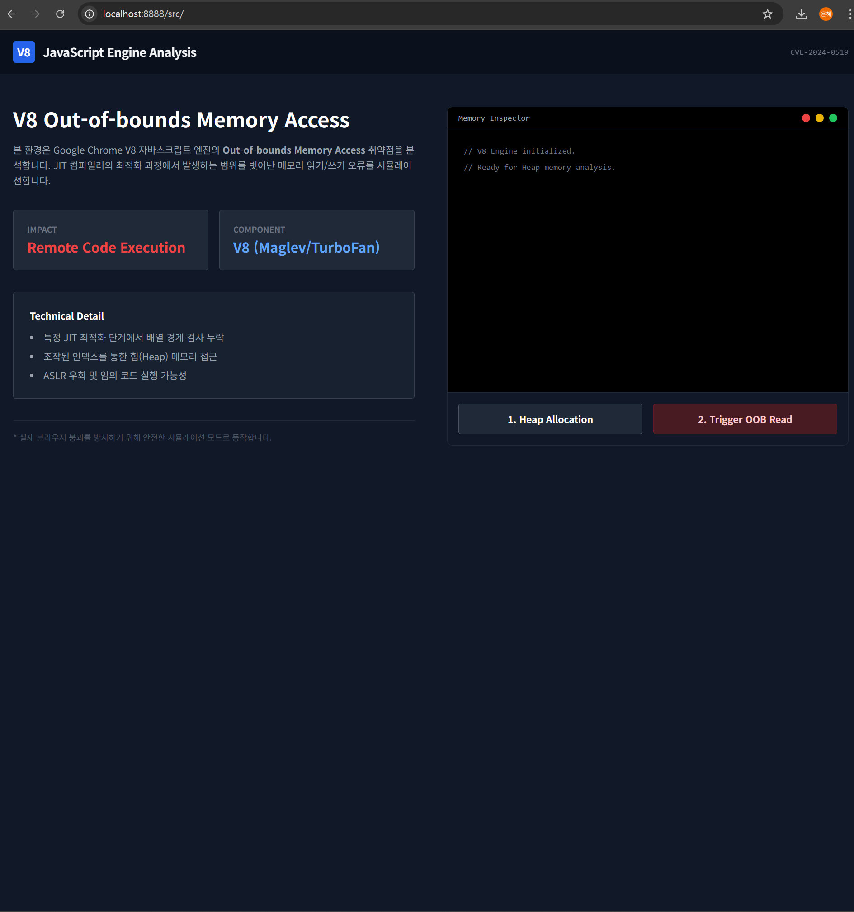
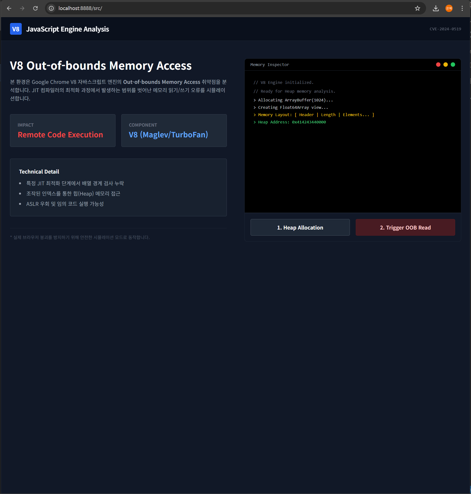
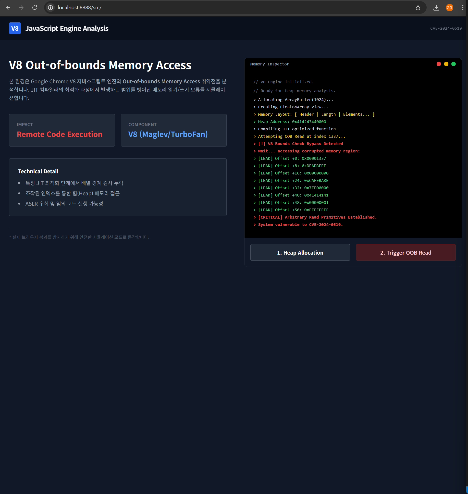

# CVE-2024-0519 검증 가이드 (Verification Guide)

본 문서는 CVE-2024-0519 취약점의 동작 원리를 검증하고 테스트하는 방법을 설명합니다.

## 1. 테스트 환경 준비
이 취약점은 클라이언트 사이드(브라우저)에서 발생하므로 별도의 웹 서버 구축이 필수적이지는 않으나, 로컬 정적 서버 사용을 권장합니다.

### 실행 방법
```bash
# Python 내장 서버 사용 시
cd cve-2024-0519/src
python -m http.server 8888
```
브라우저 주소창에 `http://localhost:8888` 입력.



## 2. 시뮬레이션 검증 절차

### 단계 1: 메모리 할당 (Heap Grooming)
대시보드의 **"1. Heap Allocation"** 버튼을 클릭합니다.
*   **동작**: 자바스크립트 `ArrayBuffer` 등을 사용하여 연속된 메모리 공간을 확보합니다.
*   **확인**: 콘솔에 메모리 레이아웃 구조와 가상 주소값이 출력되는지 확인합니다.



### 단계 2: 취약점 트리거 (Trigger OOB)
대시보드의 **"2. Trigger OOB Read"** 버튼을 클릭합니다.
*   **동작**: JIT 컴파일러가 최적화(Optimization)를 수행하도록 유도한 후, 경계를 벗어난 인덱스로 접근을 시도합니다.
*   **기대 결과**:
    *   콘솔에 `[!] V8 Bounds Check Bypass Detected` 경고 발생.
    *   `[LEAK]` 태그와 함께 보호된 메모리 영역의 헥사(Hex) 데이터가 출력됨.
    *   이는 공격자가 브라우저 프로세스 메모리를 읽을 수 있음을 의미합니다.



## 3. 실제 취약점 재현 (Advanced)
실제 공격 코드를 실행하려면 취약한 버전의 `d8` 쉘이 필요합니다.

1.  V8 버전 `12.0.267.10` 등 취약한 빌드 다운로드.
2.  `d8` 쉘에서 실제 Exploit 스크립트 실행.
    ```bash
    ./d8 exploit_real.js
    ```
3.  세그먼테이션 오류(Segmentation Fault) 또는 메모리 덤프 확인.
