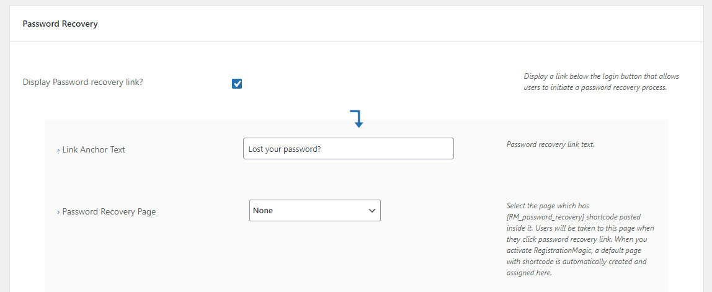
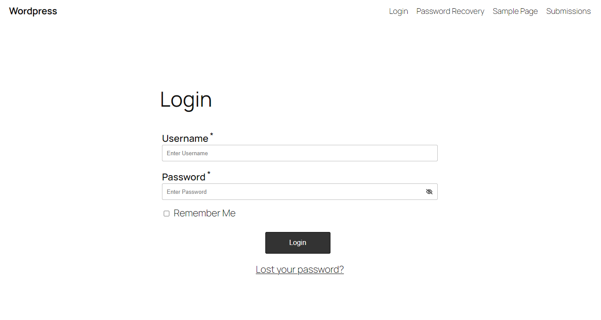
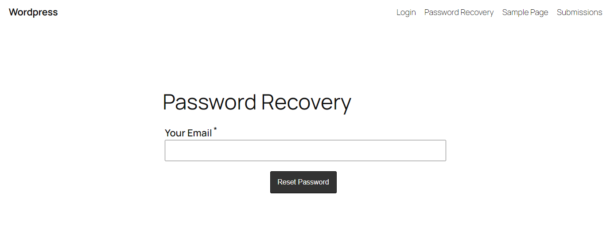
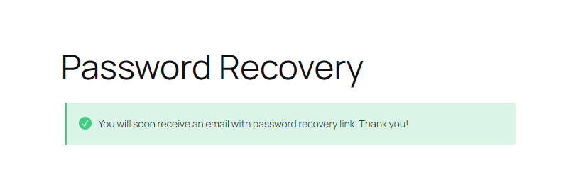
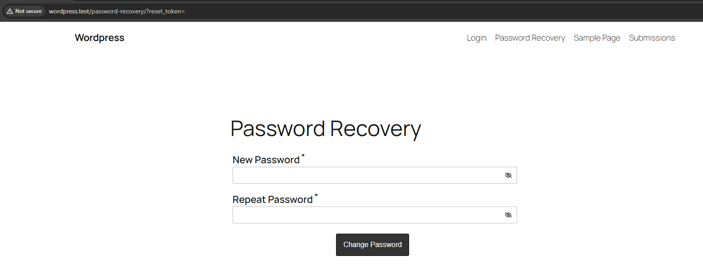
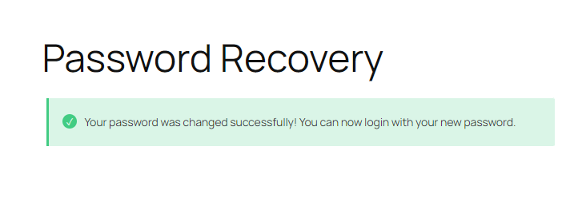
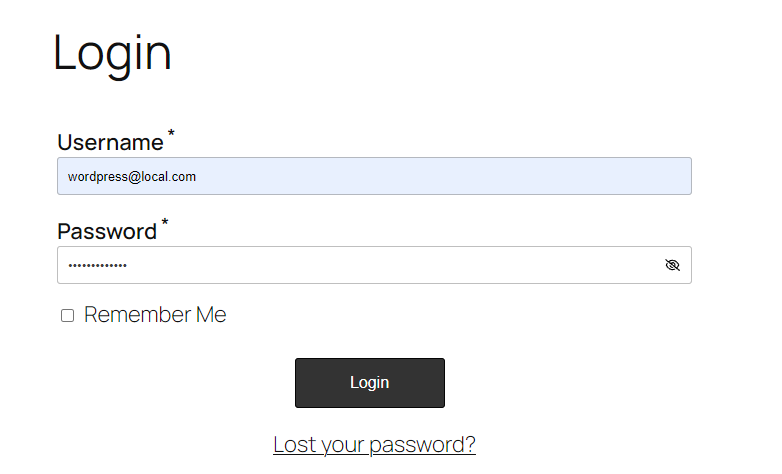
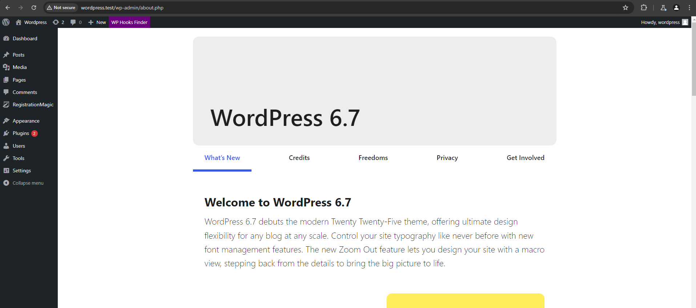

### Unauthenticated Privilege Escalation via Password Recovery on RegistrationMagic <= 6.0.2.6

**Disclaimer**: This information is provided for educational purposes only. This document aims to raise awareness of security vulnerabilities and should not be used for any unauthorized or malicious activities. Engaging in actions that exploit these vulnerabilities without permission is illegal and unethical.

The RegistrationMagic – User Registration Plugin with Custom Registration Forms plugin for WordPress is vulnerable to privilege escalation via account takeover in all versions up to, and including, 6.0.2.6. This is due to the plugin not properly validating the password reset token prior to updating a user's password. This makes it possible for unauthenticated attackers to reset the password of arbitrary users, including administrators, and gain access to these accounts.

After researching from several sources related to this CVE, I realized that the attack on this CVE is quite easy and does not require additional applications such as Burpsuite or Postman, this CVE only requires an email from an account that has an administrator level and resets it via the /password-recovery page or another custom password reset page.

## Dependencies
- Password reset page that has been set by admin (by default not)
  
- Knowing email accounts that have administrator level

## PoC
 1. Go to the login page of the target that has this plugin (RegistrationMagic)
    
 2. Click “Lost your password”, if the page leads to the password reset page, the password reset page has been set by the admin. if not, it means not.
  
 3. fill in an email that has an administrator level, and send it
  
 4. After that add ?reset_token= at the end of the url, and reset the password.
  
  
 5. After resetting your password, you can now log in using the password you sent earlier.
  
  
