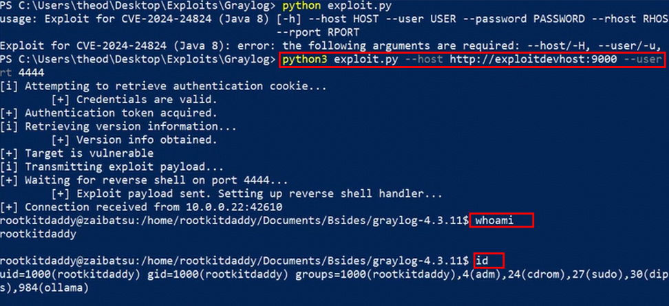

# Exploiting Arbitrary Class Loading on the JVM

This repository contains the proof-of-concept exploit presented in my talk:

> **Exploiting Arbitrary Class Loading on the JVM** 

Watch it here if you're interested: [Youtube](https://www.youtube.com/watch?v=QTkNK1IUWgA)

The exploit targets **CVE-2024-24824** (minor typo in the slides), an arbitrary class loading vulnerability affecting Graylog versions **2.0.0 through 5.2.3**.

Rather than treating arbitrary class loading as an end goal, this research explores how the primitive can be abused to discover and build increasingly powerful exploitation techniques by analysing the available JVM classpath.

## Overview

Given the ability to instantiate arbitrary classes with attacker-controlled data, the challenge becomes:

> *What can we actually do with that?*

The answer depends entirely on what classes exist within the target application's classpath.

## Overview

The accompanying research explored how an arbitrary class loading primitive could be transformed into multiple exploitation primitives, including:

- Local file disclosure
- Process enumeration
- Information leakage
- Arbitrary file writes
- SSRF
- XXE
- Internal port scanning
- Remote code execution

This repository focuses on the **remote code execution exploit** demonstrated during the talk.

Below is the expected result of running the exploit on a vulnerable instance: 



## Repository Contents

```
exploit/
    exploit source

docs/
    slides
```

## Research Methodology

The accompanying talk walks through the exploitation process from start to finish:

1. Discover the arbitrary class loading primitive.
2. Understand Jackson's deserialization behaviour.
3. Enumerate candidate classes.
4. Reduce thousands of constructors using Joern.
5. Identify useful exploitation primitives.
6. Chain those primitives into increasingly impactful attacks.
7. Achieve remote code execution.

The goal is to demonstrate the *thought process* behind exploit development rather than simply dropping an exploit.

## Requirements

- Vulnerable Graylog instance
- Valid credentials with permissions to edit cluster configurations
- Java version compatible with the demonstrated exploit chain

## Disclaimer

This code is released for educational purposes, security research, and authorized security testing only.

Only test systems that you own or have explicit permission to assess.

## References

- [CVE-2024-24824](https://nvd.nist.gov/vuln/detail/CVE-2024-24824)
- Talk: [Exploiting Arbitrary Class Loading on the JVM](https://www.youtube.com/watch?v=QTkNK1IUWgA)