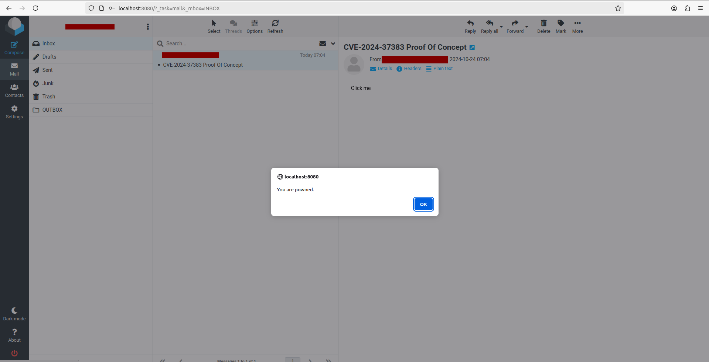

# CVE-2024-37383-POC
Proof of concept for CVE-2024-37383

## Introduction

This repository contains a proof of concept for the XSS vulnerability in roundcube: CVE-2024-37383.

More information about this vulnerability can be found: [here](https://global.ptsecurity.com/analytics/pt-esc-threat-intelligence/fake-attachment-roundcube-mail-server-attacks-exploit-cve-2024-37383-vulnerability)

## Steps

### Start Roundcube

If you don't have an instance of roundcube running yet. You can use the `start_roundcube.sh` script to do so. 

You will need docker installed.

The script is now configured to work with [gmx](https://gmx.com), but you can change the variables in the script if you want to work with a different email provider. The email provider must support IMAP.

### Send email with payload

Below are some sample commands you can use to send an email with the payload.

```
python3 exploit.py -e your.email@gmail.com -p 'your app password' -t your.roundcube.email@gmx.com
```
_This command assumes that you use gmail for sending the email, you need an app password which you can request [here](https://myaccount.google.com/apppasswords)._

```
python3 exploit.py -e your.email@emailprovider.com -p 'email.password' -t your.roundcube.email@gmx.com -sh your.smtp.host -sp 587
```
_If you use another email provider to send the email._

### Check your mail in roundcube

Check your mail in the roundcube instance. If you click the link it should trigger an alert.



## Note

This payload still requires the user to click, if you have an idea for a payload that doesn't require a click please let me know.

X: @Gibout2f

