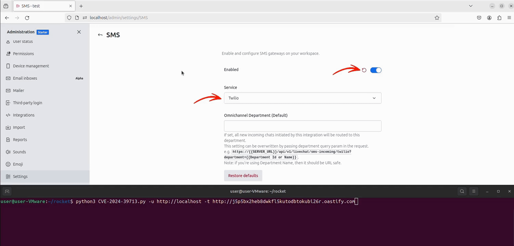

# CVE-2024-39713: Rocket.Chat SSRF PoC

## Description

A Server-Side Request Forgery (SSRF) affects Rocket.Chat's Twilio webhook endpoint before version 6.10.1.

**Links:**
- https://nvd.nist.gov/vuln/detail/CVE-2024-39713
- https://hackerone.com/reports/1886954


## Usage

```
pip install -r requirements.txt
python3 CVE-2024-39713.py -u [Rocket.Chat URL] -t [SSRF target]
``` 

```
nuclei -t CVE-2024-39713.yaml -u [Rocket.Chat URL]
```

## Demo

<p align="center"></p>

## Disclaimer

This Proof of Concept is provided for educational and research purposes only. It is intended to help security professionals, developers, and researchers understand and mitigate vulnerabilities.

The author is not responsible for any misuse, damage, or legal consequences resulting from the use of this PoC.