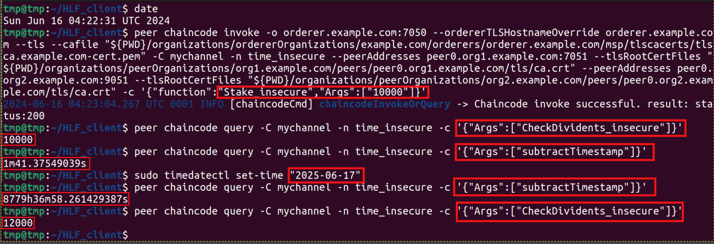
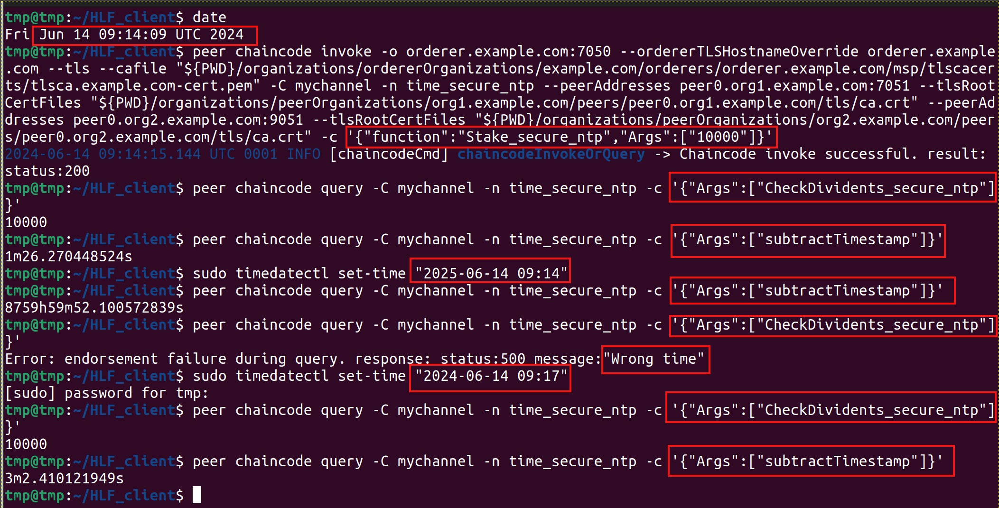
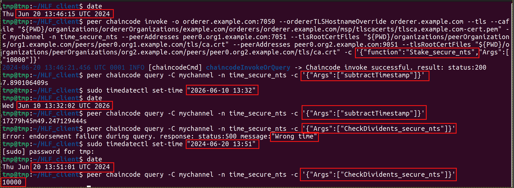
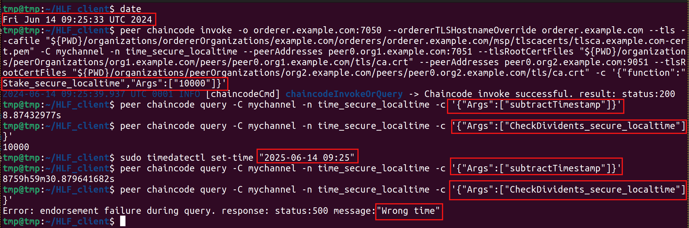

# HLF_TxTime_spoofing

HLF_TxTime_spoofing - a PoC covering the problem of transaction time manipulation (using GetTxTimestamp() or GetHistoryForKey() ) in the Hyperledger Fabric blockchain. Tested on v 2.5.5 and v3.0.0-beta

The project consists of several parts:
1. time_insecure - vulnerable chaincode variant using GetTxTimestamp() to calculate interest from deposit
2. time_secure_ntp - a chaincode that uses time acquisition from an NTP (Network Time Protocol) server to protect against time spoofing by an attacker when calculating interest on a deposit.
3. time_secure_nts - a chaincode that uses time acquisition from an NTS (Network Time Security) server to protect against time spoofing by an attacker when calculating interest on a deposit.
4. time_secure_localtime - chaincode using time from the OS where the smart-contract is executed to protect against time spoofing by an attacker when calculating interest from the deposit
In all cases (i.e. chaincodes) the deposit is equal to 20% per annum.

Additional functions to understanding the operation of business logic:
CalcDividents() - returns the dividend accumulated for a given number of days and the initial deposit amount
subtractTimestamp() - returns the difference between the current time and the time of the initial deposit

#### time_insecure workflow

Call Stake_insecure() to add deposit with initial deposit amount. Call CheckDividents_insecure() to make sure the deposit amount hasn't changed. Change local time on client and call CheckDividents_insecure() again.

Financial attack: moving the time 1 year forward allowed you to get 20% annual interest.

  
   
  Successful financial attack

In the same way we make sure that the transaction time can be manipulated in GetHistoryForKey().

#### time_secure_ntp workflow

In this variant of the chaincode we check the transaction time against the time received from the NTP (Network Time Protocol) server ([using ntp client package](https://github.com/beevik/ntp)). Each chaincode has its own NTP-server address (i.e. [different chaincode packages](https://hyperledger-fabric.readthedocs.io/en/release-2.5/chaincode_lifecycle.html#organizations-install-different-chaincode-packages)) for distribution. In case of time deviation an error will be displayed: "wrong time". Note that NTP traffic data can be spoofed (data is transmitted in plaintext).

  
   
  Usuccessful financial attack

#### time_secure_nts workflow

In this variant of the chaincode we check the transaction time against the time received from the NTS (Network Time Security) server ([using nts client package](https://github.com/beevik/nts)). Each chaincode has its own NTS-server address (i.e. [different chaincode packages](https://hyperledger-fabric.readthedocs.io/en/release-2.5/chaincode_lifecycle.html#organizations-install-different-chaincode-packages)) for distribution. In case of time deviation an error will be displayed: "wrong time".

  
   
  Usuccessful financial attack

#### time_secure_localtime workflow

In this variant of the chaincode we check the transaction time against localtime time (i.e. time in peer-node). In case of time deviation an error will be displayed: "wrong time". Note that correct timing is required on all peer nodes.

  
   
  Usuccessful financial attack

## Time Oracle

[hlf-time-oracle](https://github.com/shanker-sec/hlf-time-oracle) is a chaincode for blockchain Hyperledger Fabric provides accurate time to other chaincodes. `hlf-time-oracle` based on [ntp pakage](https://github.com/beevik/ntp) pakage and [nts pakage](https://github.com/beevik/nts). Thus solving the security problem associated with possible transaction time manipulation by the blockchain client. The chaincode provides functions GetTimeNtp() and GetTimeNts(). Calling these functions creates a call to the NTP (Network Time Protocol) and NTS (Network Time Security) servers. The time received from any of these servers can be used to verify the correctness of the transaction time defined on the client side. Developers of chaincodes for blockchain can use `hlf-time-oracle` instead of independent writing code to interact with NTP and NTS servers. `hlf-time-oracle` does not save any data to the blockchain during its operation.

