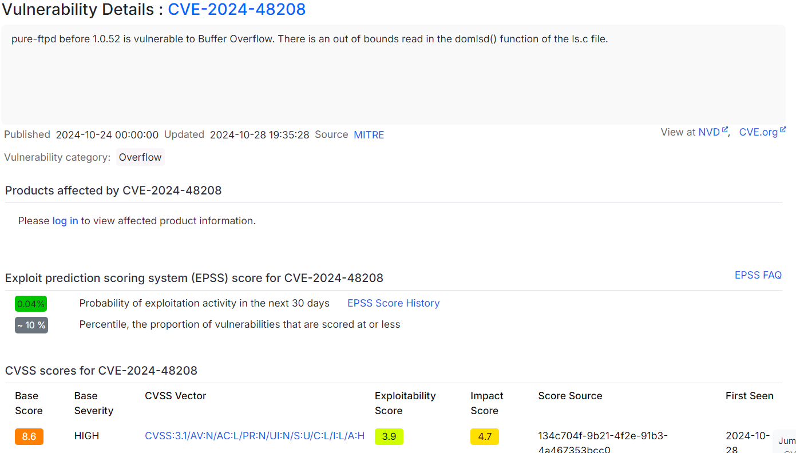
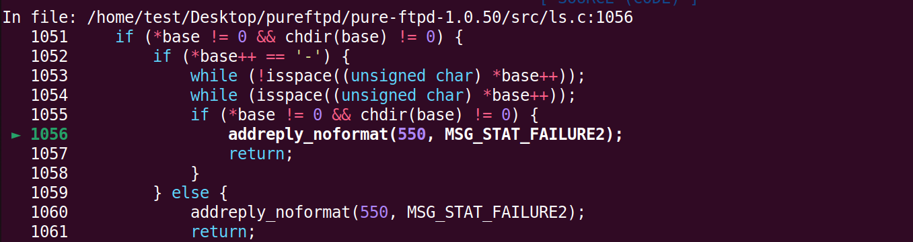
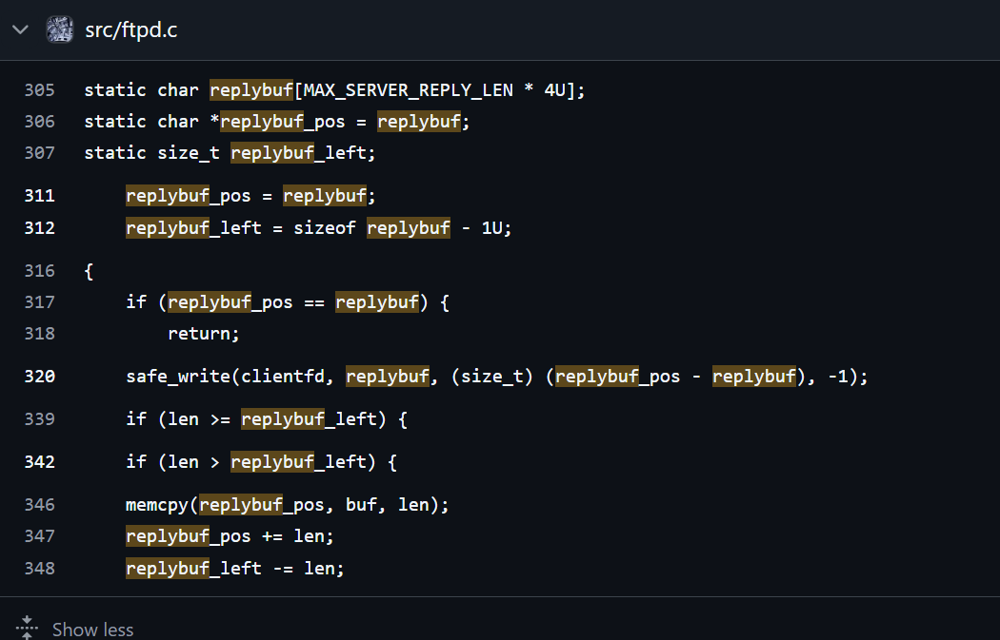

# CVE-2024-48208

The repo contains all the work surrounding the development of the PoC for how a simple OOB(Out-of-bound) read can result in jail escapes as well as broken access control.

## About the Vulnerability

The orginial CVE Description is as follows:

The [Github PR](https://github.com/jedisct1/pure-ftpd/pull/176) on the official repo details out a how the `domlsd()` function in the `ls.c` file is vulnerable to an OOB read vulnerability , because of an unchecked increment of the base pointer , which can lead the pointer to point to a buffer outside the `cmd` buffer, as can be noticed in the line number `1053` and `1054`.

## Exploiting OOB to Jail escape/ Broken Access control:

While debugging the buffer in GDB, we noticed that the OOB read was making the user land into something called the `replybuf`.

Upon further analysis, we found that the replybuf is a buffer which is populated by the reply that the server has provided to the client. The `replybuf` is definedin the file `ftpd.c` , as shown below:
 

So to sum it up:
1. The OOB read makes the `base` point to a part of the `replybuf`.
2. The `replybuf` contains the response provided to the client.

Now , in the original [Github PR](https://github.com/jedisct1/pure-ftpd/pull/176) the CVE authour has not considered/demopnstrated what would happen if the following condition in `ls.c:1055` returns back true?

We started pondering over it , and it turns out that if an attacker can make the `chdir(base)` to return true , then the `domlsd()` function goes ahead with listing the file.

The team considered the scenarios , which has been provided in the [VMsetup.txt](./VMsetup.txt), about sysadmins setting up restricted environments, and decided to build an exploit, which would work as follows:

1. The restricted user will connect to the vulnerable FTP server, and login with their credentials.
        
        nc <server-ip> <ftp-port>
        USER <username>
        PASS <password> 
2. The user will then go onto entering into [EPSV mode](https://www.jscape.com/blog/what-is-the-ftp/s-epsv-command-and-when-do-you-use-it).

        EPSV
3. The user takes note the returned Port number , as they will have to connect to it for reading the listing results.
4. The user can now create a link file (Depends on the buffer offset that can be easily automated according to the last reply recieved) pointing to the directory they want to list files from.
5. The user sends the malacious command (Depends on the offset selected).
        
        MLSD -........<more than 4096 to overflow the cmd buffer>
6. The user can then establish another connection to the earlier noted port number, to read the listing.

We developed an automated exploit script [pure.py](./pure.py) that performs the same steps, and is based off other scripts we developed along the way for testing which can be found in [dev_files](./dev_files/) directory.

## Setup Options
To reproduce the vulnerability you can follow a step-by-step guide for a Virtual Machine setup at [VMsetup.txt](./VMsetup.txt)

To create a docker container of the vulnerable instace you can refer to [Dockersetup.txt](./Dockersetup.txt)