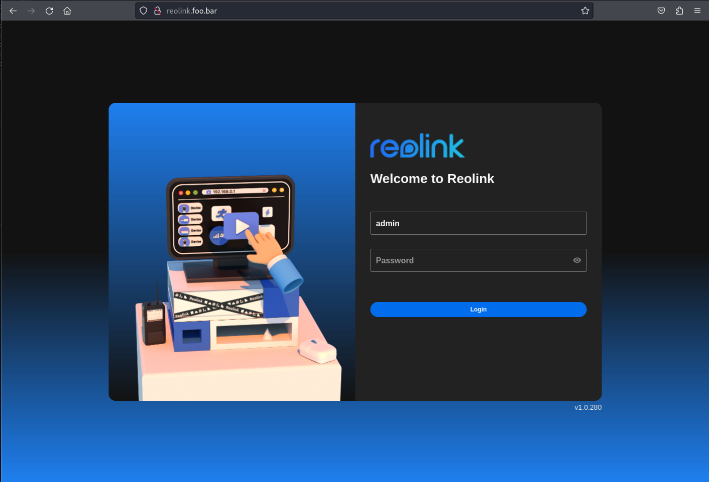
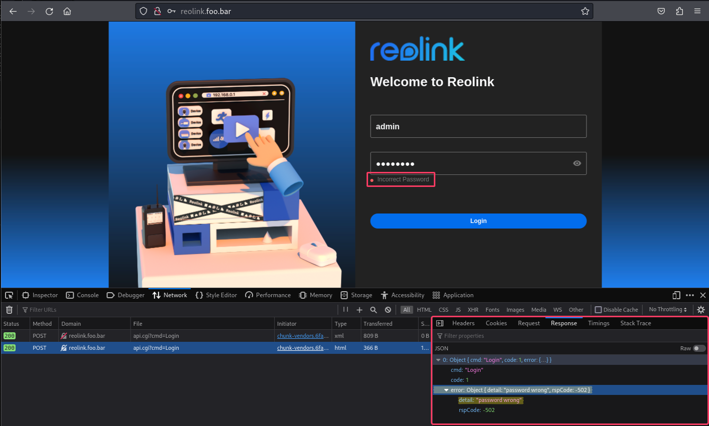
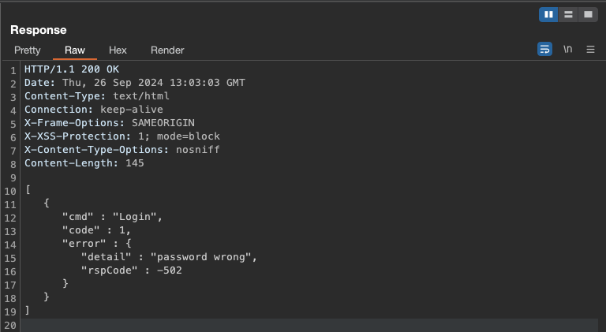
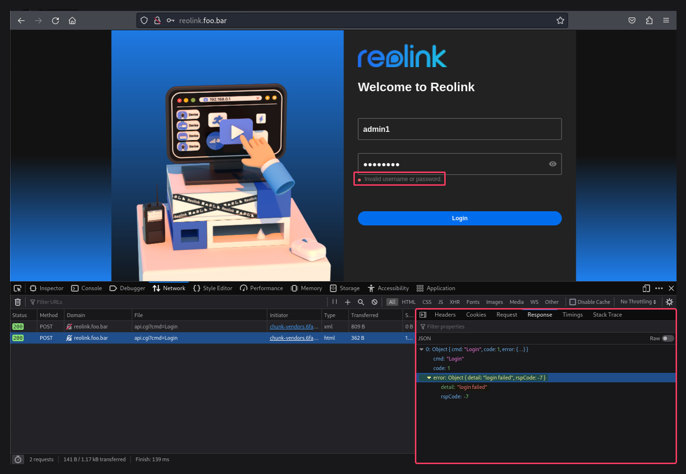
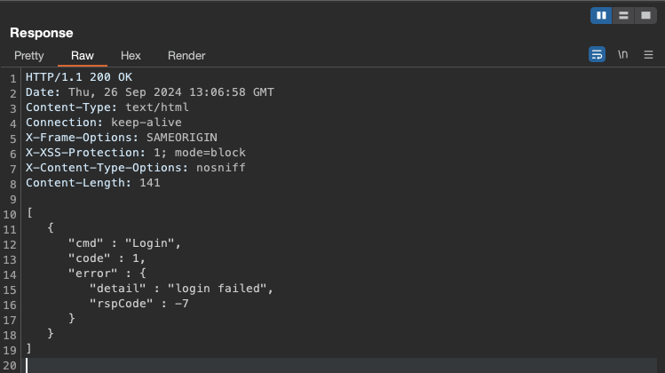

# CVE-2024-48644
September, 2024

### CVE Details
CVE: https://www.cve.org/CVERecord?id=CVE-2024-48644

NVD: https://nvd.nist.gov/vuln/detail/CVE-2024-48644

Tenable: https://www.tenable.com/cve/CVE-2024-48644

## Account Enumeration and Guessable User Account 

### Summary
Accounts enumeration vulnerability in the Login Component of Reolink Duo 2 WiFi Camera (Firmware Version v3.0.0.1889_23031701) allows remote attackers, unauthenticated, to determine valid user accounts via login attempts. This can lead to the enumeration of user accounts and potentially facilitate other attacks, such as brute-forcing of passwords. The vulnerability arises from the application responding differently to login attempts with valid and invalid usernames.

### Tested Versions
Reolink Duo Wifi v3.0.0.1889_23031701

### Product URLs
Reolink Duo 2 WiFi - https://reolink.com/br/product/reolink-duo-wifi/

## Details
### Proof of Concept (PoC)
This vulnerability can be replicated by attempting to log in with default or common usernames. The application's distinct responses to valid and invalid usernames enable potential attackers to discern valid accounts. Specifically, the application responds with `password wrong` when a valid username is provided with an incorrect password and `login failed` when an invalid username is provided.

Outlined below is a three-step proof of concept to reproduce and demonstrate the vulnerability:

#### Step 1: Access the Login Page
Upon accessing the login page, it is observed that the username field is automatically populated with `admin`. This indicates that `admin` may be a default username.

#### Step 2: Observing incorrect password response
When an incorrect password is used, the application responds with a JSON array containing an object. Within this object, the `error` property includes another object with two properties: `detail` and `rspCode`. The `detail` property specifically returns the message `password wrong`.

#### Step 3: Observing Invalid Username Response
When an invalid username is used, the application responds with a JSON array containing an object. This object includes an `error` property, which itself contains another object with two properties: `detail` and `rspCode`. In this case, the `detail` property returns the message `login failed`, indicating that the username does not exist.

### Recommendation
To mitigate this Account Enumeration Vulnerability, it is recommended to implement a generic error message for all failed login attempts, regardless of the reason. This means whether a username is valid or not, or whether a password is correct or not, the application should always return a generic message like `Invalid username or password`. This prevents potential attackers from distinguishing between valid and invalid usernames based on the application's responses.

### References
[CWE-200: Exposure of Sensitive Information to an Unauthorized Actor](https://cwe.mitre.org/data/definitions/200.html)

[OWASP - 04 Testing for Account Enumeration and Guessable User Account](https://owasp.org/www-project-web-security-testing-guide/latest/4-Web_Application_Security_Testing/03-Identity_Management_Testing/04-Testing_for_Account_Enumeration_and_Guessable_User_Account)

### Credits
Discovered by Rosemberg Silva