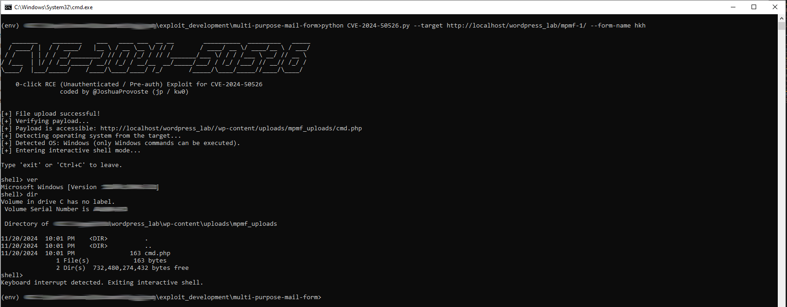

# CVE-2024-50526 / 0-Click RCE Exploit

- Author: Joshua Provoste
- https://x.com/JoshuaProvoste/status/1859403137435459727




This repository contains a proof-of-concept exploit for CVE-2024-50526, an unauthenticated arbitrary file upload vulnerability in the Multi Purpose Mail Form WordPress plugin, leading to remote command execution (RCE).

## What the script does

The script uploads a PHP payload through a vulnerable form endpoint without authentication. Once uploaded, it verifies the payload location, detects the target operating system, and provides an interactive remote shell for command execution.

## Usage

```
python CVE-2024-50526.py --target http://target-wordpress-site/mpmf-1/ --form-name hkh
```


After execution, the script uploads the payload, confirms its accessibility, detects the OS, and drops into an interactive shell.

## Notes

- No authentication required (pre-auth / 0-click).