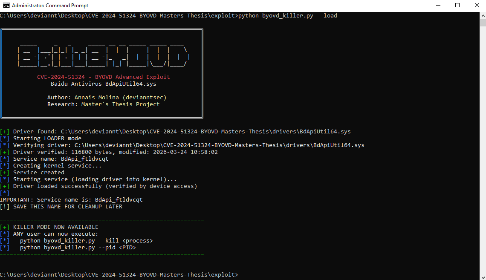
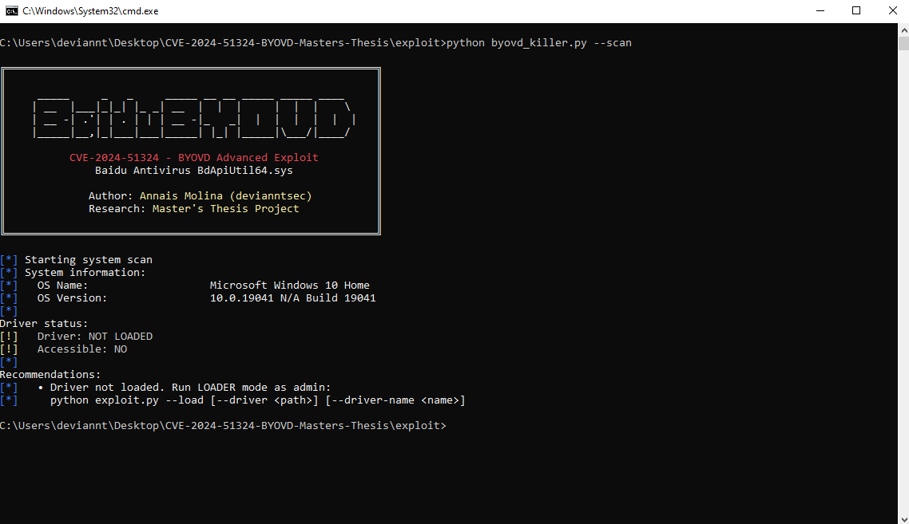
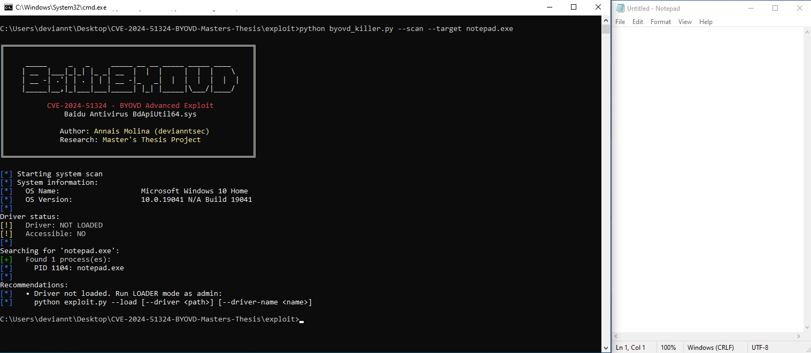
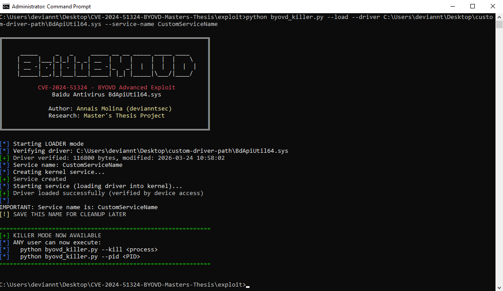
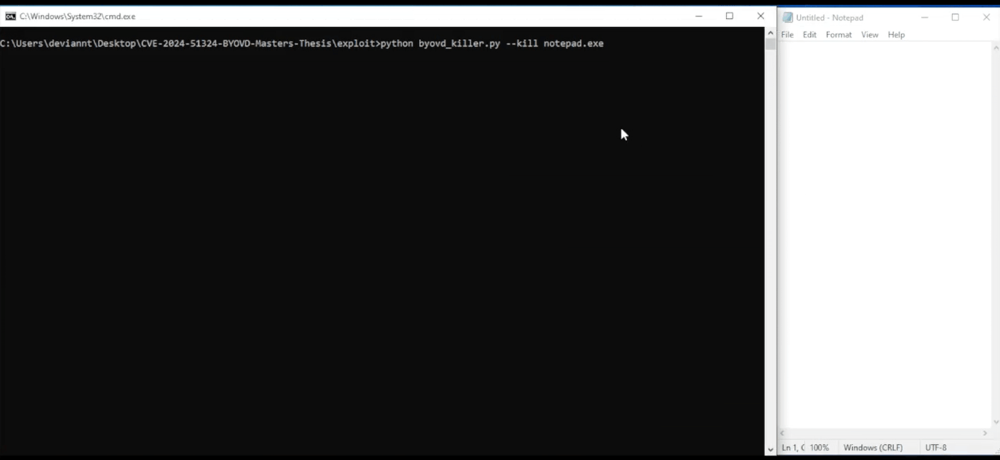
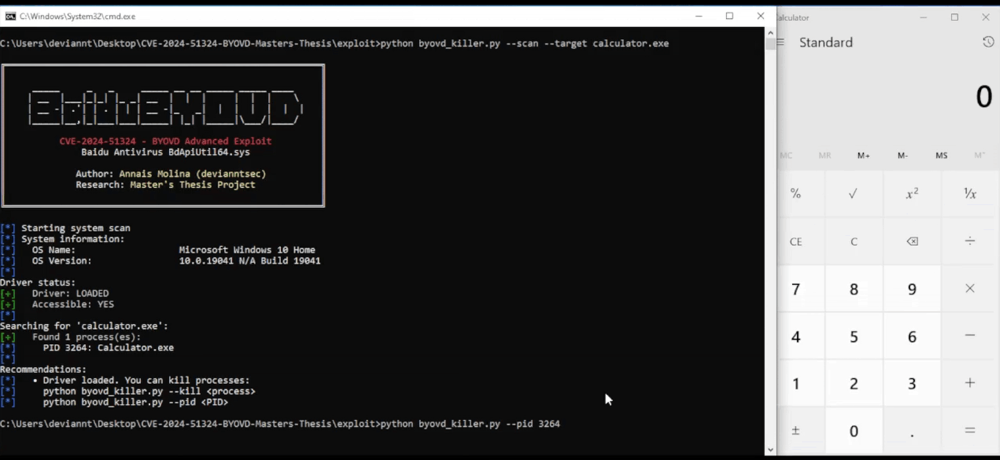
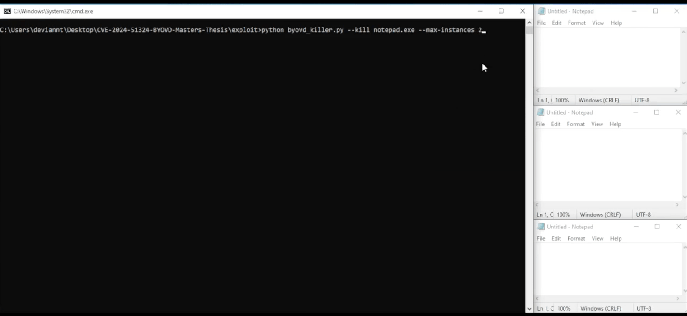
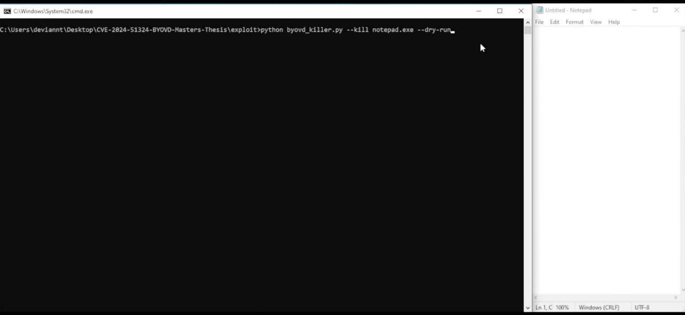
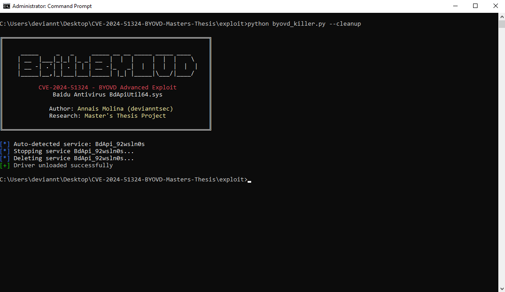

# CVE-2024-51324 — BYOVD: BdApiUtil64.sys · Master's Thesis Research

[](https://nvd.nist.gov/vuln/detail/CVE-2024-51324)
[](https://github.com/devianntsec)
[](LICENSE)
[](https://github.com/devianntsec)
[-orange)](https://nvd.nist.gov/vuln/detail/CVE-2024-51324)

> **Bring Your Own Vulnerable Driver (BYOVD) — Baidu Antivirus `BdApiUtil64.sys`**  
> Three undocumented kernel primitives: process termination, arbitrary file deletion,
> and in-use file deletion with `SectionObjectPointer` bypass  
> Affected: Baidu Antivirus v5.2.3.116083 (`BdApiUtil64.sys`)

---

<div align="center">
  

  <p><em>Loading the vulnerable driver into kernel (LOADER mode)</em></p>
</div>

## Description

This repository contains my **Master's Thesis research** on **CVE-2024-51324**, a
**Bring Your Own Vulnerable Driver (BYOVD)** vulnerability in Baidu Antivirus's kernel
driver `BdApiUtil64.sys`.

The NVD record assigns a CVSS v3.1 base score of **3.8 (Low)** with vector
`AV:N/AC:L/PR:H/UI:N/S:U/C:L/I:L/A:N` and CWE-269 (Improper Privilege Management).
This score does not reflect the local attack reality documented in this research: once
the driver is loaded by an administrator (a one-time step achievable via social
engineering or any local privilege escalation), any subsequent process — including
sandboxed or standard-user processes — can send IOCTLs without further privilege checks.
A researcher-assessed CVSS v3.1 score of **7.8 (High)** with vector
`AV:L/AC:L/PR:L/UI:N/S:U/C:H/I:H/A:H` more accurately captures the post-load
exploitation reality. Both scores are discussed in the technical documentation.

The driver creates the device object `\Device\BdApiUtil` with
`SecurityDescriptor = NULL`, allowing any process regardless of integrity level to open
a handle and send IOCTLs. Static analysis via Ghidra 11.0.3 reveals that the internal
mechanism is more significant than previously documented: the driver uses
`PsLookupProcessByProcessId` + `ObOpenObjectByPointer(KernelMode)` rather than
`ZwOpenProcess`, bypassing `SeAccessCheck` entirely. Three IOCTL primitives were fully
characterized, two of which have no prior public documentation.

### My Contribution

| Aspect | Description |
|--------|-------------|
| **Technical correction** | `ZwOpenProcess` is absent from the import table; the actual mechanism is `PsLookupProcessByProcessId` + `ObOpenObjectByPointer(KernelMode)`, which bypasses `SeAccessCheck` unconditionally |
| **Three documented primitives** | Process termination (`0x800024B4`), arbitrary file deletion (`0x80002648`), and in-use file deletion with `SectionObjectPointer` bypass (`0x8000264C`) — the last two have no prior public documentation |
| **Four operation modes** | LOADER, KILLER, SCANNER, and CLEANUP — complete lifecycle management |
| **SHA-256 verification** | Driver hash verified before any load attempt |
| **PPL empirical testing** | 10 attempts per process category confirming PPL as the only runtime mitigation |
| **Forensic analysis** | Event ID 7045 persistence post-cleanup; Event ID 1102 as self-incriminating log-clear artifact |
| **Detection rules** | Sigma rule and Sysmon configuration (Event ID 6 by hash + Event ID 13 by registry key) |
| **CVSS re-assessment** | Documented discrepancy between official NVD score (3.8 Low) and researcher-assessed local exploitation severity (7.8 High) |

---

## Repository Structure

```
CVE-2024-51324/
├── README.md
├── LICENSE
│
├── drivers/
│   └── BdApiUtil64.sys              # Driver (not distributed)
│
├── exploit/
│   ├── exploit-explanation.md
│   └── byovd_killer.py              # Main exploit — 4 operational modes
│
└── docs/
    ├── screenshots/
    │   ├── 01-byovd-scan.png
    │   ├── 02-byovd-scan-target.png
    │   ├── 03-byovd-load.png
    │   ├── 04-byovd-load-custom.png
    │   ├── 05-kill-name.gif
    │   ├── 06-kill-pid.gif
    │   ├── 07-kill-limit.gif
    │   ├── 08-dry-run.gif
    │   └── 09-byovd-cleanup.png
    │
    └── analysis/
        ├── 01-root-cause.md
        ├── 02-driver-analysis.md    # Full Ghidra RE, three primitives, PPL testing
        └── 03-timeline.md
```

---

## Quick Start

### Prerequisites

- Windows 10/11 (any build)
- Python 3.6+
- `BdApiUtil64.sys` (SHA-256: `47EC51B5F0EDE1E70BD66F3F0152F9EB536D534565DBB7FCC3A05F542DBE4428`)
- Administrator account (LOADER and CLEANUP modes only)
- Standard user account sufficient for KILLER mode once driver is loaded

### Step 1 — Scan the system

```bash
python exploit/byovd_killer.py --scan
python exploit/byovd_killer.py --scan --target lsass.exe
```

### Step 2 — Load the driver (Admin required)

```bash
python exploit/byovd_killer.py --load
python exploit/byovd_killer.py --load --driver C:\path\to\BdApiUtil64.sys
python exploit/byovd_killer.py --load --service-name MyService
```

### Step 3 — Kill processes (No admin required)

```bash
python exploit/byovd_killer.py --kill notepad.exe
python exploit/byovd_killer.py --pid 1234
python exploit/byovd_killer.py --kill notepad.exe --max-instances 2
python exploit/byovd_killer.py --kill notepad.exe --dry-run
```

### Step 4 — Cleanup (Admin required)

```bash
python exploit/byovd_killer.py --cleanup
python exploit/byovd_killer.py --cleanup --service-name MyService
```

---

## Operational Modes

| Mode | Command | Privileges | Description |
|------|---------|------------|-------------|
| **SCANNER** | `--scan` | Any user | System and driver status information |
| **LOADER** | `--load` | Admin | Load driver via kernel service creation |
| **KILLER** | `--kill` / `--pid` | Any user | Terminate processes via IOCTL |
| **CLEANUP** | `--cleanup` | Admin | Stop and delete driver service |

---

## Demonstrations

### SCANNER Mode — System Information


### SCANNER Mode — Target Process Search


### LOADER Mode — Loading Driver


### LOADER Mode — Custom Path and Service Name


### KILLER Mode — Kill by Process Name


### KILLER Mode — Kill by PID


### KILLER Mode — Limit Instances


### KILLER Mode — Dry Run (Simulation)


### CLEANUP Mode — Unload Driver


---

## Technical Overview

### IOCTL Attack Surface — Three Primitives

Reverse engineering of `BdApiUtil64.sys` via Ghidra 11.0.3 identified a wider attack
surface than any prior public source documents:

| IOCTL | Handler | Primitive | Prior documentation |
|-------|---------|-----------|-------------------|
| `0x800024B4` | `FUN_000152b0` | **Process termination** | Partial (mechanism incorrect) |
| `0x80002648` | `FUN_00013bb0` | **Arbitrary file deletion** | None |
| `0x8000264C` | `FUN_00013850` | **In-use file deletion (SectionObjectPointer bypass)** | None |

### Primitive 1 — Process Termination (`0x800024B4`)

The dispatch chain has three levels:

```
IOCTL 0x800024B4
  └─ FUN_00028630  (IRP_MJ_DEVICE_CONTROL dispatcher)
       └─ FUN_00015230  (wrapper: validates IOCTL code and buffer size = 4 bytes)
            └─ FUN_000152b0  (kill handler — vulnerability locus)
```

Reconstructed handler (Ghidra):

```c
if ((param_1 != 0) && (param_1 != 4)) {
    PsLookupProcessByProcessId(param_1, &local_res10);
    ObOpenObjectByPointer(
        local_res10,
        0x200,      // OBJ_KERNEL_HANDLE
        0,          // PassedAccessState: NULL
        0x1fffff,   // PROCESS_ALL_ACCESS
        0,          // ObjectType: NULL
        0,          // AccessMode: KernelMode  ← bypasses SeAccessCheck
        local_res18
    );
    ZwTerminateProcess(local_res18[0], 0);
}
```

**Why `KernelMode` bypasses `SeAccessCheck`:**

```
ZwOpenProcess path:
  NtOpenProcess → ObOpenObjectByName → SeAccessCheck
                                        (checks DACL, caller token, integrity level)
                                        can return STATUS_ACCESS_DENIED

ObOpenObjectByPointer(KernelMode) path:
  SeAccessCheck  ← NOT invoked
  → PROCESS_ALL_ACCESS handle granted unconditionally
```

`ZwOpenProcess` is **absent from the driver's import table**. The description based on
`ZwOpenProcess` present in prior sources is technically incorrect.

### Primitive 2 — Arbitrary File Deletion (`0x80002648`)

Handler `FUN_00013bb0` receives a Unicode path, validates
`InputBufferLength ≥ 0x208`, and delegates to `FUN_00013c10`. The sub-handler opens
the file in kernel mode (no `SeAccessCheck` on caller token) and dispatches an
`IRP_MJ_SET_INFORMATION` IRP with `FileInformationClass = 0xD`
(`FileDispositionInformation`), marking the file for deletion. Any file accessible to
the kernel can be deleted regardless of NTFS permissions.

### Primitive 3 — In-Use File Deletion (`0x8000264C`)

Handler `FUN_000139d0` accesses `FileObject->SectionObjectPointer` (offset `0x28`
in `FILE_OBJECT`) and temporarily nullifies two fields before dispatching the deletion
IRP:

```c
plVar1 = FileObject->SectionObjectPointer;
plVar1[2] = 0;  // DataSectionObject  → NULL
plVar1[0] = 0;  // ImageSectionObject → NULL

IofCallDriver(device, irp);
KeWaitForSingleObject(...);

// Restore after completion
plVar1[2] = DataSectionObject_backup;
plVar1[0] = ImageSectionObject_backup;
```

`IopDeleteFile` checks these pointers before honoring `FileDispositionInformation`.
By nullifying them, the handler makes the file appear unmapped, bypassing the
in-use protection. This primitive can delete a running EDR agent's binary from disk
without first terminating the process.

**Complete EDR elimination chain:**

```
1. Terminate EDR process     (IOCTL 0x800024B4)
2. Delete EDR binary on disk (IOCTL 0x8000264C) ← works even if memory-mapped
3. Prevent restart           ← executable no longer exists on disk
```

---

## Empirical Testing

### PPL Resistance (10 attempts per process category)

| Process | PPL active | Terminable | Cause |
|---------|-----------|------------|-------|
| `notepad.exe` | No | ✅ 10/10 | No protection |
| `regedit.exe` | No | ✅ 10/10 | No protection |
| `spoolsv.exe` | No | ✅ 9/10 | SCM restarts in 1 case |
| `MsMpEng.exe` | No (no PPL in test env) | ✅ 8/10 | Slight timing variability |
| `lsass.exe` | No (`RunAsPPL` absent) | ✅ 6/10 | State variability |
| `csrss.exe` | **Yes** (unconditional PPL) | ❌ 0/10 | `STATUS_ACCESS_DENIED` |

PPL (Protected Process Light) is the **only runtime mitigation** that resists
`ObOpenObjectByPointer(KernelMode)`-based termination from this driver.

### Import Table Analysis

| Present | Absent |
|---------|--------|
| `PsLookupProcessByProcessId` | `ZwOpenProcess` |
| `ObOpenObjectByPointer` | `SeAccessCheck` |
| `ZwTerminateProcess` | `SePrivilegeCheck` |
| | `PsGetCurrentProcess` |
| | `IoGetRequestorProcess` |

---

## Post-Exploitation Scenarios

| Scenario | Target | Impact |
|----------|--------|--------|
| EDR/AV termination | `MsMpEng.exe`, `SentinelAgent.exe` | Defense evasion |
| EDR binary deletion (in-use) | EDR executable on disk | Prevent restart after termination |
| Audit log disruption | `EventLog` service | Tamper with forensics |
| Protected process bypass | `lsass.exe` (without RunAsPPL) | Credential access facilitator |
| Ransomware pre-encryption prep | Security agents | Full defense evasion chain |

---

## Forensic Artifacts

### What persists after `--cleanup`

| Artifact | Post-cleanup state |
|----------|-------------------|
| Service in SCM | Removed |
| Driver in `driverquery` | Removed |
| Device object | Inaccessible |
| Registry key | Removed |
| **Event ID 7045** | **Persists — cannot be removed by `sc delete`** |

Event ID 7045 is the **only artifact that survives a complete attack cycle with
cleanup**. It contains service name, `ImagePath` (full binary path), service type,
and creation timestamp.

### Log clearing is self-incriminating

Executing `wevtutil cl System` to remove Event ID 7045 generates **Event ID 1102**
in the Security channel, recording who cleared the log and when. This makes log
tampering detectable even if the original artifact is destroyed.

| Attacker action | Resulting artifact | Channel | Persistence |
|----------------|--------------------|---------|-------------|
| `wevtutil cl System` | Event ID 7045 deleted | System | — |
| `wevtutil cl System` | **Event ID 1102 generated** | **Security** | Permanent |

---

## Detection Rules

### Sigma Rule

```yaml
title: BYOVD Attack via BdApiUtil64.sys (CVE-2024-51324)
id: a3f7c2e1-8b4d-4f9a-b6e3-2d1c9f8a7b5e
status: experimental
logsource:
  product: windows
  service: system
detection:
  selection_eventid:
    EventID: 7045
  selection_driver:
    - ServiceName|contains: 'BdApi'
    - ImagePath|contains: 'BdApiUtil64.sys'
  condition: selection_eventid and selection_driver
level: high
tags:
  - attack.defense_evasion
  - attack.t1562.001
  - attack.privilege_escalation
  - attack.t1068
```

Full Sigma rule and Sysmon configuration (Event ID 6 by SHA-256 hash + Event ID 13
by registry key) available in [`docs/detection/`](docs/detection/).

---

## Technical Documentation

| Document | Description |
|----------|-------------|
| [Root Cause Analysis](docs/analysis/01-root-cause.md) | Missing access control in `IRP_MJ_DEVICE_CONTROL` handler |
| [Driver Analysis](docs/analysis/02-driver-analysis.md) | Full Ghidra RE, three IOCTL primitives, PPL testing, import table analysis |
| [CVE Timeline](docs/analysis/03-timeline.md) | Discovery, disclosure, and patch chronology |

---

## Academic Context

This research is part of my **Master's Thesis in Cybersecurity**
(UCAM — Campus Internacional de Ciberseguridad), analyzing N-Day vulnerabilities
across multiple environments.

This CVE represents the **Windows kernel driver / BYOVD** vector within the thesis,
demonstrating:

- Kernel driver attack surface analysis via complete IOCTL enumeration
- Technical correction of prior public descriptions (`ZwOpenProcess` absent;
  actual mechanism is `ObOpenObjectByPointer(KernelMode)`)
- Discovery of two previously undocumented primitives (file deletion IOCTLs)
- Empirical PPL resistance characterization
- Forensic artifact analysis through full post-cleanup cycle
- CVSS scoring critique: documented gap between official NVD score and local exploitation severity

**Keywords:** `BYOVD` · `Kernel Driver` · `IOCTL` · `Ghidra` · `Process Termination` ·
`File Deletion` · `SectionObjectPointer` · `ObOpenObjectByPointer` · `Defense Evasion` ·
`CVE-2024-51324`

---

## Author

**Annais Molina (devianntsec)** — Master's Student in Cybersecurity

[](https://github.com/devianntsec)
[](https://linkedin.com/in/annais-molina-fuentes)
[](mailto:me@deviannt.com)

---

## Acknowledgments

- [**NVD / NIST**](https://nvd.nist.gov/vuln/detail/CVE-2024-51324) — CVE record and scoring
- [**loldrivers.io**](https://www.loldrivers.io) — Community-maintained vulnerable driver index
- [**BlackSnufkin**](https://github.com/BlackSnufkin/BYOVD/tree/main/BdApiUtil-Killer) — Original PoC reference
- [**Cisco Talos**](https://blog.talosintelligence.com/byovd-loader-deadlock-ransomware/) — DeadLock ransomware BYOVD analysis (December 2025)

---

## License

MIT License — see [LICENSE](LICENSE)

---

## Legal Disclaimer

This repository is provided **for educational and security research purposes only**,
as part of an academic Master's Thesis. All testing was performed on isolated virtual
machines with no network exposure. The vulnerable driver (`BdApiUtil64.sys`) is not
distributed in this repository — it must be obtained independently. Use only on systems
you own or have explicit written authorization to test. Unauthorized use against systems
is illegal and may result in criminal prosecution.

<div align="center">
  <sub>© 2026 Annais Molina · Master's Thesis in Cybersecurity</sub><br/>
  <sub>UCAM Universidad Católica San Antonio de Murcia · Campus Internacional de Ciberseguridad</sub>
</div>