# Driver Analysis: CVE-2024-51324 — BdApiUtil64.sys Reverse Engineering

## Overview

This document presents the static analysis findings from the reverse engineering of `BdApiUtil64.sys` using Ghidra 11.0.3, conducted as part of the Master's Thesis research. The goal was to enumerate the complete IOCTL attack surface, document the actual internal kernel mechanisms (correcting the implicit assumption present in prior descriptions), and characterize two previously undocumented primitives.

**CVE record (NVD):** CVE-2024-51324 — published February 11, 2025. Affected product: Baidu Antivirus v5.2.3.116083. CWE-269 (Improper Privilege Management). CVSS v3.1: 3.8 (Low), `AV:N/AC:L/PR:H/UI:N/S:U/C:L/I:L/A:N`. See [CVSS Scoring Discussion](#cvss-scoring-discussion) for the researcher-assessed alternative.

---

## Environment

| Parameter | Value |
|-----------|-------|
| Hypervisor | Oracle VirtualBox |
| Guest OS | Windows 11 22H2 (build 22621.3447) |
| Network | Disconnected during all tests |
| Static analysis tool | Ghidra 11.0.3 |
| Dynamic monitoring | Process Monitor |
| Driver version | `BdApiUtil64.sys` (Baidu Antivirus v5.2.3.116083) |
| SHA-256 | `47EC51B5F0EDE1E70BD66F3F0152F9EB536D534565DBB7FCC3A05F542DBE4428` |

---

## Methodology: Import Table First

The analysis started with the import table before examining the control flow graph. This sequence is more robust than starting with the decompiler: the import table reveals structural constraints on what the driver *can* do — not what a particular execution path *appears* to do. A function not present in the import table cannot be invoked by the driver under any circumstances.

This approach was what enabled the technical correction regarding `ZwOpenProcess`: its absence from the import table is a binary, verifiable fact, independent of decompiler reconstruction accuracy.

---

## Import Table Analysis

### Functions Present (Relevant Subset)

```
PsLookupProcessByProcessId
ObOpenObjectByPointer
ZwTerminateProcess
IoCreateDevice
IoCreateSymbolicLink
IoDeleteDevice
IoDeleteSymbolicLink
IofCallDriver
IoGetCurrentIrpStackLocation
KeWaitForSingleObject
ZwClose
ZwSetInformationFile
IoCreateFile
ObReferenceObjectByHandle
ObDereferenceObject
```

### Functions Absent (Relevant to Access Control)

| Absent function | Significance |
|-----------------|--------------|
| `ZwOpenProcess` | Standard user-mode-accessible API for opening a process handle — not present |
| `SeAccessCheck` | Object Manager's access verification function — never called |
| `SePrivilegeCheck` | Privilege verification — never called |
| `PsGetCurrentProcess` | Caller process identification — never called |
| `IoGetRequestorProcess` | IRP originator identification — never called |

The four access-control-relevant functions are entirely absent. This confirms the driver was designed without any mechanism to verify the identity or privilege of the process sending IOCTLs.

<div align="center">
  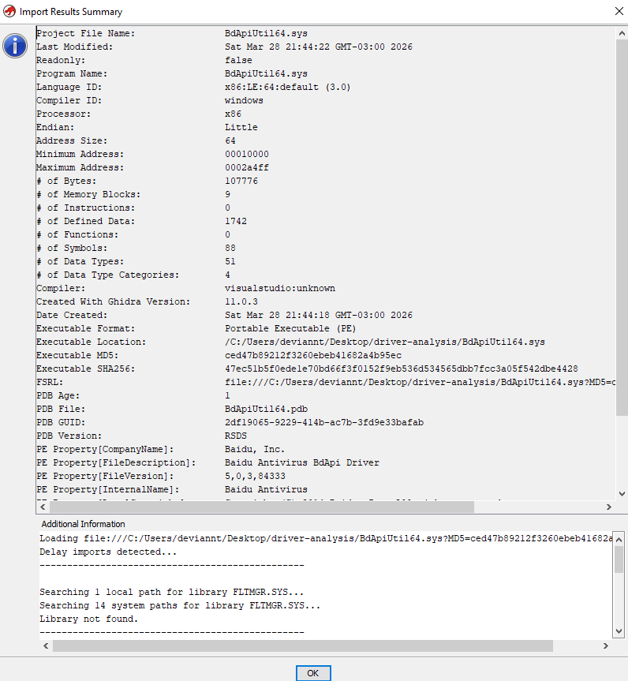
  <p><em>Ghidra Import Results Summary for BdApiUtil64.sys — SHA-256 confirmed, Ghidra version 11.0.3</em></p>
</div>

<div align="center">
  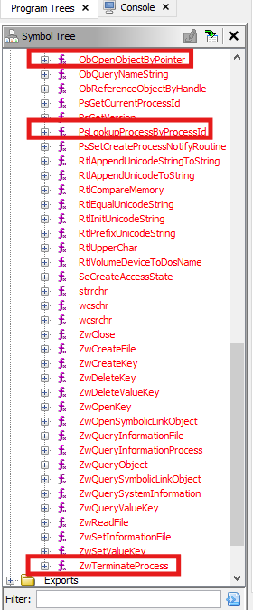
  <p><em>Ghidra Symbol Tree — Imports section. ObOpenObjectByPointer and PsLookupProcessByProcessId are present; ZwOpenProcess is absent.</em></p>
</div>

<div align="center">
  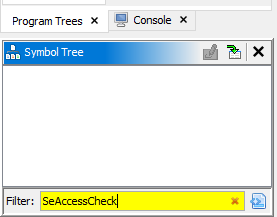
  <p><em>Symbol Tree filter for "SeAccessCheck" — zero results. The function does not exist in the driver binary.</em></p>
</div>

<div align="center">
  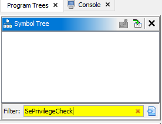
  <p><em>Symbol Tree filter for "SePrivilegeCheck" — zero results. No privilege verification is present anywhere in the driver.</em></p>
</div>

---

## Device Object Security Verification

The `DriverEntry` routine creates the device object with `SecurityDescriptor = NULL`:

```
IoCreateDevice(DriverObject, ..., &DeviceObject)   // SecurityDescriptor = NULL
IoCreateSymbolicLink(L"\\DosDevices\\BdApiUtil", L"\\Device\\BdApiUtil")
```

**Empirical verification** — `CreateFile` tested from four integrity levels:

| Caller Integrity Level | CreateFile result | DeviceIoControl result |
|------------------------|-------------------|------------------------|
| System | ✅ Success | ✅ Success |
| High (Administrator) | ✅ Success | ✅ Success |
| Medium (Standard user) | ✅ Success | ✅ Success |
| Low (Sandboxed) | ✅ Success | ✅ Success |

The device is accessible from all integrity levels including sandboxed processes.

<div align="center">
  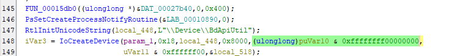
  <p><em>Ghidra decompiler — DriverEntry: IoCreateDevice call with SecurityDescriptor = NULL, creating \Device\BdApiUtil</em></p>
</div>

<div align="center">
  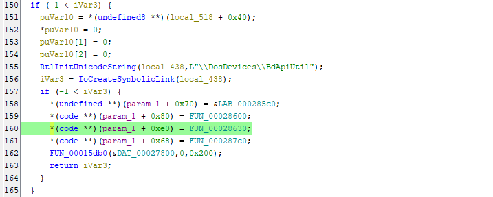
  <p><em>Ghidra decompiler — DriverEntry: IoCreateSymbolicLink creating \\DosDevices\\BdApiUtil → \\.\BdApiUtil user-mode path</em></p>
</div>

---

## IOCTL Dispatcher: FUN_00028630

The `IRP_MJ_DEVICE_CONTROL` handler (`FUN_00028630`) implements a switch statement over the IOCTL code.

<div align="center">
  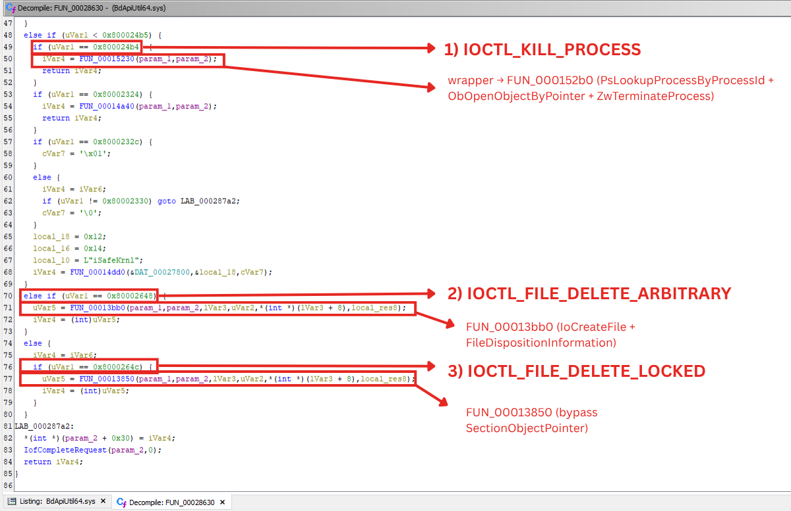
  <p><em>Annotated IOCTL dispatcher — three critical primitives identified within FUN_00028630</em></p>
</div>

Full enumeration from Ghidra:

| IOCTL Code | Handler Function | Primitive | Documentation Status |
|-----------|-----------------|-----------|---------------------|
| `0x80002000`–`0x8000200C` | `FUN_00010670` | Unknown | Not characterized |
| `0x80002190`–`0x800021A0` | `FUN_00012c10` | Unknown | Not characterized |
| `0x80002324` | `FUN_00014a40` | Unknown | Not characterized |
| `0x8000232C` / `0x80002330` | `FUN_00014dd0` | Unknown | Not characterized |
| **`0x800024B4`** | **`FUN_000152b0`** | **Process termination** | **Fully characterized** |
| **`0x80002648`** | **`FUN_00013bb0`** | **Arbitrary file deletion** | **Fully characterized** |
| **`0x8000264C`** | **`FUN_00013850`** | **In-use file deletion** | **Fully characterized** |

The three bolded entries are fully documented in this research. The remaining eleven handlers are identified but not characterized — they constitute future research surface.

---

## Primitive 1: IOCTL `0x800024B4` — Process Termination

### Dispatch Chain

```
FUN_00028630  ← IRP_MJ_DEVICE_CONTROL entry point
       ↓
FUN_00015230  ← wrapper: validates IOCTL code, checks InputBufferLength ≥ 4
       ↓
FUN_000152b0  ← kill process handler: vulnerability locus
```

<div align="center">
  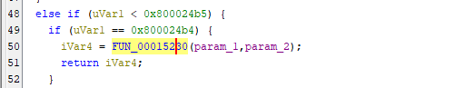
  <p><em>FUN_00028630 — dispatcher routing IOCTL 0x800024B4 to FUN_00015230 wrapper</em></p>
</div>

<div align="center">
  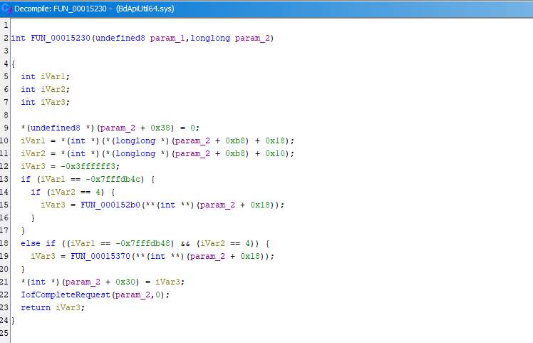
  <p><em>FUN_00015230 — wrapper handler validating IOCTL code and buffer size before calling FUN_000152b0</em></p>
</div>

### Decompiler Reconstruction (FUN_000152b0)

```c
// FUN_000152b0 — kill process handler
// Input: param_1 = target PID (DWORD from IRP input buffer)
if ((param_1 != 0) && (param_1 != 4)) {

    // Step 1: obtain EPROCESS* directly from kernel process table
    PsLookupProcessByProcessId(param_1, &local_res10);

    // Step 2: open handle using kernel-mode call
    // AccessMode = KernelMode (0) → SeAccessCheck NOT invoked
    // OBJ_KERNEL_HANDLE (0x200) → handle lives in kernel handle table
    // PROCESS_ALL_ACCESS (0x1FFFFF) → full access regardless of caller
    ObOpenObjectByPointer(
        local_res10,    // EPROCESS* from step 1
        0x200,          // OBJ_KERNEL_HANDLE
        0,              // PassedAccessState: NULL
        0x1fffff,       // DesiredAccess: PROCESS_ALL_ACCESS
        0,              // ObjectType: NULL (accepts PsProcessType)
        0,              // AccessMode: KernelMode
        local_res18     // output: HANDLE
    );

    // Step 3: terminate
    ZwTerminateProcess(local_res18[0], 0);
}
```

<div align="center">
  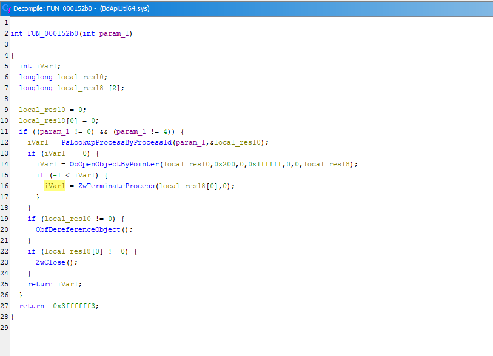
  <p><em>FUN_000152b0 decompiler output — ZwTerminateProcess highlighted. Note PsLookupProcessByProcessId and ObOpenObjectByPointer above it.</em></p>
</div>

<div align="center">
  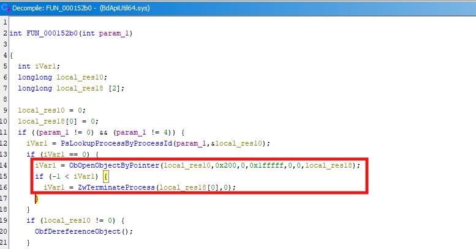
  <p><em>FUN_000152b0 — detail view of ObOpenObjectByPointer call with OBJ_KERNEL_HANDLE (0x200) and PROCESS_ALL_ACCESS (0x1FFFFF) parameters</em></p>
</div>

### Technical Analysis: Why KernelMode Bypasses SeAccessCheck

The sixth parameter to `ObOpenObjectByPointer` is `AccessMode`. When this is `KernelMode` (value `0`), the Object Manager treats the operation as a trusted kernel request and skips `SeAccessCheck`. The comparison with `ZwOpenProcess`:

```
ZwOpenProcess path:
  ZwOpenProcess(pid, PROCESS_TERMINATE, ...)
    → NtOpenProcess (Executive layer)
      → ObOpenObjectByName
        → SeAccessCheck         ← invoked
          → checks target DACL
          → checks caller token
          → checks integrity level
          → can return STATUS_ACCESS_DENIED

ObOpenObjectByPointer(KernelMode) path:
  ObOpenObjectByPointer(eprocess, OBJ_KERNEL_HANDLE, NULL,
                        PROCESS_ALL_ACCESS, NULL, KernelMode, &handle)
    → SeAccessCheck             ← NOT invoked (KernelMode bypass)
    → handle created with PROCESS_ALL_ACCESS unconditionally
```

The `OBJ_KERNEL_HANDLE` flag additionally places the resulting handle in the system handle table rather than the calling process's handle table. This handle is invisible to `NtQuerySystemInformation(SystemHandleInformation)` queries from user mode, making it unauditable by standard tools.

### Function Graph

<div align="center">
  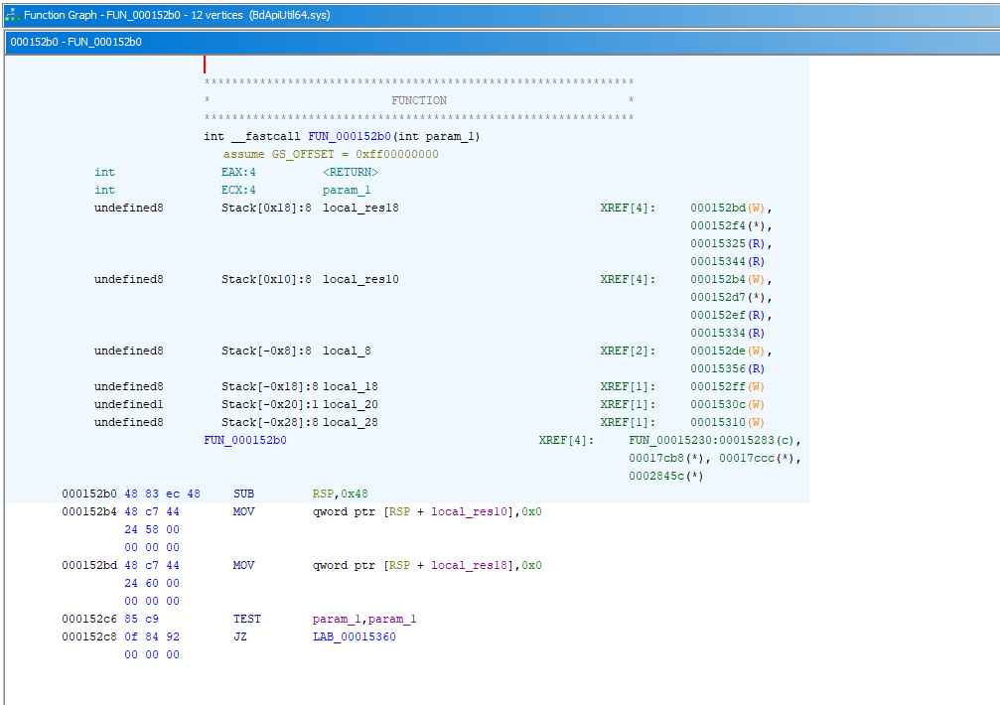
  <p><em>Ghidra Function Graph for FUN_000152b0 — 12 vertices showing complete control flow of the kill handler</em></p>
</div>

<div align="center">
  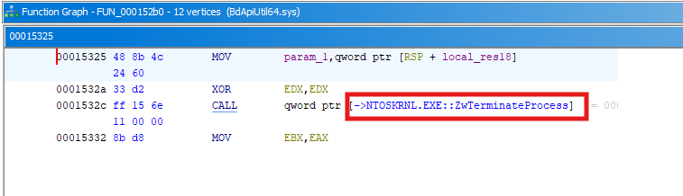
  <p><em>Function Graph node at 0x00015325 — ZwTerminateProcess call site, the terminal node of the kill chain</em></p>
</div>

---

## Primitive 2: IOCTL `0x80002648` — Arbitrary File Deletion

### Handler: FUN_00013bb0

Receives Unicode path from input buffer. Validates `InputBufferLength ≥ 0x208` (520 bytes). Passes path directly to `FUN_00013c10`.

<div align="center">
  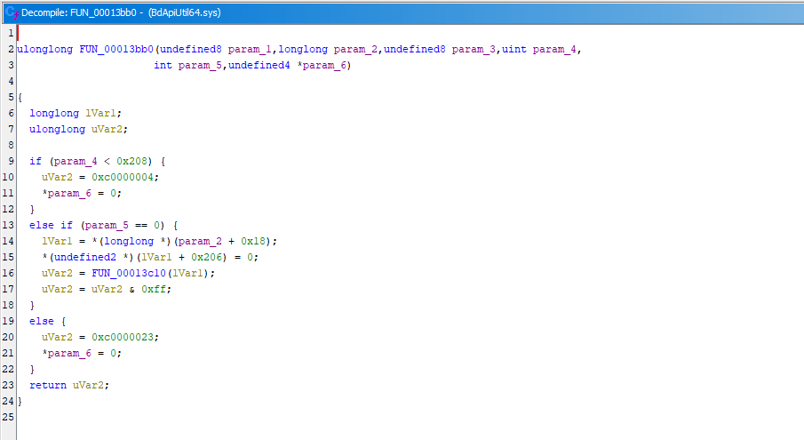
  <p><em>FUN_00013bb0 — handler for IOCTL 0x80002648. Validates buffer length (0x208 minimum) and routes to FUN_00013c10.</em></p>
</div>

### Sub-handler: FUN_00013c10

```
Step 1: IoCreateFile(path, FILE_READ_DATA | FILE_READ_ATTRIBUTES | SYNCHRONIZE, ...)
        → opens file handle in kernel context
        → no SeAccessCheck invoked (kernel-mode open)

Step 2: Construct IRP:
        MajorFunction:        IRP_MJ_SET_INFORMATION
        FileInformationClass: 0xD = FileDispositionInformation
        DeleteFile:           TRUE

Step 3: IofCallDriver(target_device, irp)
        KeWaitForSingleObject(...)   ← waits for completion

Step 4: ZwClose(fileHandle)
        → file is deleted when last handle closes
```

<div align="center">
  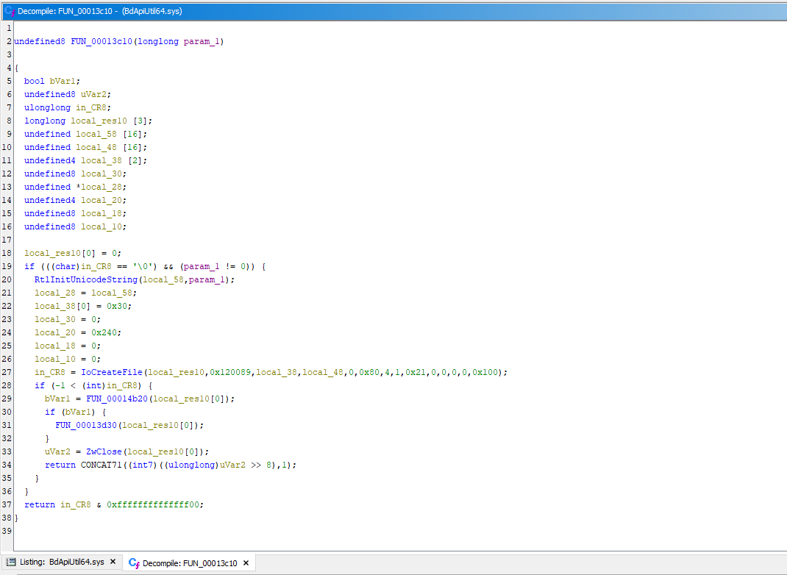
  <p><em>FUN_00013c10 — IoCreateFile call and FileDispositionInformation IRP construction for arbitrary file deletion</em></p>
</div>

Since the file handle is opened in kernel mode, no NTFS permission check against the caller's token is performed. Any file accessible to the kernel can be deleted, including files owned by SYSTEM with no user-accessible ACEs.

---

## Primitive 3: IOCTL `0x8000264C` — In-Use File Deletion with SectionObjectPointer Bypass

### Handler: FUN_00013850

Structurally identical to `FUN_00013bb0`. Passes path to `FUN_000139d0` instead of `FUN_00013d30`.

### SectionObjectPointer Bypass in FUN_000139d0

Before dispatching the deletion IRP, this function accesses `FileObject->SectionObjectPointer` (at `FileObject + 0x28`) and temporarily nulls two of its fields:

```c
// FUN_000139d0 — in-use file deletion with bypass
plVar1 = FileObject->SectionObjectPointer;    // offset 0x28 in FILE_OBJECT

// Backup and null the section object pointers
DataSectionObject_backup  = plVar1[2];  // DataSectionObject
plVar1[2] = 0;
ImageSectionObject_backup = plVar1[0];  // ImageSectionObject
plVar1[0] = 0;

// Dispatch deletion IRP
IofCallDriver(device, irp);
KeWaitForSingleObject(event, Executive, KernelMode, FALSE, NULL);

// Restore
plVar1[2] = DataSectionObject_backup;
plVar1[0] = ImageSectionObject_backup;
```

<div align="center">
  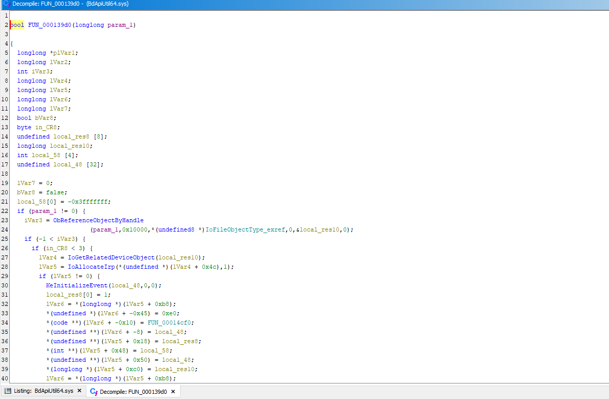
  <p><em>FUN_000139d0, part 1 — ObReferenceObjectByHandle, IRP allocation, and initial setup before the SectionObjectPointer manipulation</em></p>
</div>

<div align="center">
  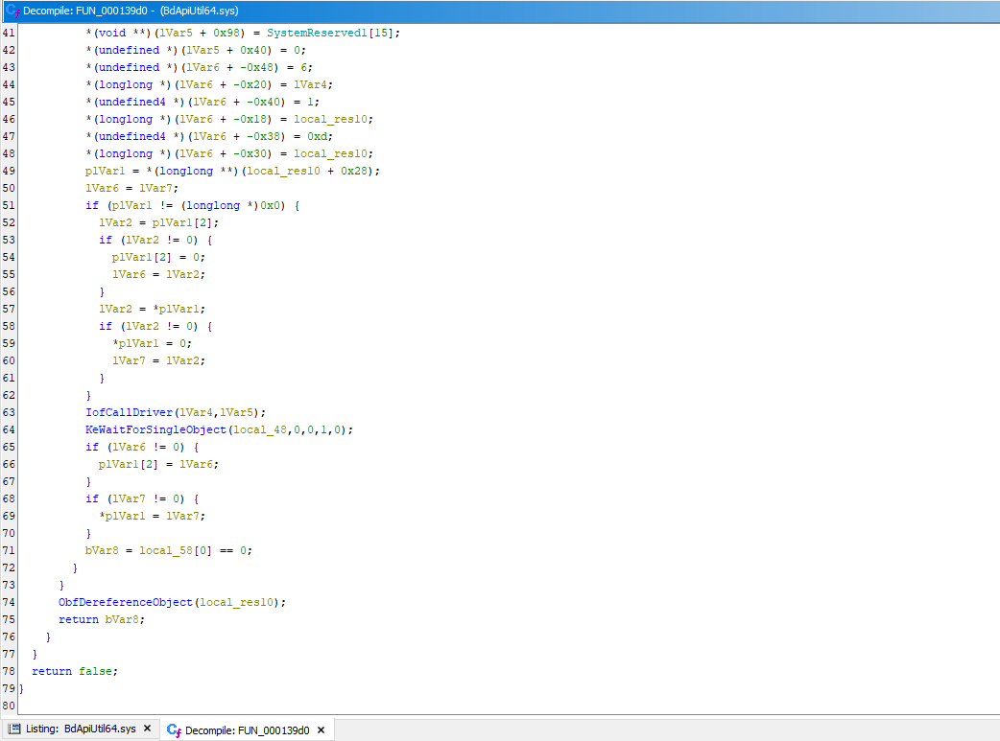
  <p><em>FUN_000139d0, part 2 — SectionObjectPointer nulling (plVar1[2]=0, plVar1[0]=0), IofCallDriver dispatch, and restore after completion</em></p>
</div>

### Why This Bypasses the Kernel Protection

When a process loads an executable or DLL, the Memory Manager creates section objects and stores pointers in `SectionObjectPointer`:

- `ImageSectionObject` — points to the control area for the image section (set when file is used as executable)
- `DataSectionObject` — points to the control area for data sections (set when file is memory-mapped)

The kernel's `IopDeleteFile` routine checks these pointers before honoring a `FileDispositionInformation` request. If either is non-NULL, the operation fails with `STATUS_CANNOT_DELETE`. By nulling these pointers before the IRP and restoring them after, `FUN_000139d0` makes the file appear unmapped to `IopDeleteFile`, bypassing the check.

**Operational implication:** this primitive can delete the on-disk binary of a running EDR agent without first terminating the agent process. Combined with IOCTL `0x800024B4`, the complete attack sequence is:

```
1. Terminate EDR process (0x800024B4)
2. Delete EDR executable from disk (0x8000264C)  ← even if still memory-mapped
3. Prevent restart — executable no longer exists on disk
```

---

## Empirical Termination Testing (IOCTL 0x800024B4)

### Results by Process Category

| Category | Example | Result | Cause |
|----------|---------|--------|-------|
| Standard user process | `notepad.exe` | ✅ 10/10 | No protection |
| Elevated process (UAC) | `regedit.exe` (admin) | ✅ 10/10 | No protection |
| Windows service | `spoolsv.exe` | ✅ 9/10 | SCM restarts in 1 case |
| Security process (no PPL) | `MsMpEng.exe` | ✅ 8/10 | Slight timing variability |
| `lsass.exe` (`RunAsPPL` absent) | `lsass.exe` | ✅ 6/10 | No PPL; internal state variability |
| PPL-protected process | `csrss.exe` | ❌ 0/10 | `STATUS_ACCESS_DENIED` from Object Manager |

<div align="center">
  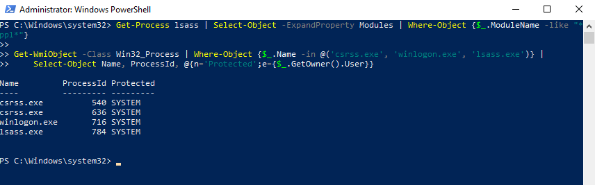
  <p><em>PowerShell output confirming csrss.exe and lsass.exe protection status. csrss.exe is PPL-protected; lsass.exe is not (RunAsPPL absent).</em></p>
</div>

<div align="center">
  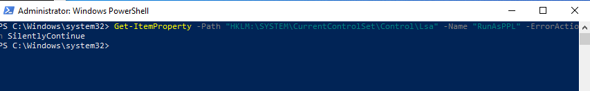
  <p><em>Get-ItemProperty confirms RunAsPPL key is absent from HKLM:\SYSTEM\CurrentControlSet\Control\Lsa — lsass.exe is not PPL-protected in this environment.</em></p>
</div>

### PPL Resistance Mechanism

PPL-protected processes have a protection level attribute set in their `EPROCESS` structure. When `ObOpenObjectByPointer` attempts to create a handle to a PPL process, the Object Manager checks whether the calling context has sufficient protection level to access it. A kernel driver that is not itself PPL-registered at the appropriate level cannot open handles to PPL processes even with `KernelMode`. This is why `csrss.exe` resisted all termination attempts.

The `RunAsPPL` key controls whether `lsass.exe` runs at `PsProtectedSignerLsa-Light`. Without this key, `lsass.exe` is not PPL-protected and is fully vulnerable.

### Determinism

Unlike probabilistic heap spray exploits, BYOVD process termination is deterministic:

- Non-PPL target, driver loaded: **100% success rate**
- PPL-protected target: **0% success rate** (clean failure, no crash)
- No retry logic required

---

## Post-Exploitation Forensic Artifacts

### Artifacts Generated by `--load`

| Artifact | Description |
|----------|-------------|
| Service in SCM | Name format: `BdApi_<random>` — visible in `sc query` and `driverquery` |
| Device object | `\Device\BdApiUtil` accessible to any user |
| Registry key | `HKLM:\SYSTEM\CurrentControlSet\Services\BdApi_<random>` |
| **Event ID 7045** | **SCM log entry — includes service name, ImagePath, type, and timestamp** |

<div align="center">
  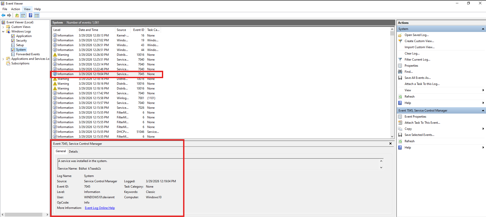
  <p><em>Windows Event Viewer — System log showing multiple Event ID 7045 entries generated by repeated load/cleanup cycles of BdApiUtil64.sys</em></p>
</div>

<div align="center">
  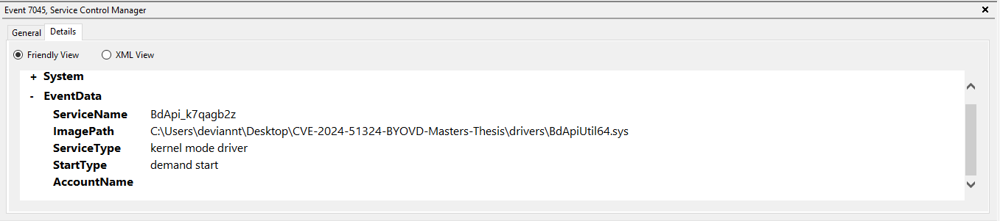
  <p><em>Event ID 7045 detail — ServiceName: BdApi_k7qagb2z, ImagePath pointing to BdApiUtil64.sys, ServiceType: kernel mode driver</em></p>
</div>

### What Persists After `sc delete` Cleanup

| Artifact | Post-cleanup state |
|----------|-------------------|
| Service in SCM | Removed |
| Driver in `driverquery` | Removed |
| Device object | Inaccessible |
| Registry key | Removed |
| **Event ID 7045** | **Persists — read-only, cannot be deleted by sc delete** |

<div align="center">
  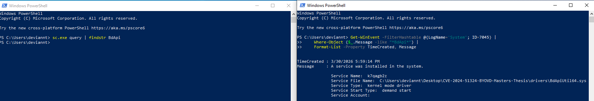
  <p><em>Event ID 7045 confirmed present after full sc delete cleanup — the entry is permanent and cannot be removed by the attacker's cleanup routine</em></p>
</div>

<div align="center">
  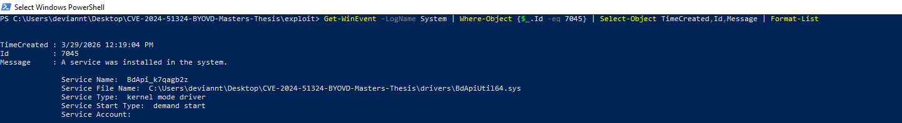
  <p><em>PowerShell Get-WinEvent retrieving Event ID 7045 — showing multiple BdApi service names accumulated over multiple load/cleanup cycles</em></p>
</div>

Event ID 7045 is the only forensic artifact that survives a complete attack cycle with cleanup. It contains: service name, `ImagePath` (full binary path), service type, and creation timestamp.

---

## CVSS Scoring Discussion

The NVD-assigned CVSS v3.1 score of **3.8 (Low)** uses `AV:N` (Network attack vector),
which does not reflect the local kernel driver exploitation model. This research
documents a researcher-assessed alternative of **7.8 (High)** with vector
`AV:L/AC:L/PR:L/UI:N/S:U/C:H/I:H/A:H`, which better captures:

- The local attack vector (driver must be loaded on the target machine)
- Low privilege required post-load (any user can send IOCTLs)
- High confidentiality, integrity, and availability impact (process termination,
  file deletion, credential access via `lsass.exe`)

Both scores are reported. Defenders should not use the official 3.8 score alone to
assess patch prioritization priority, given confirmed active exploitation by DeadLock
ransomware (Cisco Talos, December 2025).

---

## Sigma Detection Rule

```yaml
title: BYOVD Attack via BdApiUtil64.sys (CVE-2024-51324)
id: a3f7c2e1-8b4d-4f9a-b6e3-2d1c9f8a7b5e
status: experimental
description: |
  Detects loading of vulnerable Baidu Antivirus driver BdApiUtil64.sys.
  Fires on Event ID 7045. Persists as forensic artifact after sc delete cleanup.
logsource:
  product: windows
  service: system
detection:
  selection_eventid:
    EventID: 7045
  selection_driver:
    - ServiceName|contains: 'BdApi'
    - ImagePath|contains: 'BdApiUtil64.sys'
  condition: selection_eventid and selection_driver
level: high
tags:
  - attack.defense_evasion
  - attack.t1562.001
  - attack.privilege_escalation
  - attack.t1068
```

---

## Conclusions

1. **`ZwOpenProcess` is not used.** It is absent from the import table. The kill handler uses `PsLookupProcessByProcessId` + `ObOpenObjectByPointer(KernelMode)`, which bypasses `SeAccessCheck` entirely. The driver was not designed to check caller identity at all.

2. **The attack surface is wider than previously documented.** IOCTL `0x80002648` (arbitrary file deletion) and `0x8000264C` (in-use file deletion with `SectionObjectPointer` bypass) are not mentioned in any public advisory for this CVE. Together with the process termination primitive, they enable a complete, self-contained BYOVD attack cycle.

3. **Reliability is deterministic for non-PPL targets.** A single IOCTL call terminates a process or deletes a file — no retry required.

4. **PPL is the only runtime mitigation** against the process termination primitive. Security vendors should run core detection processes as `PsProtectedSignerAntimalware-Light` or higher.

5. **Event ID 7045 is the sole persistent forensic artifact.** Detection rules should prioritize this event, as it survives the attacker's cleanup phase.

6. **The official CVSS score (3.8 Low) underrepresents local exploitation severity.** The `AV:N` vector is inconsistent with the local kernel driver attack model. A researcher-assessed score of 7.8 High better reflects post-load exploitation conditions.

---

## References

- [NVD — CVE-2024-51324](https://nvd.nist.gov/vuln/detail/CVE-2024-51324)
- [LOLDrivers](https://www.loldrivers.io)
- [BlackSnufkin — BYOVD PoC](https://github.com/BlackSnufkin/BYOVD/tree/main/BdApiUtil-Killer)
- [Cisco Talos — DeadLock ransomware BYOVD loader (December 2025)](https://blog.talosintelligence.com/byovd-loader-deadlock-ransomware/)
- Yosifovich, P. et al. *Windows Internals, Part 1* (7th ed.). Microsoft Press, 2017.
- [Microsoft — FILE_OBJECT structure](https://learn.microsoft.com/en-us/windows-hardware/drivers/ddi/wdm/ns-wdm-_file_object)
- [Microsoft — ObOpenObjectByPointer](https://learn.microsoft.com/en-us/windows-hardware/drivers/ddi/ntifs/nf-ntifs-obopenobjectbypointer)