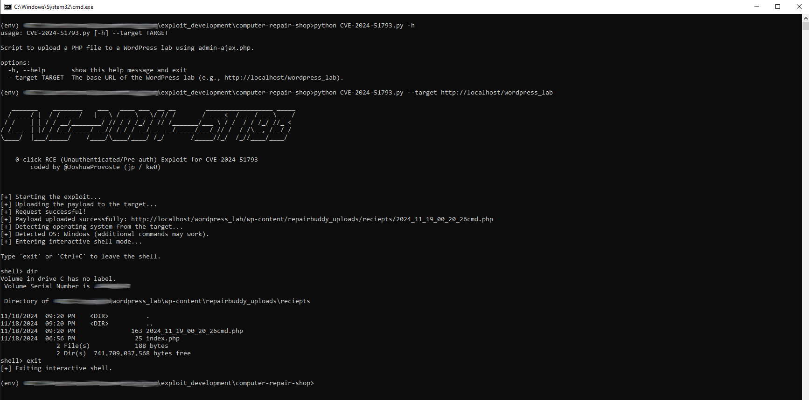

# CVE-2024-51793 / 0-Click RCE Exploit

- Author: Joshua Provoste
- https://x.com/JoshuaProvoste/status/1858668072279626138



This repository contains a proof-of-concept exploit for CVE-2024-51793, an unauthenticated arbitrary file upload vulnerability in a vulnerable WordPress plugin, leading to remote command execution (RCE).

## What the script does

The script abuses a vulnerable admin-ajax.php action to upload a PHP payload without authentication. Once uploaded, it detects the target operating system and provides an interactive remote shell for command execution.

## Usage

```
python CVE-2024-51793.py --target http://target-wordpress-site
```

After execution, the script uploads the payload, extracts the uploaded file URL from the server response, detects the OS, and drops into an interactive shell.

## Notes

- No authentication required (pre-auth / 0-click).
- Works only against vulnerable installations.